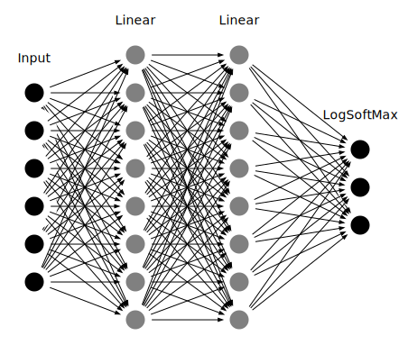

# Neural Network tutorial

There is vast literature on neural networks and their uses, as well as
strategies for choosing initial points effectively, keeping the algorithm from
converging in local minima, choosing the best model structure, choosing the best
optimizers, and so forth. mlpack implements many of these building blocks,
making it very easy to create different neural networks in a modular way.

mlpack currently implements two easy-to-use forms of neural networks:
*Feed-Forward Networks* (this includes convolutional neural networks) and
*Recurrent Neural Networks*.

## Model API

There are two main neural network classes that are meant to be used as container
for neural network layers that mlpack implements; each class is suited to a
different setting:

- `FFN`: the Feed Forward Network model provides a means to plug layers
   together in a feed-forward fully connected manner.  This is the 'standard'
   type of deep learning model, and includes convolutional neural networks
   (CNNs).

- `RNN`: the Recurrent Neural Network model provides a means to consider
   successive calls to forward as different time-steps in a sequence.  This is
   often used for time sequence modeling tasks, such as predicting the next
   character in a sequence.

Below is some basic guidance on what should be used. Note that the question of
"which algorithm should be used" is a very difficult question to answer, so the
guidance below is just that---guidance---and may not be right for a particular
problem.

 - *Feed-forward Networks* allow signals or inputs to travel one way only.
   There is no feedback within the network; for instance, the output of any
   layer does only affect the upcoming layer. That makes Feed-Forward Networks
   straightforward and very effective. They are extensively used in pattern
   recognition and are ideally suitable for modeling relationships between a
   set of input and one or more output variables.


 - *Recurrent Networks* allow signals or inputs to travel in both directions by
   introducing loops in the network. Computations derived from earlier inputs
   are fed back into the network, which gives the recurrent network some kind of
   memory. RNNs are currently being used for all kinds of sequential tasks; for
   instance, time series prediction, sequence labeling, and
   sequence classification.

In order to facilitate consistent implementations, the `FFN` and `RNN` classes
have a number of methods in common:

 - `Train()`: trains the initialized model on the given input data. Optionally
   an optimizer object can be passed to control the optimization process.

 - `Predict()`: predicts the responses to a given set of predictors. Note the
   responses will reflect the output of the specified output layer.

 - `Add()`: this method can be used to add a layer to the model.

*Note*: to be able to optimize the network, both classes implement the
[ensmallen](https://www.ensmallen.org) function API. In short, the `FNN` and
`RNN` class implement two methods: `Evaluate()` and `Gradient()`.  This enables
the optimization given some learner and some performance measure.

Similar to the existing layer infrastructure, the `FFN` and `RNN` classes are
very extensible, having the following template arguments; which can be modified
to change the behavior of the network:

 - `OutputLayerType`: this type defines the output layer used to evaluate the
   network; by default, `NegativeLogLikelihood` is used.

 - `InitializationRuleType`: this type defines the method by which initial
   parameters are set; by default, `RandomInitialization` is used.

```c++
template<
  typename OutputLayerType = NegativeLogLikelihood<>,
  typename InitializationRuleType = RandomInitialization
>
class FNN;
```

Internally, the `FFN` and `RNN` class keeps an instantiated `OutputLayerType`
class (which can be given in the constructor). This is useful for using
different loss functions like the Negative-Log-Likelihood function or the
VRClassReward function, which takes an optional score parameter. Therefore, you
can write a non-static `OutputLayerType` class and use it seamlessly in
combination with the `FNN` and `RNN` class. The same applies to the
`InitializationRuleType` template parameter.

By choosing different components for each of these template classes in
conjunction with the `Add()` method, a very arbitrary network object can be
constructed.

Below are several examples of how the `FNN` and `RNN` classes might be used.
The first examples focus on the `FNN` class, and the last shows how the
`RNN` class can be used.

The simplest way to use the `FNN` class is to pass in a dataset with the
corresponding labels, and receive the classification in return. Note that the
dataset must be column-major – that is, one column corresponds to one point. See
the [matrices guide](../user/matrices.md) for more information.

The code below builds a simple feed-forward network with the default options,
then queries for the assignments for every point in the `queries` matrix.



*Note*: the number of inputs in the above graph doesn't match with the real
number of features in the thyroid dataset and are just used as an abstract
representation.

```c++
#include <mlpack.hpp>

using namespace mlpack;

int main()
{
  // Load the training set and testing set.
  arma::mat trainData;
  data::Load("thyroid_train.csv", trainData, true);
  arma::mat testData;
  data::Load("thyroid_test.csv", testData, true);

  // Split the labels from the training set and testing set respectively.
  // Decrement the labels by 1, so they are in the range 0 to (numClasses - 1).
  arma::mat trainLabels = trainData.row(trainData.n_rows - 1) - 1;
  arma::mat testLabels = testData.row(testData.n_rows - 1) - 1;
  trainData.shed_row(trainData.n_rows - 1);
  testData.shed_row(testData.n_rows - 1);

  // Initialize the network.
  FFN<> model;
  model.Add<Linear>(8);
  model.Add<Sigmoid>();
  model.Add<Linear>(3);
  model.Add<LogSoftMax>();

  // Train the model.
  model.Train(trainData, trainLabels);

  // Use the Predict method to get the predictions.
  arma::mat predictionTemp;
  model.Predict(testData, predictionTemp);

  /*
    Since the predictionsTemp is of dimensions (3 x number_of_data_points)
    with continuous values, we first need to reduce it to a dimension of
    (1 x number_of_data_points) with scalar values, to be able to compare with
    testLabels.

    The first step towards doing this is to create a matrix of zeros with the
    desired dimensions (1 x number_of_data_points).

    In predictionsTemp, the 3 dimensions for each data point correspond to the
    probabilities of belonging to the three possible classes.
  */
  arma::mat prediction = arma::zeros<arma::mat>(1, predictionTemp.n_cols);

  // Find index of max prediction for each data point and store in "prediction"
  for (size_t i = 0; i < predictionTemp.n_cols; ++i)
  {
    prediction(i) = arma::as_scalar(arma::find(
        arma::max(predictionTemp.col(i)) == predictionTemp.col(i), 1));
  }

  /*
    Compute the error between predictions and testLabels,
    now that we have the desired predictions.
  */
  size_t correct = arma::accu(prediction == testLabels);
  double classificationError = 1 - double(correct) / testData.n_cols;

  // Print out the classification error for the testing dataset.
  std::cout << "Classification Error for the Test set: " << classificationError << std::endl;
  return 0;
}
```

Now, the matrix prediction holds the classification of each point in the
dataset. Subsequently, we find the classification error by comparing it
with `testLabels`.

In the next example, we create simple noisy sine sequences, which are trained
later on, using the `RNN` class.

```c++
#include <mlpack.hpp>

using namespace ens;
using namespace mlpack;

/**
 * Generates noisy sine wave and outputs the data and the labels that
 * can be used directly for training and testing with RNN.
 */
void GenerateNoisySines(arma::cube& data,
                        arma::cube& labels,
                        size_t rho,
                        const size_t dataPoints = 100,
                        const double noisePercent = 0.2)
{
  size_t points = dataPoints;
  size_t r = dataPoints % rho;

  if (r == 0)
    points += 1;
  else
    points += rho - r + 1;

  arma::colvec x(points);
  int i = 0;
  double interval = 0.6 / points;

  x.for_each([&i, noisePercent, interval]
    (arma::colvec::elem_type& val) {
    double t = interval * (++i);
    val = ::sin(2 * M_PI * 10 * t) + (noisePercent * Random(0.0, 0.1));
  });

  arma::colvec y = x;
  y = arma::normalise(x);

  // Now break this into columns of rho size slices.
  size_t numColumns = y.n_elem / rho;
  data = arma::cube(1, numColumns, rho);
  labels = arma::cube(1, numColumns, 1);

  for (size_t i = 0; i < numColumns; ++i)
  {
    data.tube(0, i) = y.rows(i * rho, i * rho + rho - 1);
    labels.subcube(0, i, 0, 0, i, 0) =
        y.rows(i * rho + rho, i * rho + rho);
  }
}

int main()
{
  const size_t rho = 10;

  // Generate 12 (2 * 6) noisy sines. A single sine contains rho
  // points/features.
  arma::cube input, labels;
  GenerateNoisySines(input, labels, rho);

  /**
   * Construct a network with 1 input unit, 4 LSTM units and 1 output
   * unit. The hidden layer is connected to itself. The network structure
   * looks like:
   *
   *  Input         Hidden        Output
   * Layer(1)      LSTM(4)       Layer(1)
   * +-----+       +-----+       +-----+
   * |     |       |     |       |     |
   * |     +------>|     +------>|     |
   * |     |    ..>|     |       |     |
   * +-----+    .  +--+--+       +-----+
   *            .     .
   *            .     .
   *            .......
   *
   * We use MeanSquaredError for the loss type, since we are predicting a
   * continuous value.
   */
  RNN<MeanSquaredError> model(rho, true /* only one response per sequence */);
  model.Add<LSTM>(4);
  model.Add<LinearNoBias>(1);

  StandardSGD opt(0.1, 1, 10 * input.n_cols /* 10 epochs */, -100);
  model.Train(input, labels, opt);

  // Now compute the MSE on the training set.
  arma::cube predictions;
  model.Predict(input, predictions);
  const double mse = arma::accu(arma::square(
      arma::vectorise(labels) -
      arma::vectorise(predictions.slice(predictions.n_slices - 1)))) /
      input.n_cols;
  std::cout << "MSE on training set is " << mse << "." << std::endl;
}
```

For further examples on the usage of the ann classes, see [mlpack
models](https://github.com/mlpack/models).

## Layer API

In order to facilitate consistent implementations, we have defined a `LayerType`
API that describes all the methods that a layer may implement. mlpack offers a
few variations of this API, each designed to cover some of the model
characteristics mentioned in the previous section. Any layer requires the
implementation of a `Forward()` method. The interface looks like:

```c++
template<typename MatType>
void Forward(const MatType& input, MatType& output);
```

*(Note that `MatType` can be a template parameter of the layer class itself, not
necessarily the `Forward()` function.  This applies to the other functions of
the API too.)*

The method should calculate the output of the layer given the input matrix and
store the result in the given output matrix. Next, any layer must implement the
`Backward()` method, which uses certain computations obtained during the forward
pass and should calculate the function `f(x)` by propagating `x` backward
through `f`:

```c++
template<typename MatType>
void Backward(const MatType& input,
              const MatType& gy,
              MatType& g);
```

Finally, if the layer is differentiable, the layer must also implement
a `Gradient()` method:

```c++
template<typename MatType>
void Gradient(const MatType& input,
              const MatType& error,
              MatType& gradient);
```

The `Gradient()` function should calculate the gradient with respect to the
input activations `input` and calculated errors `error` and place the results
into the gradient matrix object `gradient` that is passed as an argument.

Each of these three methods accepts a template parameter `MatType`,
which may be `arma::mat` (dense Armadillo matrix) or `arma::sp_mat`
(sparse Armadillo matrix). This allows support for both sparse-supporting and
non-sparse-supporting layer without explicitly passing the type.

Every new layer should inherit from `Layer<MatType>`, which defines some core
functionality.  There are three additional functions that must be implemented:

 - `void ComputeOutputDimensions()`: this sets the internal member
   `outputDimensions` to the correct output dimensions of the layer, given that
   `inputDimensions` is set.

 - `size_t WeightSize() const`: given that `ComputeOutputDimensions()` has been
   called (and so `outputDimensions` and `inputDimensions` are correct), return
   the number of trainable weights in the layer.

 - `void SetWeights(typename MatType::elem_type*)`: this sets the layer's
   internal parameter memory to the given pointer.

Below is an example that shows each function with some additional boilerplate
code.  Note this is not an actual layer but instead an example that exists to show and
document all the functions that mlpack layer must implement.  For a better
overview of the various layers, see the layers in
`src/mlpack/methods/ann/layer/`. Also be aware that the implementations of each
of the methods in this example are entirely fake and do not work; this example
exists for its API, not its implementation.

```c++
template<typename MatType = arma::mat>
class ExampleLayer : public Layer<MatType>
{
 public:
  // Note that the input size will be set in the member
  // `Layer<MatType>::inputParameters` automatically before
  // `ComputeOutputDimensions()` is called.
  ExampleLayer()
  {
    /* Nothing to do here */
  }

 private:
  MatType weights;
}
```

The constructor for `ExampleLayer` will build the layer given the output size.
Note that, if the output size information isn't used internally it's not
necessary to provide a specific constructor. Also, one could add additional or
other information that are necessary for the layer construction. One example
could be:

```c++
template<typename MatType>
ExampleLayer<MatType>(const double ratio = 0.5) : ratio(ratio)
{ /* Nothing to do here */ }
```

When this constructor is finished, the entire layer will be built, but may not
yet be ready to use.  We can assume that the enclosing `FFN` or `RNN` network
will call `ComputeOutputDimensions()`, `WeightSize()`, and `SetWeights()` before
any call to `Forward()` is done. Next, as pointed out above, each layer has to
follow the `LayerType` API, so we must implement some additional functions.

```c++
template<typename MatType>
void ExampleLayer<MatType>::Forward(const MatType& input, MatType& output)
{
  output = arma::ones(input.n_rows, input.n_cols) + weights;
}

template<typename MatType>
void ExampleLayer<MatType>::Backward(const MatType& input,
                                     const MatType& gy,
                                     MatType& g)
{
  g = gy - weights;
}

template<typename MatType>
void ExampleLayer<MatType>::Gradient(const InputType& input,
                                     ErrorType& error,
                                     GradientType& gradient)
{
  gradient = arma::ones(input.n_rows, input.n_cols);
}
```

The three functions `Forward()`, `Backward()` and `Gradient()` (which is
needed for a differentiable layer) contain the main logic of the layer.

Now let's implement `ComputeOutputDimensions()`, `WeightSize()`, and
`SetWeights()`.

```c++
template<typename MatType>
void ExampleLayer<MatType>::ComputeOutputDimensions()
{
  // The output size is the same as the input size.
  this->outputDimensions = this->inputDimensions;
}

template<typename MatType>
size_t ExampleLayer<MatType>::WeightSize() const
{
  size_t numWeights = this->inputDimensions[0];
  for (size_t i = 1; i < this->inputDimensions.size(); ++i)
    numWeights *= this->inputDimensions[i];
  return numWeights;
}

template<typename MatType>
void ExampleLayer<MatType>::SetWeights(typename MatType::elem_type* weightsPtr)
{
  MakeAlias(weights, weightsPtr, WeightSize(), 1);
}
```

## Model Setup & Training

Once the base container is selected (`FNN` or `RNN`), the `Add` method can be
used to add layers to the model.  The code below adds two linear layers to the
model---the first takes 512 units as input and gives 256 output units, and
the second takes 256 units as input and gives 128 output units.

```c++
FFN<> model;
model.Add<Linear>(256);
model.Add<Linear>(128);
```

The model is trained on Armadillo matrices. For training a model, you will
typically use the `Train()` function:

```c++
arma::mat trainingSet, trainingLabels;
model.Train(trainingSet, trainingLabels);
```

You can use mlpack's `Load()` function to load a dataset like this:

```c++
arma::mat trainingSet;
data::Load("dataset.csv", dataset, true);
```

```sh
$ cat dataset.csv
0, 1, 4
1, 0, 5
1, 1, 1
2, 0, 2
```

The type does not necessarily need to be a CSV; it can be any supported storage
format, assuming that it is a coordinate-format file in the format specified
above.  For more information on mlpack file formats, see the
[tutorial](../user/formats.md).

*Note*: it’s often a good idea to normalize or standardize your data, for
example using:

```c++
for (size_t i = 0; i < dataset.n_cols; ++i)
  dataset.col(i) /= norm(dataset.col(i), 2);
```

Also, it is possible to retrain a model with new parameters or with
a new reference set. This is functionally equivalent to creating a new model.

## Saving & Loading

Using `cereal` (for more information about the internals see [the Cereal
website](http://uscilab.github.io/cereal/)), mlpack is able to load and save
machine learning models with ease.  Note that due to the large compilation
overhead of enabling serialization, it is disabled by default.  To enable
serialization for neural networks, define the `MLPACK_ENABLE_ANN_SERIALIZATION`
macro before including mlpack:

```c++
#define MLPACK_ENABLE_ANN_SERIALIZATION
#include <mlpack.hpp>
```

The example below builds a model on the `thyroid` dataset and then saves the
model to the file `model.xml` for later use.

```c++
// Load the training set.
arma::mat dataset;
data::Load("thyroid_train.csv", dataset, true);

// Split the labels from the training set.
arma::mat trainData = dataset.submat(0, 0, dataset.n_rows - 4,
    dataset.n_cols - 1);

// Split the data from the training set.
// Subtract 1 so the labels are the range from 0 to (numClasses - 1).
arma::mat trainLabels = dataset.submat(dataset.n_rows - 3, 0,
    dataset.n_rows - 1, dataset.n_cols - 1) - 1;

// Initialize the network.
FFN<> model;
model.Add<Linear>(3);
model.Add<Sigmoid>();
model.Add<LogSoftMax>();

// Train the model.
model.Train(trainData, trainLabels);

// Use the Predict method to get the assignments.
arma::mat assignments;
model.Predict(trainData, assignments);

data::Save("model.xml", "model", model, false);
```

After this, the file `model.xml` will be available in the current working
directory.

Now, we can look at the output model file, `model.xml`:

```sh
$ cat model.xml
<?xml version="1.0" encoding="utf-8"?>
<cereal>
	<model>
		<cereal_class_version>0</cereal_class_version>
		<parameter>
			<n_rows>60</n_rows>
			<n_cols>1</n_cols>
			<vec_state>0</vec_state>
			<elem>10.461979353567767</elem>
			<elem>-10.040855482151116</elem>
			<elem>0.18048901768535316</elem>
			<elem>4.8989495084787169</elem>
			<elem>-4.4381643782652276</elem>
			<elem>0.049477846402230616</elem>
			<elem>2.5271808924795987</elem>
			<elem>-3.96993488526287</elem>
			...
		</parameter>
		<width>0</width>
		<height>0</height>
		<reset>true</reset>
		<value0>
			<vecSize>3</vecSize>
			<value0>
				<which>30</which>
				<value0>
					<cereal_class_version>0</cereal_class_version>
					<smartPointer>
						<ptr_wrapper>
							<valid>1</valid>
							<data>
								<cereal_class_version>0</cereal_class_version>
								<inSize>19</inSize>
								<outSize>3</outSize>
							</data>
						</ptr_wrapper>
					</smartPointer>
				</value0>
			</value0>
			<value1>
				<which>6</which>
				<value0>
					<cereal_class_version>0</cereal_class_version>
					<smartPointer>
						<ptr_wrapper>
							<valid>1</valid>
							<data>
								<cereal_class_version>0</cereal_class_version>
							</data>
						</ptr_wrapper>
					</smartPointer>
				</value0>
			</value1>
			<value2>
				<which>32</which>
				<value0>
					<cereal_class_version>0</cereal_class_version>
					<smartPointer>
						<ptr_wrapper>
							<valid>1</valid>
							<data>
								<cereal_class_version>0</cereal_class_version>
							</data>
						</ptr_wrapper>
					</smartPointer>
				</value0>
			</value2>
		</value0>
	</model>
</cereal>
```

As you can see, the `<parameter>` section of `model.xml` contains the trained
network weights.  We can see that this section also contains the network input
size, which is 66 rows and 1 column. Note that in this example, we used three
different layers, as can be seen by looking at the `<network>` section. Each
node has a unique id that is used to reconstruct the model when loading.

The models can also be saved as `.bin` or `.txt`; the `.xml` format provides
a human-inspectable format (though the models tend to be quite complex and may
be difficult to read). These models can then be re-used to be used for
classification or other tasks.

So, instead of saving or training a network, mlpack can also load a pre-trained
model. For instance, the example below will load the model from `model.xml` and
then generate the class predictions for the `thyroid` test dataset.

```c++
data::Load("thyroid_test.csv", dataset, true);

arma::mat testData = dataset.submat(0, 0, dataset.n_rows - 4,
    dataset.n_cols - 1);

data::Load("model.xml", "model", model);

arma::mat predictions;
model.Predict(testData, predictions);
```

This enables the possibility to distribute a model without having to train it
first or simply to save a model for later use. Note that loading will also work
on different machines.

## Extracting Parameters

To access the weights from the neural network layers, you can call the following
function on any initialized network:

```c++
model.Parameters();
```

which will return the complete model parameters as an armadillo matrix object;
however often it is useful to not only have the parameters for the complete
network, but the parameters of a specific layer.  The parameters for a specific
layer `x` can be accessed via the `Parameters()` member:

```c++
arma::mat parametersX = model.Model()[x].Parameters();
```

In the example above, we get the weights of the `x`th layer.

## Further documentation

For further documentation on the ann classes, consult the source code in the
`src/mlpack/methods/ann/` directory.  Each of the layers are implemented in
`src/mlpack/methods/ann/layer`.
