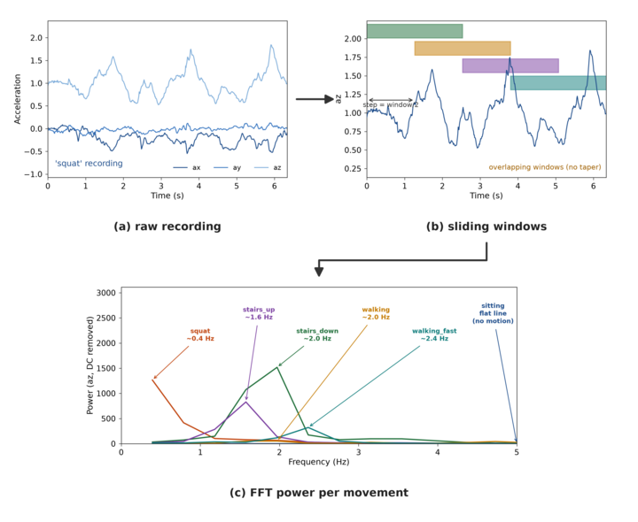
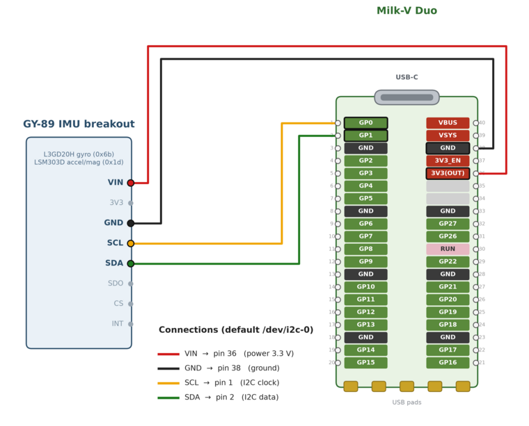

## On-device movement recognition with an IMU

In this tutorial we build a complete, end-to-end human-movement / activity
recognition pipeline that runs entirely on a tiny RISC-V Linux board. Data
collection, training, and inference all happen on the target device.
The main target of this tutorial is to provide an end-to-end example of using mlpack
on real resource-constrained embedded hardware.  The tutorial can be followed
step-by-step.

If you have not cross-compiled mlpack before, see also these other resources on cross-compiling mlpack:

 * [Run mlpack bindings on a Raspberry Pi](../embedded/crosscompile_armv7.md)
 * [Cross-compile an mlpack example for embedded hardware](../embedded/crosscompile_example.md)
 * [Cross-compilation setup (toolchains per board)](../embedded/supported_boards.md)

The full source code for this tutorial can be found in the
[mlpack examples repository](https://github.com/mlpack/examples), under
[`cpp/movement_recognition/`](https://github.com/mlpack/examples/tree/master/cpp/movement_recognition).

Contents:

 * [What are we building](#what-are-we-building)
 * [Hardware](#hardware)
 * [Setting up the cross-compilation toolchain](#setting-up-the-cross-compilation-toolchain)
 * [Getting the example](#getting-the-example)
 * [Building the programs](#building-the-programs)
 * [Copying binaries to the device](#copying-binaries-to-the-device)
 * [Running it on the device](#running-it-on-the-device)

### What are we building

We are building a machine learning based human movement recognition pipeline to detect
movements such as walking, sitting, squats, and climbing stairs. This
is enabled by using a 9 Degree of Freedom inertial sensor that is read over an I2C bus.
The collected data is cut into windows, and then fed into an FFT in order to
extract the features from each collected window.
Finally, we build a small `float32` neural network that learns to recognize the
movements with the highest possible accuracy.

The example is split into four small independent programs, each of which
performs a single task:

 * `imu_test`: sensor check
 * `collect`: record sensor data to CSV
 * `train`: train a neural network from the CSVs
 * `infer`: live inference from the IMU

All four are built from one CMake project that uses the same cross-compilation
infrastructure described in the [embedded example tutorial](../embedded/crosscompile_example.md).

The pipeline is:

 * `collect` writes one CSV file per recording (the file name is the label),
 * `train` turns those CSVs into FFT features and fits a network, and
 * `infer` reads the live sensor stream and prints the predicted movement.

The figure below shows that feature pipeline on the real recorded data, from
raw signal to the features the network learns from:

<center>

</center>

In the figure,

 * `(a)` "raw recording" shows the accelerometer's three axes over a few seconds
   for a squat movement; the vertical axis (`az`) oscillates around 1g with the
   movement's rhythm.

 * `(b)` "sliding windows" cuts each recording into fixed-length windows that
   overlap by half a window (a sliding window with a 50% step): overlap
   generates more training windows, creating a higher exposure for each
   movement; this increases the accuracy.

 * `(c)` "FFT power per movement" shows how the FFT is applied per-channel for
   each window on all the movements in order to extract the relevant power
   spectrum.  Different movements can be identified with different frequencies.
   Note that the gravity (DC) component is removed from this plot for clarity.
   However, it is kept as part of the features used for training.

### Hardware

This tutorial uses a [Milk-V Duo](https://milkv.io/duo), a SOPHGO
CV1800B board with a dual-core RISC-V C906 CPU and 64 MB of RAM (of which
only ~28 MB is usable from Linux), running a musl-based Linux.  The sensor is a
GY-89 9-DOF breakout, which carries three separate I2C chips:

| Chip        | Function                            | 7-bit address |
|-------------|-------------------------------------|---------------|
| L3GD20H | 3-axis gyroscope                    | `0x6B`        |
| LSM303D | 3-axis accelerometer + magnetometer | `0x1D`        |
| BMP180  | barometric pressure + temperature   | `0x77`        |

Wire the GY-89 to the Duo's I2C0 bus (the example defaults to `/dev/i2c-0`), as
shown below:

<center>


<em>GY-89 to Milk-V Duo wiring: SCL to pin 1 (GP0), SDA to pin 2 (GP1), VIN to
pin 36 (3V3 out), and GND to pin 38.  See the
<a href="https://milkv.io/docs/duo/getting-started/duo">Milk-V Duo pinout
documentation</a> for the full pin map.</em>
</center>

On the Duo, pins 1 and 2 (GP0 and GP1) are general-purpose GPIO pins by default,
so we must mux them to the I2C0 controller. To use I2C there are two pins that
are necessary: the first one is the clock pin labelled `IIC0_SCL`, while the
second one is the data line labelled `IIC0_SDA`.  This is done on the device with
`duo-pinmux` and is shown in [Running it on the device](#running-it-on-the-device).
`duo-pinmux` can be used to change the functionality of each pin on the Duo.

### Setting up the cross-compilation toolchain

Since the device is resource-constrained with only 28 MB available
RAM, we cross-compile on a host `x86_64` machine and copy the static
binaries to the target machine, exactly as we did in the [Raspberry Pi tutorial](../embedded/crosscompile_armv7.md).
The board uses a RISC-V C906 core, so we need a `riscv64-lp64d`
[Bootlin](https://toolchains.bootlin.com/) toolchain.  Our target in this tutorial is to produce
a small static binary; therefore, we use the musl variant:

```sh
wget https://toolchains.bootlin.com/downloads/releases/toolchains/riscv64-lp64d/tarballs/riscv64-lp64d--musl--stable-2025.08-1.tar.xz
tar -xvf riscv64-lp64d--musl--stable-2025.08-1.tar.xz
```

For the rest of the tutorial we refer to the unpacked toolchain through a shell
variable; adjust the path to where you extracted it:

```sh
export TC=/path/to/riscv64-lp64d--musl--stable-2025.08-1
```

The C906's architecture is `RV64GCV`, and that architecture's toolchain prefix/sysroot
are listed on the [cross-compilation setup page](../embedded/supported_boards.md#rv64gcv).

### Getting the example

Clone the examples repository and move into the example directory:

```sh
git clone https://github.com/mlpack/examples.git
cd examples/cpp/movement_recognition
```

### Building the programs

Please note that in order to run mlpack on the Milk-V, we need first to disable
OpenMP since the board has one core. Second, we need to modify the underlying
OpenBLAS library. The latter is necessary because the Milk-V has 28MB of usable
RAM.  Without this modification, the `train` program will not run; this is because the matrix
multiplication functionality in OpenBLAS allocates an internal buffer of size
32MB---larger than the available RAM.  Therefore, we have to reduce this, along
with the block sizes used during matrix multiplication.

Both of these changes are a part of the example repository, in the file
[CMake/patches/openblas-riscv64-low-memory.patch](../../.jenkins/cross-compilation/openblas-riscv64-low-memory.patch).

The example applies this patch automatically when it calls `mlpack.cmake` to
download mlpack's dependencies and cross-compile OpenBLAS.

We are also disabling STB, dr_libs, and httplib. These dependencies
support loading images, audio files, and downloading from a server. However,
they add a dead footprint that can be avoided for low-resource devices.
For more information please check [compile-time options](../user/compile.md#configuring-mlpack-with-compile-time-definitions).

At this stage, we need to define the architecture of the target device with
the `ARCH_NAME=RV64GCV` variable (the ISA of the board's C906 core):

```sh
mkdir build && cd build
cmake \
    -DCMAKE_CROSSCOMPILING=ON \
    -DARCH_NAME=RV64GCV \
    -DCMAKE_TOOLCHAIN_FILE=../CMake/crosscompile-toolchain.cmake \
    -DTOOLCHAIN_PREFIX=$TC/bin/riscv64-buildroot-linux-musl- \
    -DCMAKE_SYSROOT=$TC/riscv64-buildroot-linux-musl/sysroot \
    -DOPENBLAS_PATCHES=CMake/patches/openblas-riscv64-low-memory.patch \
    -DMLPACK_DISABLE_STB=ON \
    -DMLPACK_DISABLE_DR_LIBS=ON \
    -DMLPACK_DISABLE_HTTPLIB=ON \
    ..
make            # builds imu_test, collect, train, and infer
```

`ARCH_NAME=RV64GCV` selects C906 tuning (`-mtune=thead-c906`) and a scalar
`RISCV64_GENERIC` OpenBLAS target.

When the build finishes you will have `imu_test`, `collect`, `train`, and
`infer` in the build directory, all static RISC-V binaries:

```sh
file train
# train: ELF 64-bit LSB executable, UCB RISC-V, ... statically linked, stripped
```

### Copying binaries to the device

We can use `scp` to copy the programs to the Milk-V, but we have to use the
`-O` option for the legacy SCP protocol since the Milk-V does not support SFTP.
If you have plugged in your Milk-V via USB, the board should be reachable at
`192.168.42.1`; you can check that by doing a local ping.  The default password
for the Duo is `milkv`:
```sh
scp -O imu_test collect train infer  root@192.168.42.1:/root/
ssh root@192.168.42.1 /root/imu_test /root/collect /root/train /root/infer
```

### Running it on the device

SSH into the board.  All the commands below run on the Duo.

1. Mux the GP0 and GP1 pins to the I2C functionality using the following
   commands:

```sh
duo-pinmux -p GP0 -f IIC0_SCL
duo-pinmux -p GP1 -f IIC0_SDA
```

2. Check the I2C0 pins and the sensor. The GP0/GP1 pads must be set to
their I2C function first, you should get a similar output if you have the same
IMU. If not, you need to check your specific sensor's address in the datasheet,
and verify that it matches the one detected on the bus.

```sh
i2cdetect -y -r 0
     0  1  2  3  4  5  6  7  8  9  a  b  c  d  e  f
00:          -- -- -- -- -- -- -- -- -- -- -- -- --
10: -- -- -- -- -- -- -- -- -- -- -- -- -- 1d -- --
20: -- -- -- -- -- -- -- -- -- -- -- -- -- -- -- --
30: -- -- -- -- -- -- -- -- -- -- -- -- -- -- -- --
40: -- -- -- -- -- -- -- -- -- -- -- -- -- -- -- --
50: -- -- -- -- -- -- 56 -- -- -- -- -- -- -- -- --
60: -- -- -- -- -- -- -- -- -- -- -- 6b -- -- -- --
70: -- -- -- -- -- -- -- 77
```

3. Collect labelled data.  Each recording is labelled according to executed
   movements with the following `<label>_<date>.csv` format.
   To use the collect command
   ```
   collect <label> [sensors] [out-dir] [device] [rate-hz] <duration-sec>
   ```
   `collect` records for the given `duration-sec` and then stops on its own, so
   `duration-sec` is required and must be greater than zero.
In the following example, we record accelerometer only, into `data`,
on the default I2C bus, at 100 Hz, for 30 seconds.  Run `collect` once per movement:

```sh
mkdir data
./collect walking   accel data /dev/i2c-0 100 30
./collect sitting   accel data /dev/i2c-0 100 30
./collect squat     accel data /dev/i2c-0 100 30
```

4. Train the network.  `train` groups the CSVs by label, cuts each into
overlapping sliding windows of 256 samples spaced 128 apart (a 50% overlap),
turns each window into features (the FFT power spectrum, mean, standard
deviation, and median for each accelerometer axis), and trains a small
`float32` neural network.  The window size and step are hardcoded constants in
`train.cpp` (and `infer.cpp`); edit them in the source if your movements are
slower or faster.  Instead of a fixed epoch count it uses early stopping: the
`patience` argument is how many epochs it keeps searching after the lowest
validation loss before stopping. To use the `train` command

`train <data-dir> [out-dir] [patience] [test-split]`:

```sh
./train data model 10
```

It prints a per-epoch loss and a progress bar while training, then a held-out
test accuracy, and writes `model.bin` (the trained network), `model.labels`
(the class names), and `scaler.bin` (the feature scaler, so `infer`
standardizes live features the same way training did).

5. Run live inference.  `infer` reads the IMU, slides the same window over
the stream, extracts features using FFT, and uses the trained model for the inference.
To run the inference use the following command:

`infer <sensors> <device> <model-dir>`

```sh
./infer accel /dev/i2c-0 model
```

In this tutorial, we have demonstrated how you can simply build an entire
machine learning pipeline with mlpack running on a resource constrained device
such as the Milk-V Duo for data collection, training, and model prediction.


