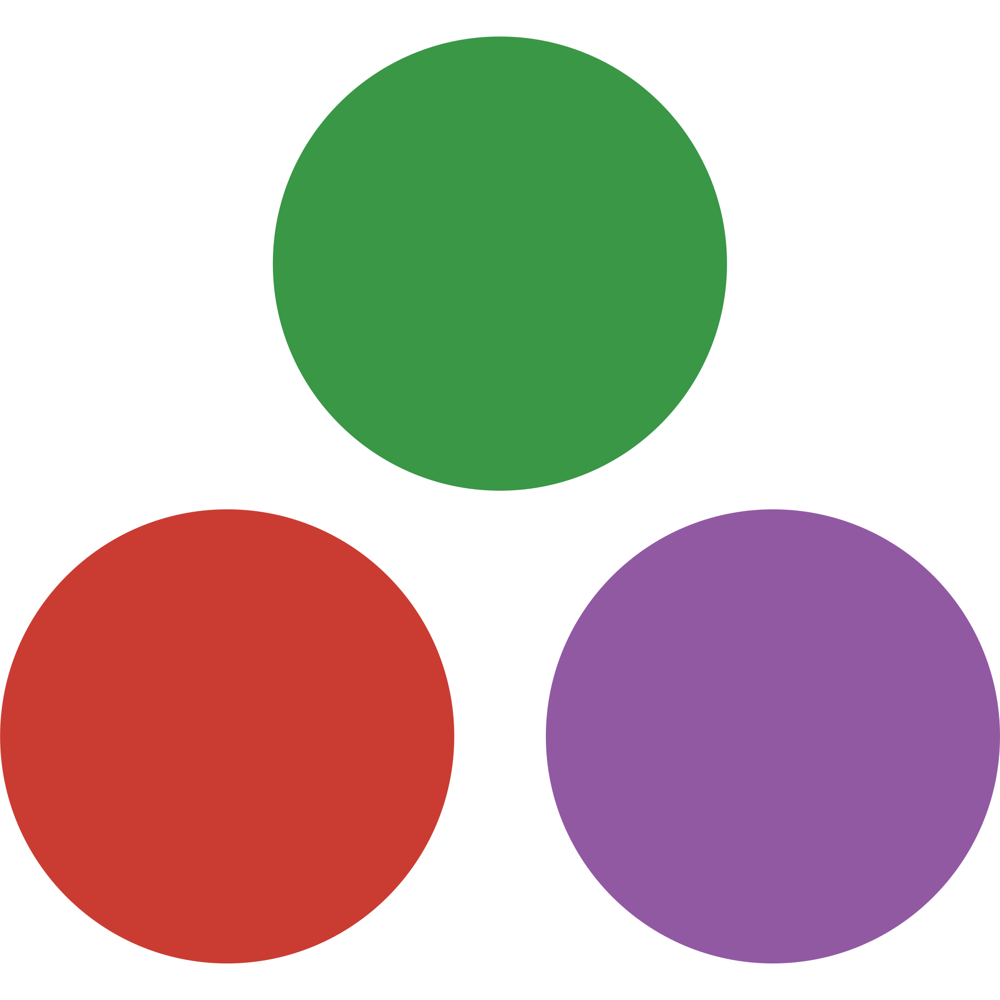
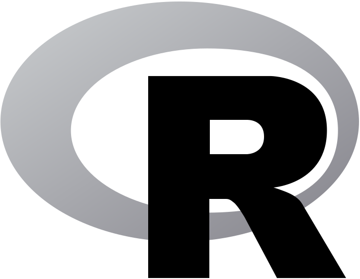
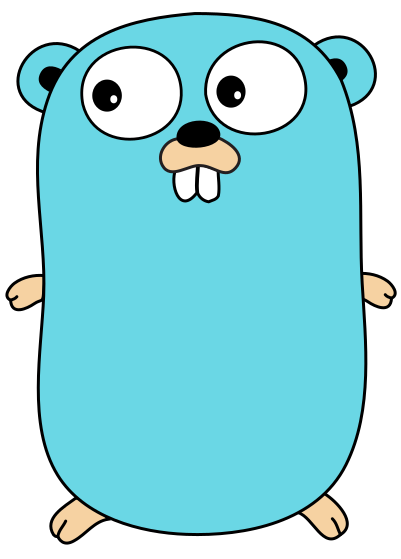

# Bindings to Other Languages

In addition to the [main C++ interface](../index.md), mlpack also provides
bindings via a simplified API to a number of other languages.  This binding API
is consistent across all languages, allowing for easy transition of mlpack code
between languages,

***Note:*** the binding API is not as flexible or general as the C++ interface;
to get the most out of mlpack, C++ is likely the better route to go.

## CLI (Command-line programs)

 - [CLI quickstart](../quickstart/cli.md)
 - [CLI API reference](bindings/cli.md)

## Python

 - [Python quickstart](../quickstart/python.md)
 - [Python API reference](bindings/python.md)

## Julia

 - [Julia quickstart](../quickstart/julia.md)
 - [Julia API reference](bindings/julia.md)

## R

 - [R quickstart](../quickstart/r.md)
 - [R API reference](bindings/r.md)

## Go

 - [Go quickstart](../quickstart/go.md)
 - [Go API reference](bindings/go.md)
