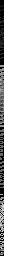
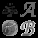

# Core math utilities

mlpack provides a number of mathematical utility classes and functions on top of
Armadillo.

 * [Aliases](#aliases): utilities to create and manage aliases (`MakeAlias()`,
   `ClearAlias()`, `UnwrapAlias()`).

 * [`Range`](#range): simple mathematical range (i.e. `[0, 3]`)

 * [`ColumnCovariance()`](#columncovariance): compute covariance of
   [column-major](../matrices.md#representing-data-in-mlpack) data

 * [`ColumnsToBlocks`](#columnstoblocks): reshape data points into a block
   matrix for visualization (useful for images)

 * [Distribution utilities](#distribution-utilities): `Digamma()`, `Trigamma()`

 * [`RandVector()`](#randvector): generate random vector on the unit sphere
   using the Box-Muller transform

 * [Logarithmic utilities](#logarithmic-utilities): `LogAdd()`, `AccuLog()`,
   `LogSumExp()`, `LogSumExpT()`.

 * [`MultiplyCube2Cube()`](#multiplycube2cube): multiply each slice in a cube by each slice in another cube
 * [`MultiplyMat2Cube()`](#multiplymat2cube): multiply a matrix by each slice in a cube
 * [`MultiplyCube2Mat()`](#multiplycube2mat): multiply each slice in a cube by a matrix
 * [`Quantile()`](#quantile): compute the quantile function of the Gaussian
   distribution

 * [RNG and random number utilities](#rng-and-random-number-utilities): extended
   scalar random number generation functions
 * [`RandomBasis()`](#randombasis): generate a random orthogonal basis
 * [`ShuffleData()`](#shuffledata): shuffle a dataset and associated labels

---

## Aliases

Aliases are matrix, vector, or cube objects that share memory with another
matrix, vector, or cube.  They are often used internally inside of mlpack to
avoid copies.

***Important caveats about aliases***:

 - An alias represents the same memory block as the input.  As such, changes to
   the alias object will also be reflected in the original object.

 - The `MakeAlias()` function is not guaranteed to return an alias; it only
   returns an alias *if possible*, and makes a copy otherwise.

 - If `mat` goes out of scope or is destructed, then `a` ***becomes invalid***.
   _You are responsible for ensuring an invalid alias is not used!_

---

 * `MakeAlias(a, vector, rows, cols, offset=0, strict=true)`
   - Make `a` into an alias of `vector` with the given size.
   - If `offset` is `0`, then the alias is identical: the first element of
     `a` is the first element of `vector`. Otherwise, the first element of `a`
     is the `offset`'th element of `vector`.
   - If `strict` is `true`, the size of `a` cannot be changed.
   - `vector` and `a` should have the same vector type (e.g. `arma::vec`,
     `arma::fvec`).
   - If an alias cannot be created, the vector will be copied.

 * `MakeAlias(a, mat, rows, cols, offset=0, strict=true)`
   - Make `a` into an alias of `mat` with the given size.
   - If `offset` is `0`, then the alias is identical: the first element of
     `a` is the first element of `mat`. Otherwise, the first element of `a`
     is the `offset`'th element of `mat`; elements in `mat` are ordered in
     a [column-major way](../matrices.md#representing-data-in-mlpack).
   - If `strict` is `true`, the size of `a` cannot be changed.
   - `mat` and `a` should have the same matrix type (e.g. `arma::mat`,
     `arma::fmat`, `arma::sp_mat`).
   - If an alias cannot be created, the matrix will be copied.  Sparse types
     cannot have aliases and will be copied.

 * `MakeAlias(a, cube, rows, cols, slices, offset=0, strict=true)`
   - Make `a` into an alias of `cube` with the given size.
   - If `offset` is `0`, then the alias is identical: the first element of
     `a` is the first element of `cube`. Otherwise, the first element of `a`
     is the `offset`'th element of `cube`; elements in `cube` are ordered in
     a [column-major way](../matrices.md#representing-data-in-mlpack).
   - If `strict` is `true`, the size of `a` cannot be changed.
   - `cube` and `a` should have the same cube type (e.g. `arma::cube`,
     `arma::fcube`).
   - If an alias cannot be created, the cube will be copied.

---

 * `ClearAlias(a)`
   - If `a` is an alias, reset `a` to an empty matrix, without modifying the
     aliased memory.  `a` is no longer an alias after this call.

---

 * `UnwrapAlias(a, in)`
   - If `in` is a matrix type (e.g. `arma::mat`), make `a` into an alias of
     `in`.
   - If `in` is not a matrix type, but instead, e.g., an Armadillo expression,
     fill `a` with the results of the evaluated expression `in`.
   - This can be used in place of, e.g., `a = in`, to avoid a copy when
     possible.
   - `a` should be a matrix type that matches the type of the expression or
     matrix `in`.

## `Range`

The `Range` class represents a simple mathematical range (i.e. `[0, 3]`),
with the bounds represented as `double`s.

### Constructors

 * `r = Range()`
   - Construct an empty range.

 * `r = Range(p)`
   - Construct the range `[p, p]`.

 * `r = Range(lo, hi)`
   - Construct the range `[lo, hi]`.

### Accessing and modifying range properties

 * `r.Lo()` and `r.Hi()` return the lower and upper bounds of the range as
   `double`s.
   - A range is considered empty if `r.Lo() > r.Hi()`.
   - These can be used to modify the bounds, e.g., `r.Lo() = 3.0`.

 * `r.Width()` returns the span of the range (i.e. `r.Hi() - r.Lo()`) as a
   `double`.

 * `r.Mid()` returns the midpoint of the range as a `double`.

### Working with ranges

 * Given two ranges `r1` and `r2`,
   - `r1 | r2` returns the union of the ranges,
   - `r1 |= r2` expands `r1` to include the range `r2`,
   - `r1 & r2` returns the intersection of the ranges (possibly an empty range),
   - `r1 &= r2` shrinks `r1` to the intersection of `r1` and `r2`,
   - `r1 == r2` returns `true` if the two ranges are strictly equal (i.e. lower
     and upper bounds are equal),
   - `r1 != r2` returns `true` if the two ranges are not strictly equal,
   - `r1 < r2` returns `true` if `r1.Hi() < r2.Lo()`,
   - `r1 > r2` returns `true` if `r1.Lo() > r2.Hi()`, and
   - `r1.Contains(r2)` returns `true` if the ranges overlap at all.

 * Given a range `r` and a `double` scalar `d`,
   - `r * d` returns a new range `[d * r.Lo(), d * r.Hi()]`,
   - `r *= d` scales `r.Lo()` and `r.Hi()` by `d`, and
   - `r.Contains(d)` returns `true` if `d` is contained in the range.

---

 * To use ranges with different element types (e.g. `float`), use the type
   `RangeType<float>` or similar.

### Usage example

```c++
mlpack::Range r1(5.0, 6.0); // [5, 6]
mlpack::Range r2(7.0, 8.0); // [7, 8]

mlpack::Range r3 = r1 | r2; // [5, 8]
mlpack::Range r4 = r1 & r2; // empty range

bool b1 = r1.Contains(r2); // false
bool b2 = r1.Contains(5.5); // true
bool b3 = r1.Contains(r3); // true
bool b4 = r3.Contains(r4); // false

// Create a range of `float`s and a range of `int`s.
mlpack::RangeType<float> r5(1.0f, 1.5f); // [1.0, 1.5]
mlpack::RangeType<int> r6(3, 4); // [3, 4]
```

---

`Range` is used by:

 * [`RangeSearch`](/src/mlpack/methods/range_search/range_search.hpp)
 * [mlpack trees](../../developer/trees.md) <!-- TODO: link to local trees section -->

## `ColumnCovariance()`

 * `ColumnCovariance(X, normType=0)`
   - `X`: a [column-major](../matrices.md#representing-data-in-mlpack) data
     matrix
   - `normType`: either `0` or `1` (see below)

 * Computes the covariance of the data matrix `X`.

 * Equivalent to `arma::cov(X.t(), normType)`, but avoids computing the
   transpose and is thus slightly more efficient.

 * `normType` controls the type of normalization done when computing the
   covariance:
   - `0` will normalize with `X.n_cols - 1`, providing the best unbiased
     estimation of the covariance matrix (if the columns are from a normal
     distribution);
   - `1` will normalize with `X.n_cols`, providing the second moment about the
     mean of the columns.

 * Any dense matrix type can be used so long as it supports the Armadillo API
   (e.g., `arma::mat`, `arma::fmat`, etc.).

Example:

```c++
// Generate a random data matrix with 100 points in 5 dimensions.
arma::mat data(5, 100, arma::fill::randu);

// Compute the covariance matrix of the column-major matrix.
arma::mat cov = mlpack::ColumnCovariance(data);
cov.print("Covariance of random matrix:");
```

## `ColumnsToBlocks`

The `ColumnsToBlocks` class provides a way to transform data points (e.g.
columns in a matrix) into a block matrix format, primarily useful for
visualization as an image.

As a simple example, given a matrix with four columns `A`, `B`, `C`, and `D`,
`ColumnsToBlocks` can transform this matrix into the form

```
[[m m m m m]
 [m A m B m]
 [m m m m m]
 [m C m D m]
 [m m m m m]]
```

where `m` is a margin, and where each column may itself be reshaped into a
block.

### Constructors

 * `ctb = ColumnsToBlocks(rows, cols)`
   - Create a `ColumnsToBlocks` object that will reshape the input matrix into
     blocks of shape `rows` by `cols`.
   - Each input column will be reshaped into a square (e.g. `ctb.BlockHeight()`
     and `ctb.BlockWidth()` are set to `0`).

 * `ctb = ColumnsToBlocks(rows, cols, blockHeight, blockWidth)`
   - Create a `ColumnsToBlocks` object that will reshape the input matrix into
     blocks of shape `rows` by `cols`.
   - Each individual column will also be reshaped into a block of shape
     `blockHeight` by `blockWidth`.

### Properties

 * `ctb.Rows(rows)` will set the number of rows in the block output to `rows`.
   - `ctb.Rows()` will return a `size_t` with the current setting.

 * `ctb.Cols(cols)` will set the number of columns in the block output to
   `cols`.
   - `ctb.Cols()` will return a `size_t` with the current setting.

 * `ctb.BlockHeight(blockHeight)` will set the number of rows in each individual
   block to `blockHeight`.
   - `ctb.BlockHeight()` will return a `size_t` with the current setting.
   - If `ctb.BlockHeight()` is `0`, each input column will be reshaped into a
     square; if this is not possible, an exception will be thrown.

 * `ctb.BlockWidth()` will set the number of columns in each individual block to
   `blockWidth`.
   - `ctb.BlockWidth()` will return a `size_t` with the current setting.
   - If `ctb.BlockWidth()` is `0`, each input column will be reshaped into a
     square; if this is not possible, an exception will be thrown.

 * `ctb.BufSize(bufSize)` will set the number of margin elements to `bufSize`.
   - `ctb.BufSize()` will return a `size_t` with the current setting.
   - The default setting is `1`.

 * `ctb.BufValue(bufValue)` will set the element used for margins to `bufValue`.
   - `ctb.BufValue()` will return a `size_t` with the current setting.
   - The default setting is `-1.0`.

### Scaling values

`ColumnsToBlocks` also has the capability of linearly scaling values of the
inputs to a given range.

 * `ctb.Scale(true)` enables scaling values.
   - By default scaling is disabled.
   - `ctb.Scale(false)` will disable scaling.
   - `ctb.Scale()` will return a `bool` indicating whether scaling is enabled.

 * `ctb.MinRange(value)` sets the lower bound of the scaling range to `value`.
   - `ctb.MinRange()` returns the current value as a `double`.

 * `ctb.MaxRange(value)` sets the upper bound of the scaling range to `value`.
   - `ctb.MaxRange()` returns the current value as a `double`.
   - Must be greater than `ctb.MinRange()`, if `ctb.Scale() == true`.

***Note:*** the margin element (`ctb.BufValue()`) is considered during the
scaling process.

### Transforming into block format

 * `ctb.Transform(input, output)` will perform the columns-to-blocks
   transformation on the given matrix `input`, storing the result in the matrix
   `output`.
   - An exception will be thrown if `input.n_rows` is not equal to
     `ctb.BlockHeight() * ctb.BlockWidth()` (if neither of those are `0`).
   - If either `ctb.BlockHeight()` or `ctb.BlockWidth()` is `0`, each column
     will be reshaped into a square, and an exception will be thrown if
     `input.n_rows` is not a perfect square (i.e. if `sqrt(input.n_rows)` is not
     an integer).

### Examples

Reshape two 4-element vectors into one row of two blocks.

```c++
// This matrix has two columns.
arma::mat input;
input = { { -1.0000, 0.1429 },
          { -0.7143, 0.4286 },
          { -0.4286, 0.7143 },
          { -0.1429, 1.0000 } };
input.print("Input columns:");

arma::mat output;
mlpack::ColumnsToBlocks ctb(1, 2);
ctb.Transform(input, output);

// The columns of the input will be reshaped as a square which is
// surrounded by padding value -1 (this value could be changed with the
// BufValue() method):
// -1.0000  -1.0000  -1.0000  -1.0000  -1.0000  -1.0000  -1.0000
// -1.0000  -1.0000  -0.4286  -1.0000   0.1429   0.7143  -1.0000
// -1.0000  -0.7143  -0.1429  -1.0000   0.4286   1.0000  -1.0000
// -1.0000  -1.0000  -1.0000  -1.0000  -1.0000  -1.0000  -1.0000
output.print("Output using 2x2 block size:");

// Now, let's change some parameters; let's have each input column output not
// as a square, but as a 4x1 vector.
ctb.BlockWidth(1);
ctb.BlockHeight(4);
ctb.Transform(input, output);

// The output here will be similar, but each maximal input is 4x1:
// -1.0000 -1.0000 -1.0000 -1.0000 -1.0000
// -1.0000 -1.0000 -1.0000  0.1429 -1.0000
// -1.0000 -0.7143 -1.0000  0.4286 -1.0000
// -1.0000 -0.4286 -1.0000  0.7143 -1.0000
// -1.0000 -0.1429 -1.0000  1.0000 -1.0000
// -1.0000 -1.0000 -1.0000 -1.0000 -1.0000
output.print("Output using 4x1 block size:");
```

---

Load simple images and reshape into blocks.

```c++
// Load some favicons from websites associated with mlpack.
std::vector<std::string> images;
// See the following files:
// - https://datasets.mlpack.org/images/mlpack-favicon.png
// - https://datasets.mlpack.org/images/ensmallen-favicon.png
// - https://datasets.mlpack.org/images/armadillo-favicon.png 
// - https://datasets.mlpack.org/images/bandicoot-favicon.png
images.push_back("mlpack-favicon.png");
images.push_back("ensmallen-favicon.png");
images.push_back("armadillo-favicon.png");
images.push_back("bandicoot-favicon.png");

mlpack::data::ImageInfo info;
info.Channels() = 1; // Force loading in grayscale.

arma::mat matrix;
mlpack::data::Load(images, matrix, info, true);

// Now `matrix` has 4 columns, each of which is an individual image.
// Let's save that as its own image just for visualization.
mlpack::data::ImageInfo outInfo(matrix.n_cols, matrix.n_rows, 1);
mlpack::data::Save("favicons-matrix.png", matrix, outInfo, true);

// Use ColumnsToBlocks to create a 2x2 block matrix holding each image.
mlpack::ColumnsToBlocks ctb(2, 2);
ctb.BufValue(0.0); // Use 0 for the margin value.
ctb.BufSize(2); // Use 2-pixel margins.

arma::mat blocks;
ctb.Transform(matrix, blocks);

mlpack::data::ImageInfo blockOutInfo(blocks.n_cols, blocks.n_rows, 1);
mlpack::data::Save("favicons-blocks.png", blocks, blockOutInfo, true);
```

The resulting images (before and after using `ColumnsToBlocks`) are shown below.

*Before*:

<center>

</center>

*After*:

<center>

</center>

### See also

 * [Loading and saving image data](../load_save.md#image-data)
 * [`SparseAutoencoder`](/src/mlpack/methods/sparse_autoencoder/sparse_autoencoder.hpp)

## Distribution utilities

 * `Digamma(x)` returns the logarithmic derivative of the gamma function (see
   [Wikipedia](https://en.wikipedia.org/wiki/Digamma_function)).
    - `x` should have type `double`.
    - The return type is `double`.

 * `Trigamma(x)` returns the
   [trigamma function](https://en.wikipedia.org/wiki/Trigamma_function) at the
   value `x`.
    - `x` should have type `double`.
    - The return type is `double`.

 * Both of these functions are used internally by the
   [`GammaDistribution`](distributions.md#gammadistribution) class.

*Example*:

```
const double d1 = mlpack::Digamma(0.25);
const double d2 = mlpack::Digamma(1.0);

const double t1 = mlpack::Trigamma(0.25);
const double t2 = mlpack::Trigamma(1.0);

std::cout << "Digamma(0.25):  " << d1 << "." << std::endl;
std::cout << "Digamma(1.0):   " << d2 << "." << std::endl;
std::cout << "Trigamma(0.25): " << t1 << "." << std::endl;
std::cout << "Trigamma(1.0):  " << t2 << "." << std::endl;
```

## `RandVector()`

 * `RandVector(v)` generates a random vector on the unit sphere (i.e. with an
   L2-norm of 1) and stores it in the vector `v`.

 * `v` should be a dense floating-point Armadillo vector (e.g. `arma::vec` or
   `arma::fvec`).

 * The [Box-Muller transform](https://en.wikipedia.org/wiki/Box-Muller_transform)
   is used to generate the vector.

 * `v` is not resized, and should have size equal to the desired dimensionality
   when `RandVector()` is called.

*Example*:

```
// Generate a random 10-dimensional vector.
arma::vec v;
v.set_size(10);
RandVector(v);
v.print("Random 10-dimensional vector: ");

std::cout << "Random 10-dimensional vector: " << std::endl;
std::cout << v.t();
std::cout << "L2-norm of vector (should be 1): " << arma::norm(v, 2) << "."
    << std::endl;
```

## Logarithmic utilities

mlpack contains a few functions that are useful for working with logarithms, or
vectors containing logarithms.

 * `LogAdd(x, y)` for scalars `x` and `y` (e.g. `double`, `float`, `int`, etc.)
   will return `log(e^x + e^y)`.

 * `AccuLog(v)`, given a vector `v` containing log values, will return the
   scalar log-sum of those values:
   `log(e^(v[0]) + e^(v[1]) + ... + e^(v[v.n_elem - 1]))`.

---

 * `LogSumExp(m, out)`, given a matrix `m` (`arma::mat`) containing log values,
   will compute the scalar log-sum of each *column*, storing the result in the
   column vector `out` (type `arma::vec`).
   - `out` will be set to size `m.n_cols`.
   - `out[i]` will be equal to `AccuLog(m.col(i))`.
   - Different element types can be used for `m` and `out` (e.g. `arma::fmat`
     and `arma::fvec`).

 * `LogSumExpT(m, out)`, given a matrix `m` (type `arma::mat`) containing log
   values, will compute the scalar log-sum of each *row*, storing the result in
   the column vector `out` (type `arma::vec`)
   - `out` will be set to size `m.n_rows`.
   - `out[i]` will be equal to `AccuLog(m.row(i))`.
   - Different element types can be used for `m` and `out` (e.g. `arma::fmat`
     and `arma::fvec`).

---

 * `LogSumExp<eT, true>(m, out)` performs an incremental sum, otherwise
   identical to `LogSumExp()`.
   - The input values of `out` are not ignored.
   - `out[i]` will be equal to `log(e^(out[i]) + e^(AccuLog(m.col(i))))`.
   - `eT` represents the element type of `m` and `out` (e.g., `double` if `m` is
     `arma::mat` and `out` is `arma::vec`).

 * `LogSumExpT<eT, true>(m, out)` performs an incremental sum, otherwise
   identical to `LogSumExpT()`.
   - The input values of `out` are not ignored.
   - `out[i]` will be equal to `log(e^(out[i]) + e^(AccuLog(m.row(i))))`.
   - `eT` represents the element type of `m` and `out` (e.g., `double` if `m` is
     `arma::mat` and `out` is `arma::vec`).

## `MultiplyCube2Cube()`

 * `z = MultiplyCube2Cube(x, y, transX=false, transY=false)`
   - Inputs `x` and `y` are cubes (e.g. `arma::cube`), and must have the same
     number of slices
   - `z` is a cube whose slices are the slices of `x` and `y` multiplied
   - `transX` and `transY` indicate whether each slice of `x` and `y` should be
     transposed before multiplication.

 * If `transX` and `transY` are `false`, then
   `z.slice(i) = x.slice(i) * y.slice(i)`.

 * If `transX` is `false` and `transY` is `true`, then
   `z.slice(i) = x.slice(i) * y.slice(i).t()`.

 * The inner dimensions of `x` and `y` must match for multiplication, or an
   exception will be thrown.

*Example usage:*

```c++
// Generate two random cubes.
arma::cube x(10, 100, 5, arma::fill::randu); // 5 matrices, each 10x100.
arma::cube y(12, 100, 5, arma::fill::randu); // 5 matrices, each 12x100.

arma::cube z = mlpack::MultiplyCube2Cube(x, y, false, true);

// Output size should be 10x12x5.
std::cout << "Output size: " << z.n_rows << "x" << z.n_cols << "x" << z.n_slices
    << "." << std::endl;
```

## `MultiplyMat2Cube()`

 * `z = MultiplyMat2Cube(x, y, transX=false, transY=false)`
   - Input `x` is a matrix and `y` is a cube (e.g. `arma::cube`).
   - `z` is a cube whose slices are `x` multiplied by the slices of `y`.
   - `transX` and `transY` indicate whether `x` and each slice of `y` should be
     transposed before multiplication.

 * If `transX` and `transY` are `false`, then `z.slice(i) = x * y.slice(i)`.

 * If `transX` is `false` and `transY` is `true`, then
   `z.slice(i) = x * y.slice(i).t()`.

 * The inner dimensions of `x` and `y` must match for multiplication, or an
   exception will be thrown.

*Example usage:*

```c++
// Generate random inputs.
arma::mat  x(10, 100,    arma::fill::randu); // Random 10x100 matrix.
arma::cube y(12, 100, 5, arma::fill::randu); // 5 matrices, each 12x100.

arma::cube z = mlpack::MultiplyMat2Cube(x, y, false, true);

// Output size should be 10x12x5.
std::cout << "Output size: " << z.n_rows << "x" << z.n_cols << "x" << z.n_slices
    << "." << std::endl;
```

## `MultiplyCube2Mat()`

 * `z = MultiplyCube2Mat(x, y, transX=false, transY=false)`
   - Input `x` is a cube (e.g. `arma::cube`) and `y` is a matrix.
   - `z` is a cube whose slices are the slices of `x` multiplied with `y`.
   - `transX` and `transY` indicate whether each slice of `x` and `y` should be
     transposed before multiplication.

 * If `transX` and `transY` are `false`, then `z.slice(i) = x.slice(i) * y`.

 * If `transX` is `true` and `transY` is `false`, then
   `z.slice(i) = x.slice(i).t() * y`.

 * The inner dimensions of `x` and `y` must match for multiplication, or an
   exception will be thrown.

*Example usage:*

```c++
// Generate two random cubes.
arma::cube x(12, 50, 5, arma::fill::randu); // 5 matrices, each 12x50.
arma::mat  y(12, 60,    arma::fill::randu); // Random 12x60 matrix.

arma::cube z = mlpack::MultiplyCube2Mat(x, y, true, false);

// Output size should be 50x60x5.
std::cout << "Output size: " << z.n_rows << "x" << z.n_cols << "x" << z.n_slices
    << "." << std::endl;
```

## `Quantile()`

 * Compute the quantile function of the Gaussian distribution at the given
   probability.

 * `double q = Quantile(p, mu=0.0, sigma=1.0)`
   - `q` is the computed quantile.
   - `p` is the probability to compute the quantile of (between 0 and 1).
   - `mu` is the (optional) mean of the Gaussian distribution.
   - `sigma` is the (optional) standard deviation of the Gaussian distribution.
   - All arguments are `double`s.

 * See also [Quantile function on Wikipedia](https://en.wikipedia.org/wiki/Quantile_function).

*Example usage:*

```c++
// 70% of points from N(0, 1) are less than q1 = 0.524.
double q1 = mlpack::Quantile(0.7);

// 90% of points from N(0, 1) are less than q2 = 1.282.
double q2 = mlpack::Quantile(0.9);

// 50% of points from N(1, 1) are less than q3 = 1.0.
double q3 = mlpack::Quantile(0.5, 1.0); // Quantile of 1.0 for N(1, 1) is 1.0.

// 10% of points from N(1, 0.1) are less than q4 = 0.871.
double q4 = mlpack::Quantile(0.1, 1.0, 0.1);

std::cout << "Quantile(0.7): " << q1 << "." << std::endl;
std::cout << "Quantile(0.9): " << q2 << "." << std::endl;
std::cout << "Quantile(0.5, 1.0): " << q3 << "." << std::endl;
std::cout << "Quantile(0.1, 1.0, 0.1): " << q4 << "." << std::endl;
```

## RNG and random number utilities

On top of the random number generation support that Armadillo provides via
[randu()](https://arma.sourceforge.net/docs.html#randu),
[randn()](https://arma.sourceforge.net/docs.html#randn), and
[randi()](https://arma.sourceforge.net/docs.html#randi), mlpack provides
a few additional thread-safe random number generation functions for generating
random scalar values.

 * `RandomSeed(seed)` will set the random seed of mlpack's RNGs ***and***
   Armadillo's RNG to `seed`.
   - This internally calls `arma::arma_rng::set_seed()`.
   - In a multithreaded application, each thread's RNG will be deterministically
     set to a different value based on `seed`.

 * `Random()` returns a random `double` uniformly distributed between `0` and
   `1`, *not including 1*.

 * `Random(lo, hi)` returns a random `double` uniformly distributed between `lo`
   and `hi`, *not including `hi`*.

 * `RandBernoulli(p)` samples from a Bernoulli distribution with parameter `p`:
   with probability `p`, `1` is returned; with probability `1 - p`, `0` is
   returned.

 * `RandInt(hiExclusive)` returns a random `int` uniformly distributed in the
   range `[0, hiExclusive)`.

 * `RandInt(lo, hiExclusive)` returns a random `int` uniformly distributed in
   the range `[lo, hiExclusive)`.

 * `RandNormal()` returns a random `double` normally distributed with mean `0`
   and standard deviation `1`.

 * `RandNormal(mean, stddev)` returns a random `double` normally distributed
   with mean `mean` and standard deviation `stddev`.

*Examples*:

```c++
mlpack::RandomSeed(123); // Set a specific random seed.

const double r1 = mlpack::Random();             // In the range [0, 1).
const double r2 = mlpack::Random(3, 4);         // In the range [3, 4).
const double r3 = mlpack::RandBernoulli(0.25);  // P(1) = 0.25.
const int    r4 = mlpack::RandInt(10);          // In the range [0, 10).
const int    r5 = mlpack::RandInt(5, 10);       // In the range [5, 10).
const double r6 = mlpack::RandNormal();         // r6 ~ N(0, 1).
const double r7 = mlpack::RandNormal(2.0, 3.0); // r7 ~ N(2, 3).

std::cout << "Random():            " << r1 << "." << std::endl;
std::cout << "Random(3, 4):        " << r2 << "." << std::endl;
std::cout << "RandBernoulli(0.25): " << r3 << "." << std::endl;
std::cout << "RandInt(10):         " << r4 << "." << std::endl;
std::cout << "RandInt(5, 10):      " << r5 << "." << std::endl;
std::cout << "RandNormal():        " << r6 << "." << std::endl;
std::cout << "RandNormal(2, 3):    " << r7 << "." << std::endl;
```

## `RandomBasis()`

The `RandomBasis()` function generates a random d-dimensional orthogonal basis.

 * `RandomBasis(basis, d)` fills the matrix `basis` with `d` orthogonal vectors,
   each of dimension `d`.
   - `basis.col(i)` represents the `i`th basis vector.
   - `basis` will have size `d` rows by `d` cols.

 * The random basis is generated using the QR decomposition.

*Example*:

```c++
arma::mat basis;

// Generate a 10-dimensional random basis.
mlpack::RandomBasis(basis, 10);

// Each two vectors are orthogonal.
std::cout << "Dot product of basis vectors 2 and 4: "
    << arma::dot(basis.col(2), basis.col(4))
    << " (should be zero or very close!)." << std::endl;
```

## `ShuffleData()`

Shuffle a [column-major](../matrices.md#representing-data-in-mlpack) dataset and
associated labels/responses, optionally with weights.  This preserves the
connection of each data point to its label (and optionally its weight).

 * `ShuffleData(inputData, inputLabels, outputData, outputLabels)`
   - Randomly permute data points and labels from `inputData` and `inputLabels`
     into `outputData` and `outputLabels`.
   - `outputData` will be set to the same size as `inputData`.
   - `outputLabels` will be set to the same size as `inputLabels`.
   - `inputData` can be a dense matrix, a sparse matrix, or a cube, with any
     element type.  (That is, `inputData` may have type `arma::mat`,
     `arma::fmat`, `arma::sp_mat`, `arma::cube`, etc.)
   - `inputLabels` must be a dense vector type but may hold any element type
     (e.g.  `arma::Row<size_t>`, `arma::uvec`, `arma::vec`, etc.).
   - `outputData` must have the same type as `inputData`, and `outputLabels`
     must have the same type as `inputLabels`.

 * `ShuffleData(inputData, inputLabels, inputWeights, outputData, outputLabels, outputWeights)`
   - Identical to the previous overload, but also handles weights via
     `inputWeights` and `outputWeights`.
   - `inputWeights` must be a dense vector type but may hold any element type
     (e.g.  `arma::rowvec`, `arma::frowvec`, `arma::vec`, etc.)
   - `outputWeights` must have the same type as `inputWeights`.

***Note:*** when `inputData` is a cube (e.g. `arma::cube` or similar), the
columns of the cube will be shuffled.

*Example usage:*

```c++
// See https://datasets.mlpack.org/iris.csv.
arma::mat dataset;
mlpack::data::Load("iris.csv", dataset, true);
// See https://datasets.mlpack.org/iris.labels.csv.
arma::Row<size_t> labels;
mlpack::data::Load("iris.labels.csv", labels, true);

// Now shuffle the points in the iris dataset.
arma::mat shuffledDataset;
arma::Row<size_t> shuffledLabels;
mlpack::ShuffleData(dataset, labels, shuffledDataset, shuffledLabels);

std::cout << "Before shuffling, the first point was: " << std::endl;
std::cout << "  " << dataset.col(0).t();
std::cout << "with label " << labels[0] << "." << std::endl;
std::cout << std::endl;
std::cout << "After shuffling, the first point is: " << std::endl;
std::cout << "  " << shuffledDataset.col(0).t();
std::cout << "with label " << shuffledLabels[0] << "." << std::endl;

// Generate random weights, then shuffle those also.
arma::rowvec weights(dataset.n_cols, arma::fill::randu);
arma::rowvec shuffledWeights;
mlpack::ShuffleData(dataset, labels, weights, shuffledDataset, shuffledLabels,
    shuffledWeights);

std::cout << std::endl << std::endl;
std::cout << "Before shuffling with weights, the first point was: "
    << std::endl;
std::cout << "  " << dataset.col(0).t();
std::cout << "with label " << labels[0] << " and weight " << weights[0] << "."
    << std::endl;
std::cout << std::endl;
std::cout << "After shuffling with weights, the first point is: " << std::endl;
std::cout << "  " << shuffledDataset.col(0).t();
std::cout << "with label " << shuffledLabels[0] << " and weight "
    << shuffledWeights[0] << "." << std::endl;
```
