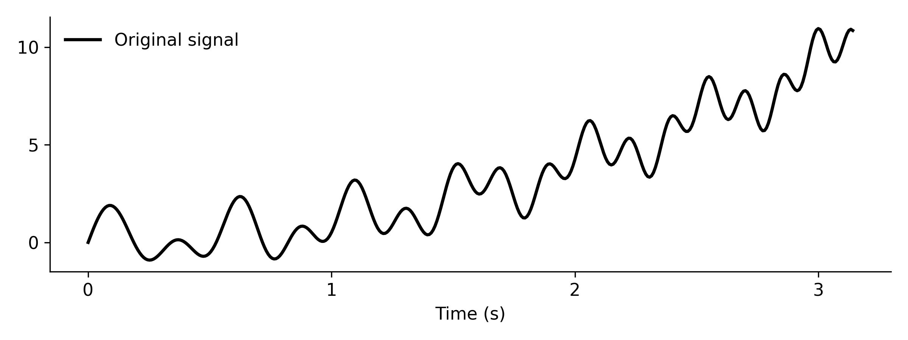
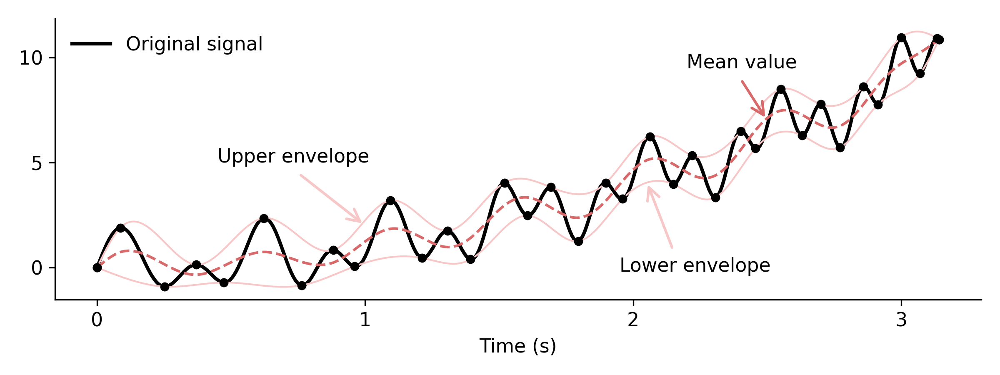
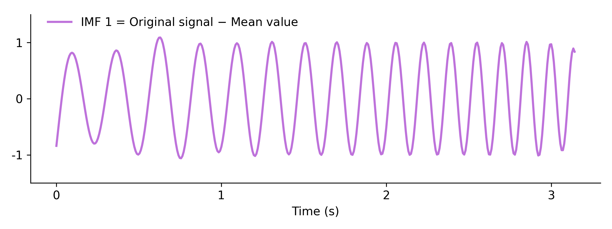

# `EMD`

Empirical Mode Decomposition (EMD) adaptively decomposes a 1D signal into a
small set of Intrinsic Mode Functions (IMFs) plus a residue. This is often used
for vibration/sensor pipelines as a time-domain alternative to FFT.

## Inputs

- `signal` (`arma::Col<eT>`): uniformly sampled 1D signal (any Armadillo
  column type / scalar `eT`).
- `maxImfs` (`size_t`, default `10`): maximum number of IMFs to extract.
- `maxSiftIter` (`size_t`, default `10`): maximum sifting iterations per IMF.
- `tol` (`double`, default `1e-3`): sifting stopping tolerance on the mean
  envelope ratio (see notes below).

## Outputs

- `imfs` (`arma::Mat<eT>`): shape `N x K`, each column an IMF, `K <= maxImfs`.
- `residue` (`arma::Col<eT>`): final residual signal after removing all IMFs.

## Reconstruction

The original signal can be reconstructed as

`signal ~ Σ_k imfs.col(k) + residue`

*Original signal:*

<p align="center">
  
</p>

*Original signal with envelopes about the local minima and maxima:*

<p align="center">
  
</p>

*The first IMF extracted from the original signal via sifting:*

<p align="center">
  
</p>

## Example

Create some periodic, time-varying signal `S`.

```c++
const arma::uword N = 400;
const double tMin = 0.0;
const double tMax = arma::datum::pi;
arma::vec T = arma::linspace<arma::vec>(tMin, tMax, N);

// S = sin(20*T*(1 + 0.2*T)) + T**2 + sin(13*T)
arma::vec S =
    arma::sin( 20.0 * T % (1.0 + 0.2 * T) ) +
    arma::square(T) +
    arma::sin(13.0 * T);
```

Then you can pass `S` into `EMD` by specifying the number of IMFs,
the maximum number of sifting operations per IMF, and the tolerance. 
A smaller tolerance sets a stricter stopping criterion. The algorithim will
terminates when either `maxSiftIter` is reached or the `tol` is satisfied, 
whichever occurs first. 

```c++
arma::mat imfs;
arma::vec residue;

// Use up to 10 IMFs, 50 sifts per IMF, tol = 1e-3
mlpack::EMD(signal, imfs, residue, 5, 50, 5e-6);
```

Check if the `EMD` parameters are appropriate by computing the
dominant frequency of the first IMFs. Using an FFT, the first
IMF should be consistent with the highest freqeuncies present in the signal.
Given our signal, the frequency increases from ~3 Hz in the first second 
to ~7 Hz in the third second. 

```c++
// Print dominant frequency for the first 3 IMFs 
//check if EMD is extracting the correct IMFs
const size_t numToShow = std::min<size_t>(3, imfs.n_cols);
const double dt = t(1) - t(0);
const double fs = 1.0 / dt;
for (size_t k = 0; k < numToShow; ++k)
{
  arma::cx_vec spectrum = arma::fft(imfs.col(k));
  arma::vec mag = arma::abs(spectrum.rows(0, spectrum.n_elem / 2));
  arma::uword idx = 0;
  mag.max(idx);
  const double peakHz = (double) idx * fs / spectrum.n_elem;
  std::cout << "IMF " << k << " peak freq: " << peakHz << " Hz" << std::endl;
}
```