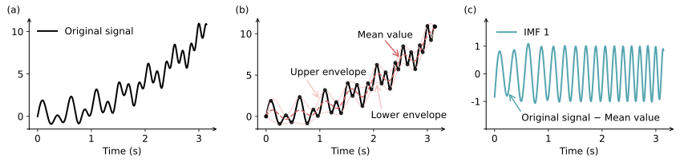

# Signal preprocessing

mlpack provides Empirical Mode Decomposition (`EMD`) to preprocess signals
for training and testing.  This can be used for signal monitoring pipelines
in nonlinear and nonstationary problems.

* `EMD()`: adaptively decomposes a 1D signal into a set of Intrinsic Mode
 Functions (IMFs) plus a residue.
<!-- TODO: add EEMD and CEEMDAN -->

## EMD 
The `EMD()` function can be used to extract IMFs from a uniformly sample 
periodic signal:

#### `EMD()` Parameters

- `EMD(signal, imfs, residue, maxImfs = 10 , maxSiftIter = 50, tol = 1e-3)`
   * `signal` is a [column vector](../../matrices.md) containing the 1D signal
     data (e.g. `arma::vec`); the sequence must be uniformly sampled.

   * `imfs` is a [matrix](../../matrices.md) that will be modified to contain
     the extracted IMFs. It will have shape `N x K`, where `N` is the length
     of `signal` and `K` is the number of extracted IMFs.

   * `residue` is a column vector (of length `N`) that will be modified to
     contain the final residual signal after extracting the IMFs.

   * `maxImfs` (of type `size_t`) is the maximum number of IMFs to extract.

   * `maxSiftIter` (of type `size_t`) is the maximum sifting iterations per IMF.

   * `tol` (`double`) is the stopping tolerance used on sifting iterations.

   * ***NOTES:*** the original signal can be reconstructed as the sum of the
      imfs and residue. 

   * The stopping criterion is based on the normalized mean envelope magnitude.

   * Sifting will terminate when zero-crossings and extrema are equal or
     differing by at most one. Specifically, the S-number is set to S=1.

*Original signal(a);*
*Original signal with envelopes about the local minima and maxima(b)*
*The first IMF extracted from the original signal via sifting(c)*

<p align="center">
  
</p>

Example using `EMD` on a time-varying signal `S`.

```c++
const arma::uword N = 400;
const double tMin = 0.0;
const double tMax = arma::datum::pi;
arma::vec time = arma::linspace(tMin, tMax, N);

// signal = sin(20*T*(1 + 0.2*T)) + T**2 + sin(13*T)
// see figure above 
arma::vec signal =
    arma::sin( 20.0 * time % (1.0 + 0.2 * time) ) +
    arma::square(time) + arma::sin(13.0 * time);

arma::mat imfs;
arma::vec residue;

// Use up to 5 IMFs, 50 sifts per IMF, tol = 1e-6
mlpack::EMD(signal, imfs, residue, 5, 50, 5e-6);

// Print dominant frequency for the first 3 IMFs 
// to check if EMD is extracting the correct IMFs
const size_t numToShow = std::min<size_t>(3, imfs.n_cols);
const double dt = time(1) - time(0);
const double fs = 1.0 / dt;
for (size_t k = 0; k < numToShow; ++k)
{
  arma::cx_vec spectrum = arma::fft(imfs.col(k));
  // Use only the first half of the spectrum
  arma::vec mag = arma::abs(spectrum.rows(0, spectrum.n_elem / 2));
  arma::uword idx = mag.index_max();
  const double peakHz = (double) idx * fs / spectrum.n_elem;
  std::cout << "IMF " << k << " peak freq: " << peakHz << " Hz" << std::endl;
}
```

***NOTE*** 
- A smaller tolerance sets a stricter stopping criterion. The algorithm will
terminate when either `maxSiftIter` is reached or the `tol` is satisfied,
whichever occurs first.

#### See also:

 * [Empirical Mode Decomposition on Wikipedia](https://en.wikipedia.org/wiki/Hilbert%E2%80%93Huang_transform#Empirical_mode_decomposition)
 * [EMD for nonlinear and non-stationary time series analysis](https://ui.adsabs.harvard.edu/abs/1998RSPSA.454..903H/abstract) (original EMD paper)
