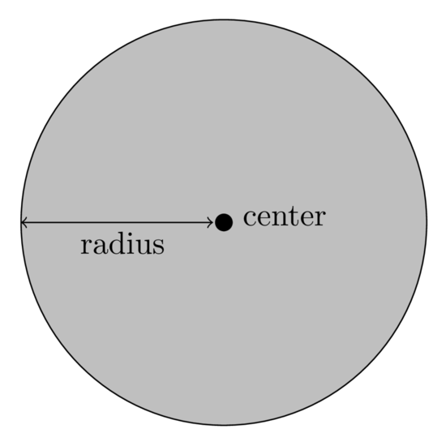

# `BinarySpaceTree`

The `BinarySpaceTree` class represents a generic multidimensional binary space
partitioning tree.  It is heavily templatized to control splitting behavior and
other behaviors, and is the actual class underlying trees such as the
[`KDTree`](kdtree.md).  In general, the `BinarySpaceTree` class is not meant to
be used directly, and instead one of the numerous variants should be used
instead:

 * [`KDTree`](kdtree.md)
 * [`MeanSplitKDTree`](mean_split_kdtree.md)

---

For users who want to use `BinarySpaceTree` directly or with custom behavior,
the full class is still detailed in the subsections below.  `BinarySpaceTree`
supports the [TreeType API](../../../developer/trees.md#the-treetype-api) and
can be used with mlpack's tree-based algorithms, although using custom behavior
may require a template typedef.

 * [Template parameters](#template-parameters)
 * [Constructors](#constructors)
 * [Basic tree properties](#basic-tree-properties)
 * [Bounding distances with the tree](#bounding-distances-with-the-tree)
 * [`BoundType`](#boundtype) template parameter
 * [`StatisticType`](#statistictype) template parameter
 * [`SplitType`](#splittype) template parameter
 * [Tree traversals](#tree-traversals)
 * [Example usage](#example-usage)

## See also

<!-- TODO: add links to all distance-based algorithms and other trees? -->

 * [`KDTree`](kdtree.md)
 * [`MeanSplitKDTree`](mean_split_kdtree.md)
 * [Binary space partitioning on Wikipedia](https://dl.acm.org/doi/pdf/10.1145/361002.361007)
 * [Tree-Independent Dual-Tree Algorithms (pdf)](https://www.ratml.org/pub/pdf/2013tree.pdf)

## Template parameters

The `BinarySpaceTree` class takes five template parameters.  The first three of
these are required by the
[TreeType API](../../../developer/trees.md#template-parameters-required-by-the-treetype-policy)
(see also
[this more detailed section](../../../developer/trees.md#template-parameters)). The
full signature of the class is:

```
template<typename DistanceType,
         typename StatisticType,
         typename MatType,
         template<typename BoundDistanceType,
                  typename BoundElemType,
                  typename...> class BoundType,
         template<typename SplitBoundType,
                  typename SplitMatType> class SplitType>
class BinarySpaceTree;
```

 * `DistanceType`: the [distance metric](../distances.md) to use for distance
   computations.  By default, this is
   [`EuclideanDistance`](../distances.md#lmetric).

 * `StatisticType`: this holds auxiliary information in each tree node.  By
   default, [`EmptyStatistic`](#emptystatistic) is used, which holds no
   information.
   - See the [`StatisticType`](#statistictype) section for more details.

 * `MatType`: the type of matrix used to represent points.  Must be a type
   matching the [Armadillo API](../../matrices.md).  By default, `arma::mat` is
   used, but other types such as `arma::fmat` or similar will work just fine.

 * `BoundType`: the class defining the bound for each node.  By default,
   [`HRectBound`](#hrectbound) is used.
   - The `BoundType` may place additional restrictions on the `DistanceType`
     parameter; for instance, [`HRectBound`](#hrectbound) requires that
     `DistanceType` be [`LMetric`](../distances.md#lmetric).
   - See the [`BoundType`](#boundtype) section for more details.

 * `SplitType`: the class defining how an individual `BinarySpaceTree` node
   should be split.  By default, [`MidpointSplit`](#midpointsplit) is used.
   - See the [`SplitType`](#splittype) section for more details.

Note that the TreeType API requires trees to have only three template
parameters.  In order to use a `BinarySpaceTree` with its five template
parameters with an mlpack algorithm that needs a TreeType, it is easiest to
define a template typedef:

```
template<typename DistanceType, typename StatisticType, typename MatType>
using CustomTree = BinarySpaceTree<DistanceType, StatisticType, MatType,
    CustomBoundType, CustomSplitType>
```

Here, `CustomBoundType` and `CustomSplitType` are the desired bound and split
strategy.  This is the way that all `BinarySpaceTree` variants (such as
[`KDTree`](kdtree.md)) are defined.

## Constructors

`BinarySpaceTree`s are efficiently constructed by permuting points in a dataset
in a quicksort-like algorithm.  However, this means that the ordering of points
in the tree's dataset (accessed with `node.Dataset()`) after construction may be
different.

---

 * `node = BinarySpaceTree(data, maxLeafSize=20)`
 * `node = BinarySpaceTree(data, oldFromNew, maxLeafSize=20)`
 * `node = BinarySpaceTree(data, oldFromNew, newFromOld, maxLeafSize=20)`
   - Construct a `BinarySpaceTree` on the given `data`, using `maxLeafSize` as
     the maximum number of points held in a leaf.
   - Default template parameters are used, meaning that this tree will be a
     [`KDTree`](kdtree.md).
   - By default, `data` is copied.  Avoid a copy by using `std::move()` (e.g.
     `std::move(data)`); when doing this, `data` will be set to an empty matrix.
   - Optionally, construct mappings from old points to new points.  `oldFromNew`
     and `newFromOld` will have length `data.n_cols`, and:
     * `oldFromNew[i]` indicates that point `i` in the tree's dataset was
       originally point `oldFromNew[i]` in `data`; that is,
       `node.Dataset().col(i)` is the point `data.col(oldFromNew[i])`.
     * `newFromOld[i]` indicates that point `i` in `data` is now point
       `newFromOld[i]` in the tree's dataset; that is,
       `node.Dataset().col(newFromOld[i])` is the point `data.col(i)`.

---

 * `node = BinarySpaceTree<DistanceType, StatisticType, MatType, BoundType, SplitType>(data, maxLeafSize=20)`
 * `node = BinarySpaceTree<DistanceType, StatisticType, MatType, BoundType, SplitType>(data, oldFromNew, maxLeafSize=20)`
 * `node = BinarySpaceTree<DistanceType, StatisticType, MatType, BoundType, SplitType>(data, oldFromNew, newFromOld, maxLeafSize=20)`
   - Construct a `BinarySpaceTree` on the given `data`, using custom template
     parameters to control the behavior of the tree, using `maxLeafSize` as the
     maximum number of points held in a leaf.
   - By default, `data` is copied.  Avoid a copy by using `std::move()` (e.g.
     `std::move(data)`); when doing this, `data` will be set to an empty matrix.
   - Optionally, construct mappings from old points to new points.  `oldFromNew`
     and `newFromOld` will have length `data.n_cols`, and:
     * `oldFromNew[i]` indicates that point `i` in the tree's dataset was
       originally point `oldFromNew[i]` in `data`; that is,
       `node.Dataset().col(i)` is the point `data.col(oldFromNew[i])`.
     * `newFromOld[i]` indicates that point `i` in `data` is now point
       `newFromOld[i]` in the tree's dataset; that is,
       `node.Dataset().col(newFromOld[i])` is the point `data.col(i)`.

---

 * `node = BinarySpaceTree()`
   - Construct an empty `BinarySpaceTree` with no children, no points, and
     default template parameters.

---

***Notes:***

 - The name `node` is used here for `BinarySpaceTree` objects instead of `tree`,
   because each `BinarySpaceTree` object is a single node in the tree.  The
   constructor returns the node that is the root of the tree.

 - Inserting individual points or removing individual points from a
   `BinarySpaceTree` is not supported, because this generally results in a tree
   with very loose bounding boxes.  It is better to simply build a new
   `BinarySpaceTree` on the modified dataset.  For trees that support individual
   insertion and deletions, see the `RectangleTree` class and all its variants
   (e.g. `RTree`, `RStarTree`, etc.).

 - See also the
   [developer documentation on tree constructors](../../../developer/trees.md#constructors-and-destructors).

<!-- TODO: add links to RectangleTree above when it is documented -->

---

### Constructor parameters:

| **name** | **type** | **description** | **default** |
|----------|----------|-----------------|-------------|
| `data` | [`MatType`](../../matrices.md) | [Column-major](../../matrices.md#representing-data-in-mlpack) matrix to build the tree on.  Pass with `std::move(data)` to avoid copying the matrix. | _(N/A)_ |
| `maxLeafSize` | `size_t` | Maximum number of points to store in each leaf. | `20` |
| `oldFromNew` | `std::vector<size_t>` | Mappings from points in `node.Dataset()` to points in `data`. | _(N/A)_ |
| `newFromOld` | `std::vector<size_t>` | Mappings from points in `data` to points in `node.Dataset()`. | _(N/A)_ |

## Basic tree properties

Once a `BinarySpaceTree` object is constructed, various properties of the tree
can be accessed or inspected.  Many of these functions are required by the
[TreeType API](../../../developer/trees.md#the-treetype-api).

### Navigating the tree

 * `node.NumChildren()` returns the number of children in `node`.  This is
   either `2` if `node` has children, or `0` if `node` is a leaf.

 * `node.IsLeaf()` returns a `bool` indicating whether or not `node` is a leaf.

 * `node.Child(i)` returns a `BinarySpaceTree&` that is the `i`th child.
   - `i` must be `0` or `1`.
   - This function should only be called if `node.NumChildren()` is not `0`
     (e.g. if `node` is not a leaf).  Note that this returns a valid
     `BinarySpaceTree&` that can itself be used just like the root node of the
     tree!
   - `node.Left()` and `node.Right()` are convenience functions specific to
     `BinarySpaceTree` that will return `BinarySpaceTree*` (pointers) to the
     left and right children, respectively, or `NULL` if `node` has no children.

 * `node.Parent()` will return a `BinarySpaceTree*` that points to the parent of
   `node`, or `NULL` if `node` is the root of the `BinarySpaceTree`.

---

### Accessing members of a tree

 * `node.Bound()` will return a `BoundType&` object that represents the
   hyperrectangle bounding box of `node`.  This is the smallest hyperrectangle
   that encloses all the descendant points of `node`.

 * `node.Stat()` will return a `StatisticType&` holding the statistics of the
   node that were computed during tree construction.

 * `node.Distance()` will return a `DistanceType&`.

See also the
[developer documentation](../../../developer/trees.md#basic-tree-functionality)
for basic tree functionality in mlpack.

---

### Accessing data held in a tree

 * `node.Dataset()` will return a `const MatType&` that is the dataset the
   tree was built on.  Note that this is a permuted version of the `data` matrix
   passed to the constructor.

 * `node.NumPoints()` returns a `size_t` indicating the number of points held
   directly in `node`.
   - If `node` is not a leaf, this will return `0`, as `BinarySpaceTree` only
     holds points directly in its leaves.
   - If `node` is a leaf, then the number of points will be less than or equal
     to the `maxLeafSize` that was specified when the tree was constructed.

 * `node.Point(i)` returns a `size_t` indicating the index of the `i`'th point
   in `node.Dataset()`.
   - `i` must be in the range `[0, node.NumPoints() - 1]` (inclusive).
   - `node` must be a leaf (as non-leaves do not hold any points).
   - The `i`'th point in `node` can then be accessed as
     `node.Dataset().col(node.Point(i))`.
   - In a `BinarySpaceTree`, because of the permutation of points done [during
     construction](#constructors), point indices are contiguous:
     `node.Point(i + j)` is the same as `node.Point(i) + j` for valid `i` and
     `j`.
   - Accessing the actual `i`'th point itself can be done with, e.g.,
     `node.Dataset().col(node.Point(i))`.

 * `node.NumDescendants()` returns a `size_t` indicating the number of points
   held in all descendant leaves of `node`.
   - If `node` is the root of the tree, then `node.NumDescendants()` will be
     equal to `node.Dataset().n_cols`.

 * `node.Descendant(i)` returns a `size_t` indicating the index of the `i`'th
   descendant point in `node.Dataset()`.
   - `i` must be in the range `[0, node.NumDescendants() - 1]` (inclusive).
   - `node` does not need to be a leaf.
   - The `i`'th descendant point in `node` can then be accessed as
     `node.Dataset().col(node.Descendant(i))`.
   - In a `BinarySpaceTree`, because of the permutation of points done [during
     construction](#constructors), point indices are contiguous:
     `node.Descendant(i + j)` is the same as `node.Descendant(i) + j` for valid
     `i` and `j`.
   - Accessing the actual `i`'th descendant itself can be done with, e.g.,
     `node.Dataset().col(node.Descendant(i))`.

 * `node.Begin()` returns a `size_t` indicating the index of the first
   descendant point of `node`.
   - This is equivalent to `node.Descendant(0)`.

 * `node.Count()` returns a `size_t` indicating the number of descendant points    of `node`.
   - This is equivalent to `node.NumDescendants()`.

---

### Accessing computed bound quantities of a tree

The following quantities are cached for each node in a `BinarySpaceTree`, and so
accessing them does not require any computation.  In the documentation below,
`ElemType` is the element type of the given `MatType`; e.g., if `MatType` is
`arma::mat`, then `ElemType` is `double`.

 * `node.FurthestPointDistance()` returns an `ElemType` representing the
   distance between the center of the bound of `node` and the furthest point
   held by `node`.
   - If `node` is not a leaf, this returns 0 (because `node` does not hold any
     points).

 * `node.FurthestDescendantDistance()` returns an `ElemType` representing the
   distance between the center of the bound of `node` and the furthest
   descendant point held by `node`.

 * `node.MinimumBoundDistance()` returns an `ElemType` representing minimum
   possible distance from the center of the node to any edge of its bound.

 * `node.ParentDistance()` returns an `ElemType` representing the distance
   between the center of the bound of `node` and the center of the bound of its
   parent.
   - If `node` is the root of the tree, `0` is returned.

***Note:*** for more details on each bound quantity, see the [developer
documentation](../../../developer/trees.md#complex-tree-functionality-and-bounds)
on bound quantities for trees.

---

### Other functionality

 * `node.Center(center)` computes the center of the bound of `node` and stores
   it in `center`.
   - `center` should be of type `arma::Col<ElemType>&`, where `ElemType` is the
     element type of the specified `MatType`.
   - `center` will be set to have size equivalent to the dimensionality of the
     dataset held by `node`.
   - This is equivalent to calling `node.Bound().Center(center)`.

 * A `BinarySpaceTree` can be serialized with
   [`data::Save()` and `data::Load()`](../../load_save.md#mlpack-objects).

## Bounding distances with the tree

The primary use of trees in mlpack is bounding distances to points or other tree
nodes.  The following functions can be used for these tasks.

 * `node.GetNearestChild(point)`
 * `node.GetFurthestChild(point)`
   - Return a `size_t` indicating the index of the child (`0` for left, `1` for
     right) that is closest to (or furthest from) `point`, with respect
     to the `MinDistance()` (or `MaxDistance()`) function.
   - If there is a tie, `0` (the left child) is returned.
   - If `node` is a leaf, `0` is returned.
   - `point` should be a column vector type of the same type as `MatType`.
     (e.g., if `MatType` is `arma::mat`, then `point` should be an `arma::vec`.)

 * `node.GetNearestChild(other)`
 * `node.GetFurthestChild(other)`
   - Return a `size_t` indicating the index of the child (`0` for left, `1` for
     right) that is closest to (or furthest from) the `BinarySpaceTree` node
     `other`, with respect to the `MinDistance()` (or `MaxDistance()`) function.
   - If there is a tie, `2` (an invalid index) is returned. ***Note that this
     behavior differs from the version above that takes a point.***
   - If `node` is a leaf, `0` is returned.

---

 * `node.MinDistance(point)`
 * `node.MinDistance(other)`
   - Return a `double` indicating the minimum possible distance between `node`
     and `point`, or the `BinarySpaceTree` node `other`.
   - This is equivalent to the minimum possible distance between any point
     contained in the bounding hyperrectangle of `node` and `point`, or between
     any point contained in the bounding hyperrectangle of `node` and any point
     contained in the bounding hyperrectangle of `other`.
   - `point` should be a column vector type of the same type as `MatType`.
     (e.g., if `MatType` is `arma::mat`, then `point` should be an `arma::vec`.)

 * `node.MaxDistance(point)`
 * `node.MaxDistance(other)`
   - Return a `double` indicating the maximum possible distance between `node`
     and `point`, or the `BinarySpaceTree` node `other`.
   - This is equivalent to the maximum possible distance between any point
     contained in the bounding hyperrectangle of `node` and `point`, or between
     any point contained in the bounding hyperrectangle of `node` and any point
     contained in the bounding hyperrectangle of `other`.
   - `point` should be a column vector type of the same type as `MatType`.
     (e.g., if `MatType` is `arma::mat`, then `point` should be an `arma::vec`.)

 * `node.RangeDistance(point)`
 * `node.RangeDistance(other)`
   - Return a [`RangeType<ElemType>`](../math.md#range) whose lower bound is
     `node.MinDistance(point)` or `node.MinDistance(other)`, and whose upper
      bound is `node.MaxDistance(point)` or `node.MaxDistance(other)`.
   - `ElemType` is the element type of `MatType`.
   - `point` should be a column vector type of the same type as `MatType`.
     (e.g., if `MatType` is `arma::mat`, then `point` should be an `arma::vec`.)

## Tree traversals

Like every mlpack tree, the `BinarySpaceTree` class provides a [single-tree and
dual-tree traversal](../../../developer/trees.md#traversals) that can be paired
with a [`RuleType` class](../../../developer/trees.md#rules) to implement a
single-tree or dual-tree algorithm.

 * `BinarySpaceTree::SingleTreeTraverser`
   - Implements a depth-first single-tree traverser.

 * `BinarySpaceTree::DualTreeTraverser`
   - Implements a dual-depth-first dual-tree traverser.

In addition to those two classes, which are required by the
[`TreeType` policy](../../../developer/trees.md), an additional traverser is
available:

 * `BinarySpaceTree::BreadthFirstDualTreeTraverser`
   - Implements a dual-breadth-first dual-tree traverser.
   - ***Note:*** this traverser is not useful for all tasks; because the
     `BinarySpaceTree` only holds points in the leaves, this means that no base
     cases (e.g. comparisons between points) will be called until *all* pairs of
     intermediate nodes have been scored!

## `BoundType`

Each node in a `BinarySpaceTree` corresponds to some region in space that
contains all of the descendant points in the node.  This region is represented
by the `BoundType` class.  The use of different `BoundType`s can mean different
shapes for each node in the tree; for instance, the [`HRectBound`](#hrectbound)
class uses a hyperrectangle bound.  An example `HRectBound` is shown below; the
bound is the smallest rectangle that encloses all of the points.

<center>

</center>

mlpack supplies several drop-in `BoundType` classes, and it is also possible to
write a custom `BoundType` for use with `BinarySpaceTree`:

 * [`HRectBound`](#hrectbound): hyperrectangle bound, encloses the descendant
   points in the smallest possible hyperrectangle
 * [`BallBound`](#ballbound): ball bound, encloses the descendant points in the
   ball with the smallest possible radius
 * [Custom `BoundType`s](#custom-boundtypes): implement a fully custom
   `BoundType`

*Note:* this section is still under construction---not all bound types are
documented yet.

### `HRectBound`

The `HRectBound` class represents a hyper-rectangle bound; that is, a
rectangle-shaped bound in arbitrary dimensions (e.g. a "box").  An `HRectBound`
can be used to perform a variety of distance-based bounding tasks.

`HRectBound` is used directly by the [`KDTree`](kdtree.md) class.

---

#### Constructors

`HRectBound` allows configurable behavior via its two template parameters:

```
HRectBound<DistanceType, ElemType>
```

Different constructor forms can be used to specify different template parameters
(and thus different bound behavior).

 * `b = HRectBound(dimensionality)`
   - Construct an `HRectBound` with the given `dimensionality`.
   - The bound will be empty with an invalid center (e.g., `b` will not contain
     any points at all).
   - The bound will use the [Euclidean distance](../distances.md#lmetric) for
     distance computation, and will expect data to have elements with type
     `double`.

 * `b = HRectBound<DistanceType>(dimensionality)`
   - Construct an `HRectBound` with the given `dimensionality` that will use
     the given `DistanceType` class to compute distances.
   - `DistanceType` is required to be an [`LMetric`](../distances.md#lmetric),
     as the distance calculation must be decomposable across dimensions.
   - The bound will expect data to have elements with type `double`.

 * `b = HRectBound<DistanceType, ElemType>(dimensionality)`
   - Construct an `HRectBound` with the given `dimensionality` that will use
     the given `DistanceType` class to compute distances, and expect data to
     have elements with type `ElemType`.
   - `DistanceType` is required to be an [`LMetric`](../distances.md#lmetric),
     as the distance calculation must be decomposable across dimensions.
   - `ElemType` should generally be `double` or `float`.

***Note***: these constructors provide an empty bound; be sure to
[grow](#growing-and-shrinking-the-bound) the bound or
[directly modify the bound](#accessing-and-modifying-properties-of-the-bound)
before using it!

---

#### Accessing and modifying properties of the bound

The individual bounds associated with each dimension of an `HRectBound` can be
accessed and modified.

 * `b.Clear()` will reset the bound to an empty bound (e.g. containing no
   points).

 * `b.Dim()` will return a `size_t` indicating the dimensionality of the bound.

 * `b[dim]` will return a [`Range`](../math.md#range) object holding the lower
   and upper bounds of `b` in dimension `dim`.

 * The lower and upper bounds of an `HRectBound` can be directly modified in a
   few ways:
   - `b[dim].Lo() = lo` will set the lower bound of `b` in dimension `dim` to
     `lo` (a `double`, or an `ElemType` if a custom `ElemType` is being used).
   - `b[dim].Hi() = hi` will set the upper bound of `b` in dimension `dim` to
     `hi`.
   - `b[dim] = Range(lo, hi)` will set the bounds for `b` in dimension `dim` to
     the (inclusive) range `[lo, hi]`.
   - ***Notes***:
     * if a bound in a dimension is set such that `hi < lo`, then the bound will
       contain nothing and have zero volume.
     * manually modifying bounds in this way will invalidate `MinWidth()`, and
       if `MinWidth()` is to be used, call `b.RecomputeMinWidth()`.

 * `b.MinWidth()` returns the minimum width of the bound in any dimension as a
   `double`.  This value is cached and no computation is performed when calling
   `b.MinWidth()`.  If the bound is empty, `0` is returned.

 * `b.Distance()` returns either a
   [`EuclideanDistance`](../distances.md#lmetric) distance metric object, or a
   `DistanceType` if a custom `DistanceType` has been specified in the
   constructor.

 * `b.Center(center)` will compute the center of the `HRectBound` (e.g. the
   vector with elements equal to the midpoint of `b` in each dimension) and
   store it in the vector `center`.  `center` should be of type `arma::vec`.

 * `b.Volume()` computes the volume of the hyperrectangle specified by `b`.  The
   volume is returned as a `double`.

 * `b.Diameter()` computes the longest diagonal of the hyperrectangle specified
   by `b`.

 * An `HRectBound` can be serialized with
   [`data::Save()` and `data::Load()`](../../load_save.md#mlpack-objects).

***Note:*** if a custom `ElemType` was specified in the constructor, then:

 * `b[dim]` will return a `RangeType<ElemType>`;
 * `b.MinWidth()`, `b.Volume()`, and `b.Diameter()` will return `ElemType`; and
 * `b.Center(center)` expects `center` to be of type `arma::Col<ElemType>`.

---

#### Growing and shrinking the bound

The `HRectBound` uses the logical `|=` and `&=` operators to perform set
operations with data points or other bounds.

 * `b |= data` expands `b` to include all of the data points in `data`.  `data`
   should be a
   [column-major `arma::mat`](../../matrices.md#representing-data-in-mlpack).
   The expansion operation is minimal, so `b` is not expanded any more than
   necessary.

 * `b |= bound` expands `b` to fully include `bound`, where `bound` is another
   `HRectBound`.  The expansion/union operation is minimal, so `b` is not
   expanded any more than necessary.

 * `b & bound` returns a new `HRectBound` whose bounding hyper-rectangle is the
   intersection of the bounding hyperrectangles of `b` and `bound`.  If `b` and
   `bound` do not intersect, then the returned `HRectBound` will be empty.

 * `b &= bound` is equivalent to `b = (b & bound)`.  (e.g. perform an in-place
   intersection with `bound`.)

***Notes:***

 - When another bound is passed, it must have the same type as `b`; so, if a
   custom `DistanceType` and `ElemType` were specified, then `bound` must have
   type `HRectBound<DistanceType, ElemType>`.

 - If a custom `ElemType` was specified, then any `data` argument should be a
   matrix with that `ElemType` (e.g. `arma::Mat<ElemType>`).

 - Each function expects the other bound or dataset to have dimensionality that
   matches `b`.

---

#### Bounding distances to other objects

Once an `HRectBound` has been successfully created and set to the desired
bounding hyperrectangle, there are a number of functions that can bound the
distance between a `HRectBound` and other objects.

 * `b.Contains(point)`
 * `b.Contains(bound)`
   - Return a `bool` indicating whether or not `b` contains the given `point`
     (an `arma::vec`) or another `bound` (an `HRectBound`).
   - When passing another `bound`, `true` will be returned if `bound` even
     partially overlaps with `b`.

 * `b.MinDistance(point)`
 * `b.MinDistance(bound)`
   - Return a `double` whose value is the minimum possible distance between `b`
     and either a `point` (an `arma::vec`) or another `bound` (an `HRectBound`).
   - The minimum distance between `b` and another point or bound is the length
     of the shortest possible line that can connect the other point or bound to
     `b`.
   - If `point` or `bound` are contained in `b`, then the returned distance is
     0.

 * `b.MaxDistance(point)`
 * `b.MaxDistance(bound)`
   - Return a `double` whose value is the maximum possible distance between `b`
     and either a `point` (an `arma::vec`) or another `bound` (an `HRectBound`).
   - The maximum distance between `b` and a given `point` is the furthest
     possible distance between `point` and any possible point falling within the
     bounding hyperrectangle of `b`.
   - The maximum distance between `b` and another `bound` is the furthest
     possible distance between any possible point falling within the bounding
     hyperrectangle of `b`, and any possible point falling within the bounding
     hyperrectangle of `bound`.
   - Note that this definition means that even if `b.Contains(point)` or
     `b.Contains(bound)` is `true`, the maximum distance may be greater than
     `0`.

 * `b.RangeDistance(point)`
 * `b.RangeDistance(bound)`
   - Compute the minimum and maximum distance between `b` and `point` or
     `bound`, returning the result as a [`Range`](../math.md#range) object.
   - This is more efficient than calling `b.MinDistance()` and
     `b.MaxDistance()`.

 * `b.Overlap(bound)`
   - Returns a `double` whose value is the volume of overlap of `b` and the
     given `bound`.
   - This is equivalent to `(b & bound).Volume()` (but more efficient!).

***Note:*** if a custom `DistanceType` and `ElemType` were specified in the
constructor, then all distances will be computed with respect to the specified
`DistanceType` and all return values will either be `ElemType` or
[`RangeType<ElemType>`](../math.md#range) (except for `Contains()`, which will
still return a `bool`).

---

#### Example usage

```c++
// Create a bound that is the unit cube in 3 dimensions, by setting the values
// manually.  The bounding range for all three dimensions is [0.0, 1.0].
mlpack::HRectBound b(3);
b[0] = mlpack::Range(0.0, 1.0);
b[1].Lo() = 0.0;
b[1].Hi() = 1.0;
b[2] = b[1];
// The minimum width is not correct if we modify bound dimensions manually, so
// we have to recompute it.
b.RecomputeMinWidth();

std::cout << "Bounding box created manually:" << std::endl;
for (size_t i = 0; i < 3; ++i)
{
  std::cout << " - Dimension " << i << ": [" << b[i].Lo() << ", " << b[i].Hi()
      << "]." << std::endl;
}

// Create a small dataset of 5 points, and then create a bound that contains all
// of those points.
arma::mat dataset(3, 5);
dataset.col(0) = arma::vec("2.0 2.0 2.0");
dataset.col(1) = arma::vec("2.5 2.5 2.5");
dataset.col(2) = arma::vec("3.0 2.0 3.0");
dataset.col(3) = arma::vec("2.0 3.0 2.0");
dataset.col(4) = arma::vec("3.0 3.0 3.0");

// The bounding box of `dataset` is [2.0, 3.0] in all three dimensions.
mlpack::HRectBound b2(3);
b2 |= dataset;

std::cout << "Bounding box created on dataset:" << std::endl;
for (size_t i = 0; i < 3; ++i)
{
  std::cout << " - Dimension " << i << ": [" << b2[i].Lo() << ", " << b2[i].Hi()
      << "]." << std::endl;
}

// Create a new bound that is the union of the two bounds.
mlpack::HRectBound b3 = b;
b3 |= b2;

std::cout << "Union-ed bounding box:" << std::endl;
for (size_t i = 0; i < 3; ++i)
{
  std::cout << " - Dimension " << i << ": [" << b3[i].Lo() << ", " << b3[i].Hi()
      << "]." << std::endl;
}

// Create a new bound that is the intersection of the two bounds (this will be
// empty!).
mlpack::HRectBound b4 = (b & b2);

std::cout << "Intersection bounding box:" << std::endl;
for (size_t i = 0; i < 3; ++i)
{
  std::cout << " - Dimension " << i << ": [" << b4[i].Lo() << ", " << b4[i].Hi()
      << "].";
  if (b4[i].Hi() < b4[i].Lo())
    std::cout << " (Empty!)";
  std::cout << std::endl;
}

// Print statistics about the union bound and intersection bound.
std::cout << "Union-ed bound details:" << std::endl;
std::cout << " - Dimensionality: " << b3.Dim() << "." << std::endl;
std::cout << " - Minimum width: " << b3.MinWidth() << "." << std::endl;
std::cout << " - Diameter: " << b3.Diameter() << "." << std::endl;
std::cout << " - Volume: " << b3.Volume() << "." << std::endl;
arma::vec center;
b3.Center(center);
std::cout << " - Center: " << center.t();
std::cout << std::endl;

std::cout << "Intersection bound details:" << std::endl;
std::cout << " - Dimensionality: " << b4.Dim() << "." << std::endl;
std::cout << " - Minimum width: " << b4.MinWidth() << "." << std::endl;
std::cout << " - Diameter: " << b4.Diameter() << "." << std::endl;
std::cout << " - Volume: " << b4.Volume() << "." << std::endl;
b4.Center(center);
std::cout << " - Center: " << center.t();
std::cout << std::endl;

// Compute the minimum distance between a point inside the unit cube and the
// unit cube bound.
const double d1 = b.MinDistance(arma::vec("0.5 0.5 0.5"));
std::cout << "Minimum distance between unit cube bound and [0.5, 0.5, 0.5]: "
    << d1 << "." << std::endl;

// Use Contains().  In this case, the 'else' will be taken.
if (b.Contains(arma::vec("1.5 1.5 1.5")))
  std::cout << "Unit cube bound contains [1.5, 1.5, 1.5]." << std::endl;
else
  std::cout << "Unit cube does not contain [1.5, 1.5, 1.5]." << std::endl;
std::cout << std::endl;

// Compute the maximum distance between a point inside the unit cube and the
// unit cube bound.
const double d2 = b.MaxDistance(arma::vec("0.5 0.5 0.5"));
std::cout << "Maximum distance between unit cube bound and [0.5, 0.5, 0.5]: "
    << d2 << "." << std::endl;

// Compute the minimum and maximum distances between the unit cube bound and the
// bound built on data points.
const mlpack::Range r = b.RangeDistance(b2);
std::cout << "Distances between unit cube bound and dataset bound: [" << r.Lo()
    << ", " << r.Hi() << "]." << std::endl;

// Create a random bound.
mlpack::HRectBound br(3);
for (size_t i = 0; i < 3; ++i)
  br[i] = mlpack::Range(mlpack::Random(), mlpack::Random() + 1);
std::cout << "Randomly created bound:" << std::endl;
for (size_t i = 0; i < 3; ++i)
{
  std::cout << " - Dimension " << i << ": [" << br[i].Lo() << ", " << br[i].Hi()
      << "]." << std::endl;
}

// Compute the overlap of various bounds.
const double o1 = b.Overlap(b2); // This will be 0: the bounds don't overlap.
const double o2 = b.Overlap(b3); // This will be 1; b3 fully overlaps b, and
                                 // the volume of b is 1 (it is the unit cube).
const double o3 = br.Overlap(b); // br and b do not fully overlap.
std::cout << "Overlap of unit cube and data bound: " << o1 << "." << std::endl;
std::cout << "Overlap of unit cube and union bound: " << o2 << "." << std::endl;
std::cout << "Overlap of unit cube and random bound: " << o3 << "."
    << std::endl;

// Create a bound using the Manhattan (L1) distance and compute the minimum and
// maximum distance to a point.
mlpack::HRectBound<mlpack::ManhattanDistance> mb(3);
mb |= dataset; // This will set the bound to [2.0, 3.0] in every dimension.
const mlpack::Range r2 = mb.RangeDistance(arma::vec("1.5 1.5 4.0"));
std::cout << "Distance between Manhattan distance HRectBound and "
    << "[1.5, 1.5, 4.0]: [" << r2.Lo() << ", " << r2.Hi() << "]." << std::endl;

// Create a bound using the Chebyshev (L-inf) distance, using random 32-bit
// floating point elements, and compute the minimum and maximum distance to a
// point.
arma::fmat floatData(3, 25, arma::fill::randu);
mlpack::HRectBound<mlpack::ChebyshevDistance, float> cb;
cb |= floatData; // This will set the bound to [2.0, 3.0] in every dimension.
// Note the use of arma::fvec to represent a point, since ElemType is float.
const mlpack::RangeType<float> r3 = cb.RangeDistance(arma::fvec("1.5 1.5 4.0"));
std::cout << "Distance between Chebyshev distance HRectBound and "
    << "[1.5, 1.5, 4.0]: [" << r3.Lo() << ", " << r3.Hi() << "]." << std::endl;
```

### `BallBound`

The `BallBound` class represents a ball with a center and a radius.  A
`BallBound` can be used to perform a variety of distance-based bounding tasks.

<center>

</center>

`BallBound` is used directly by the [`BallTree`](ball_tree.md) class.

---

#### Constructors

`BallBound` allows configurable behavior via its three template parameters:

```
BallBound<DistanceType, ElemType, VecType>
```

The three template parameters are described below:

 * `DistanceType`: specifies the [distance metric](../distances.md) to use for
   distance calculations.  Defaults to
   [`EuclideanDistance`](../distances.md#lmetric).

 * `ElemType`: specifies the element type of the bound.  By default this is
   `double`, but can also be `float`.  Generally this should be a floating-point
   type.

 * `VecType`: specifies the vector type to use to store the center of the ball
   bound.  By default this is `arma::Col<ElemType>`.  The element type of the
   given `VecType` should be the same as `ElemType`.

---

Different constructor forms can be used to specify different template parameters
(and thus different bound behavior).

 * `b = BallBound(dimensionality)`
   - Construct a `BallBound` with the given `dimensionality`.
   - The bound will be empty with an invalid center (e.g., `b` will not contain
     any points at all).
   - The bound will use the [Euclidean distance](../distances.md#lmetric) for
     distance computation, and will expect data to have elements with type
     `double`.

 * `b = BallBound<DistanceType, ElemType, VecType>(dimensionality)`
   - Construct a `BallBound` with the given `dimensionality` that will use
     the given `DistanceType`, `ElemType`, and `VecType` parameters.
   - Note that it is not required to specify all three template parameters.
   - See above for details on the meaning of each template parameter.
   - The bound will be empty with an invalid center (e.g., `b` will not contain
     any points at all).

***Note***: these constructors provide an empty bound; be sure to
[grow](#growing-and-shrinking-the-bound) the bound or
[directly modify the bound](#accessing-and-modifying-properties-of-the-bound)
before using it!

---

 * `b = BallBound(radius, center)`
   - Construct a `BallBound` with the given `radius` and `center`.
   - `radius` should have type `double`.
   - `center` should have vector type `arma::vec`.

 * `b = BallBound<DistanceType, ElemType, VecType>(radius, center)`
   - Construct a `BallBound` with the given `radius` and `center`.
   - `radius` should have type `ElemType`.
   - `center` should have type `VecType`.
   - Note that it is not required to specify all three template parameters.
   - See above for details on the meaning of each template parameter.

---

#### Accessing and modifying properties of the bound

The properties of the `BallBound` can be directly accessed and modified.

 * `b.Dim()` will return a `size_t` indicating the dimensionality of the bound.

 * `b.Center()` returns an `arma::vec&` containing the center of the ball bound.
   Its elements can be directly modified.

 * `b.Radius()` will return a `double` that is the radius of the ball.
   - `b.Radius() = r` will set the radius of the ball to `r`.

 * `b[dim]` will return a [`Range`](../math.md#range) object representing the
   extents of the bound in dimension `dim`.
   - The range is defined as
     `[b.Center()[dim] - b.Radius(), b.Center()[dim] + b.Radius()]`.
   - ***Note:*** unlike [`HRectBound`](#hrectbound), it is not possible to set
     individual bound dimensions with `b[dim]`.  Use `b.Center()` and
    `b.Radius()` instead.

 * `b.Diameter()` returns the diameter of the ball.  This is always equal to
   `2 * b.Radius()`.

 * `b.MinWidth()` returns the minimum width of the bound in any dimension as a
   `double`.  This is always equal to `b.Diameter()`.

 * `b.Distance()` returns either a
   [`EuclideanDistance`](../distances.md#lmetric) distance metric object, or a
   `DistanceType` if a custom `DistanceType` has been specified in the
   constructor.

 * `b.Center(center)` will store the center of the `BallBound` in the vector
   `center`.  `center` should be of type `arma::vec`.

 * A `BallBound` can be serialized with
   [`data::Save()` and `data::Load()`](../../load_save.md#mlpack-objects).

***Note:*** if a custom `ElemType` and/or `VecType` were specified in the
constructor, then:

 * `b.Radius()`, `b.MinWidth()`, `b.Volume()`, and `b.Diameter()` will return
   `ElemType`;
 * `b[dim]` will return a `RangeType<ElemType>`;
 * `b.Center()` will return a `VecType&`, and
 * `b.Center(center)` expects `center` to be of type `VecType`.

---

#### Growing the bound

The `BallBound` uses the logical `|=` to grow the bound to include points or
other `BallBound`s.

 * `b |= data` expands `b` to include all of the data points in `data`.  `data`
   should be a
   [column-major `arma::mat`](../../matrices.md#representing-data-in-mlpack).
   The expansion operation is minimal, so `b` is not expanded any more than
   necessary.
   - The bound is grown using [Jack Ritter's bounding sphere
     algorithm](https://en.wikipedia.org/wiki/Bounding_sphere#Ritter's_bounding_sphere),
     which may move the center of the bound as it iteratively adds points to the
     bound.
   - If the bound is empty, the center is initialized to the first point of
     `data`.
   - If the bound is not empty, then `data` is expected to have dimensionality
     that matches `b.Dim()`.

---

#### Bounding distances to other objects

Once a `BallBound` has been successfully created and set to the desired bounding
ball, there are a number of functions that can bound the distance between a
`BallBound` and other objects.

 * `b.Contains(point)`
   - Return a `bool` indicating whether or not `b` contains the given `point`
     (an `arma::vec`).

 * `b.MinDistance(point)`
 * `b.MinDistance(bound)`
   - Return a `double` whose value is the minimum possible distance between `b`
     and either a `point` (an `arma::vec`) or another `bound` (a `BallBound`).
   - The minimum distance between `b` and another point is the distance between
     the point and `b`'s center minus `b`'s radius.
   - The minimum distance between `b` and another bound is the distance between
     the centers minus the radii of the bounds.
   - If `point` is contained in `b`, or if `bound` overlaps `b`, then the
     returned distance is 0.

 * `b.MaxDistance(point)`
 * `b.MaxDistance(bound)`
   - Return a `double` whose value is the maximum possible distance between `b`
     and either a `point` (an `arma::vec`) or another `bound` (a `BallBound`).
   - The maximum distance between `b` and a given `point` is the distance
     between the point and `b`'s center plus `b`'s radius.
   - The maximum distance between `b` and another bound is the distance between
     the centers plus the radii of the bounds.
   - Note that this definition means that even if `b.Contains(point)` is true,
     or if `b` overlaps `bound`, the maximum distance may be greater than `0`.

 * `b.RangeDistance(point)`
 * `b.RangeDistance(bound)`
   - Compute the minimum and maximum distance between `b` and `point` or
     `bound`, returning the result as a [`Range`](../math.md#range) object.
   - This is more efficient than calling `b.MinDistance()` and
     `b.MaxDistance()`.

***Note:*** if a custom `DistanceType`, `ElemType`, or `VecType` were specified
in the constructor, then:

 * all distances will be computed with respect to the
   specified `DistanceType`;
 * all `point` arguments should have type `VecType`; and
 * all return values will either be `ElemType` or
   [`RangeType<ElemType>`](../math.md#range) (except for `Contains()`, which
   will still return a `bool`).

---

#### Example usage

```c++
// Create a bound that is the unit ball in 3 dimensions, by setting the center
// and radius in the constructor.
mlpack::BallBound b(1.0, arma::vec(3, arma::fill::zeros));

std::cout << "Bounding ball created manually:" << std::endl;
std::cout << " - Center: " << b.Center().t();
std::cout << " - Radius: " << b.Radius() << "." << std::endl;
for (size_t i = 0; i < 3; ++i)
{
  std::cout << " - Dimension " << i << " range: [" << b[i].Lo() << ", "
      << b[i].Hi() << "]." << std::endl;
}

// Create a small dataset of 5 points, and then create a bound that contains all
// of those points.
arma::mat dataset(3, 5);
dataset.col(0) = arma::vec("2.0 2.0 2.0");
dataset.col(1) = arma::vec("2.5 2.5 2.5");
dataset.col(2) = arma::vec("3.0 2.0 3.0");
dataset.col(3) = arma::vec("2.0 3.0 2.0");
dataset.col(4) = arma::vec("3.0 3.0 3.0");

// The bounding ball will be computed using Jack Ritter's algorithm.
mlpack::BallBound b2(3);
b2 |= dataset;

std::cout << "Bounding ball created on dataset:" << std::endl;
std::cout << " - Center: " << b2.Center().t();
std::cout << " - Radius: " << b2.Radius() << "." << std::endl;
for (size_t i = 0; i < 3; ++i)
{
  std::cout << " - Dimension " << i << ": [" << b2[i].Lo() << ", " << b2[i].Hi()
      << "]." << std::endl;
}

// Compute the minimum distance between a point inside the unit ball and the
// unit ball bound.
const double d1 = b.MinDistance(arma::vec("0.5 0.5 0.5"));
std::cout << "Minimum distance between unit ball bound and [0.5, 0.5, 0.5]: "
    << d1 << "." << std::endl;

// Use Contains().  In this case, the 'else' will be taken.
if (b.Contains(arma::vec("1.5 1.5 1.5")))
  std::cout << "Unit ball bound contains [1.5, 1.5, 1.5]." << std::endl;
else
  std::cout << "Unit ball does not contain [1.5, 1.5, 1.5]." << std::endl;
std::cout << std::endl;

// Compute the maximum distance between a point inside the unit ball and the
// unit ball bound.
const double d2 = b.MaxDistance(arma::vec("0.5 0.5 0.5"));
std::cout << "Maximum distance between unit ball bound and [0.5, 0.5, 0.5]: "
    << d2 << "." << std::endl;

// Compute the minimum and maximum distances between the unit ball bound and the
// bound built on data points.
const mlpack::Range r = b.RangeDistance(b2);
std::cout << "Distances between unit ball bound and dataset bound: [" << r.Lo()
    << ", " << r.Hi() << "]." << std::endl;

// Create a random bound with radius between 1 and 2 and random center.
mlpack::BallBound br(3);
br.Radius() = 1.0 + mlpack::Random();
br.Center() = arma::randu<arma::vec>(3);
std::cout << "Randomly created bound:" << std::endl;
std::cout << " - Center: " << br.Center().t();
std::cout << " - Radius: " << br.Radius() << "." << std::endl;
for (size_t i = 0; i < 3; ++i)
{
  std::cout << " - Dimension " << i << ": [" << br[i].Lo() << ", " << br[i].Hi()
      << "]." << std::endl;
}

// Create a bound using the Manhattan (L1) distance and compute the minimum and
// maximum distance to a point.
mlpack::BallBound<mlpack::ManhattanDistance> mb(3);
mb |= dataset; // Expand the bound to include the points in the dataset.
const mlpack::Range r2 = mb.RangeDistance(arma::vec("1.5 1.5 4.0"));
std::cout << "Distance between Manhattan distance BallBound and "
    << "[1.5, 1.5, 4.0]: [" << r2.Lo() << ", " << r2.Hi() << "]." << std::endl;

// Create a bound using the Chebyshev (L-inf) distance, using random 32-bit
// floating point elements, and compute the minimum and maximum distance to a
// point.
arma::fmat floatData(3, 25, arma::fill::randu);
mlpack::BallBound<mlpack::ChebyshevDistance, float> cb;
cb |= floatData; // Expand the bound to include the points in the dataset.
// Note the use of arma::fvec to represent a point, since ElemType is float.
const mlpack::RangeType<float> r3 = cb.RangeDistance(arma::fvec("1.5 1.5 4.0"));
std::cout << "Distance between Chebyshev distance BallBound and "
    << "[1.5, 1.5, 4.0]: [" << r3.Lo() << ", " << r3.Hi() << "]." << std::endl;
```

---

### Custom `BoundType`s

The `BinarySpaceTree` class allows an arbitrary `BoundType` template parameter
to be specified for custom behavior.  By default, this is
[`HRectBound`](#hrectbound) (a hyper-rectangle bound), but it is also possible
to implement a custom `BoundType`.  Any custom `BoundType` class must implement
the following functions:

```c++
// NOTE: the custom BoundType class must take at least two template parameters.
template<typename DistanceType, typename ElemType>
class BoundType
{
 public:
  // A default constructor must be available.
  BoundType();

  // Initialize the bound to an empty bound in the given dimensionality.
  BoundType(const size_t dimensionality);

  // A copy and move constructor must be available.  (If your class is simple,
  // you can generally omit this and use the default-generated versions, which
  // are commented out below.)
  BoundType(const BoundType& other);
  BoundType(BoundType&& other);

  // BoundType(const BoundType& other) = default;
  // BoundType(BoundType&& other) = default;

  // Return the minimum and maximum ranges of the bound in the given dimension.
  mlpack::RangeType<ElemType> operator[](const size_t dim) const;

  // Return the longest possible distance between two points contained in the
  // bound.  (Examples: for a ball bound, this is just the regular diameter.
  // For a rectangle bound, this is the length of the longest diagonal.)
  ElemType Diameter() const;

  // Return the minimum width of the bound in any dimension.
  ElemType MinWidth() const;

  // Return the DistanceType object that this bound uses for distance
  // calculations.
  DistanceType& Distance();

  // Expand the bound so that it includes all of the data points in `points`.
  // `points` will be a matrix type whose element type matches `ElemType`.
  template<typename MatType>
  BoundType& operator|=(const MatType& points);

  // Compute the minimum possible distance between the given point and the
  // bound.  `VecType` will be a single column vector with element type that
  // matches `ElemType`.
  template<typename VecType>
  ElemType MinDistance(const VecType& point) const;

  // Compute the minimum possible distance between this bound and the given
  // other bound.
  ElemType MinDistance(const BoundType& other) const;

  // Compute the maximum possible distance between the given point and the
  // bound.  `VecType` will be a single column vector with element type that
  // matches `ElemType`.
  template<typename VecType>
  ElemType MaxDistance(const VecType& point) const;

  // Compute the maximum possible distance between this bound and the given
  // other bound.
  ElemType MaxDistance(const BoundType& other) const;

  // Compute the minimum and maximum distances between the given point and the
  // bound, returning them in a Range object.  `VecType` will be a single column
  // vector with element type that matches `ElemType`.
  template<typename VecType>
  mlpack::RangeType<ElemType> RangeDistance(const VecType& point) const;

  // Compute the minimum and maximum distances between this bound and the given
  // other bound, returning them in a Range object.
  mlpack::RangeType<ElemType> RangeDistance(const BoundType& other) const;

  // Compute the center of the bound and store it into the given `center`
  // vector.
  void Center(arma::Col<ElemType>& center);

  // Serialize the bound to disk using the cereal library.
  template<typename Archive>
  void serialize(Archive& ar, const uint32_t version);
};
```

Behavior of some aspects of the `BinarySpaceTree` depend on the traits of a
particular bound.  Optionally, you may define a `BoundTraits` specialization for
your bound type, of the following form:

```c++
// Replace `BoundType` below with the name of the custom class.
template<typename DistanceType, typename ElemType>
struct BoundTraits<BoundType<DistanceType, ElemType>>
{
  //! If true, then the bounds for each dimension are tight.  If false, then the
  //! bounds for each dimension may be looser than the range of all points held
  //! in the bound.  This defaults to false if the struct is not defined.
  static const bool HasTightBounds = false;
};
```

Note that if a custom `SplitType` is being used, the custom `BoundType` will
also have to implement any functions required by the custom `SplitType`.  In
addition, custom [`RuleType`s](../../../developer/trees.md#rules) used with tree
traversals may have additional requirements on the `BoundType`; the functions
listed above are merely the minimum required to use a `BoundType` with a
`BinarySpaceTree`.

## `StatisticType`

Each node in a `BinarySpaceTree` holds an instance of the `StatisticType`
class.  This class can be used to store additional bounding information or other
cached quantities that a `BinarySpaceTree` does not already compute.

mlpack provides a few existing `StatisticType` classes, and a custom
`StatisticType` can also be easily implemented:

 * [`EmptyStatistic`](#emptystatistic): an empty statistic class that does not
   hold any information
 * [Custom `StatisticType`s](#custom-statistictypes): implement a fully custom
   `StatisticType`

*Note:* this section is still under construction---not all statistic types are
documented yet.

### `EmptyStatistic`

The `EmptyStatistic` class is an empty placeholder class that is used as the
default `StatisticType` template parameter for mlpack trees.

The class ***does not hold any members and provides no functionality***.
[See the implementation.](/src/mlpack/core/tree/statistic.hpp)

### Custom `StatisticType`s

A custom `StatisticType` is trivial to implement.  Only a default constructor
and a constructor taking a `BinarySpaceTree` is necessary.

```
class CustomStatistic
{
 public:
  // Default constructor required by the StatisticType policy.
  CustomStatistic();

  // Construct a CustomStatistic for the given fully-constructed
  // `BinarySpaceTree` node.  Here we have templatized the tree type to make it
  // easy to handle any type of `BinarySpaceTree`.
  template<typename TreeType>
  StatisticType(TreeType& node);

  //
  // Adding any additional precomputed bound quantities can be done; these
  // quantities should be computed in the constructor.  They can then be
  // accessed from the tree with `node.Stat()`.
  //
};
```

*Example*: suppose we wanted to know, for each node, the exact time at which it
was created.  A `StatisticType` could be created that has a
[`std::time_t`](https://en.cppreference.com/w/cpp/chrono/c/time_t) member,
whose value is computed in the constructor.

## `SplitType`

The `SplitType` template parameter controls the algorithm used to split each
node of a `BinarySpaceTree` while building.  The splitting strategy used can be
entirely arbitrary---the `SplitType` only needs to specify whether a node should
be split, and if so, which points should go to the left child, and which should
go to the right child.

mlpack provides several drop-in choices for `SplitType`, and it is also possible
to write a fully custom split:

 * [`MidpointSplit`](#midpointsplit): splits on the midpoint of the dimension
   with maximum width
 * [`MeanSplit`](#meansplit): splits on the mean value of the points in the
   dimension with maximum width
 * [Custom `SplitType`s](#custom-splittypes): implement a fully custom
   `SplitType` class

*Note:* this section is still under construction---not all split types are
documented yet.

### `MidpointSplit`

The `MidpointSplit` class is a splitting strategy that can be used by
[`BinarySpaceTree`](#binaryspacetree).  It is the default strategy for splitting
[`KDTree`s](kdtree.md).

The splitting strategy for the `MidpointSplit` class is, given a set of points:

 * Find the dimension of the points with maximum width.
 * Split in that dimension.
 * Points less than the midpoint (i.e. `(max + min) / 2`) will go to the left
   child.
 * Points greater than or equal to the midpoint will go to the right child.

For implementation details, see
[the source code](/src/mlpack/core/tree/binary_space_tree/midpoint_split_impl.hpp).

### `MeanSplit`

The `MeanSplit` class is a splitting strategy that can be used by
[`BinarySpaceTree`](#binaryspacetree).  It is the splitting strategy used by the
[`MeanSplitKDTree`](mean_split_kdtree.md) class.

The splitting strategy for the `MeanSplit` class is, given a set of points:

 * Find the dimension `d` of the points with maximum width.
 * Compute the mean value `m` of the points in dimension `d`.
 * Split in dimension `d`.
 * Points less than `m` will go to the left child.
 * Points greater than `m` will go to the right child.

In practice, the `MeanSplit` splitting strategy often results in a tree with
fewer leaf nodes than `MidpointSplit`, because each split is more likely to be
balanced.  However, counterintuitively, a more balanced tree can be *worse* for
search tasks like nearest neighbor search, because unbalanced nodes are more
easily pruned away during search.  In general, using `MidpointSplit` for nearest
neighbor search is 20-80% faster, *but this is not true for every dataset or
task*.

For implementation details, see
[the source code](/src/mlpack/core/tree/binary_space_tree/mean_split_impl.hpp).

### Custom `SplitType`s

Custom split strategies for a binary space tree can be implemented via the
`SplitType` template parameter.  By default, the
[`MidpointSplit`](#midpointsplit) splitting strategy is used, but it is also
possible to implement and use a custom `SplitType`.  Any custom `SplitType`
class must implement the following signature:

```c++
// NOTE: the custom SplitType class must take two template parameters.
template<typename BoundType, typename ElemType>
class SplitType
{
 public:
  // The SplitType class must provide a SplitInfo struct that will contain the
  // information necessary to perform a split.  There are no required members
  // here; the BinarySpaceTree class merely passes these around in the
  // SplitNode() and PerformSplit() functions (see below).
  struct SplitInfo { };

  // Given that a node contains the points
  // `data.cols(begin, begin + count - 1)`, determine whether the node should be
  // split.  If so, `true` should be returned and `splitInfo` should be set with
  // the necessary information so that `PerformSplit()` can actually perform the
  // split.
  //
  // If the node should not be split, `false` should be returned, and
  // `splitInfo` is ignored.
  template<typename MatType>
  static bool SplitNode(const BoundType& bound,
                        MatType& data,
                        const size_t begin,
                        const size_t count,
                        SplitInfo& splitInfo);

  // Perform the split using the `splitInfo` object, which was populated by a
  // previous call to `SplitNode()`.  This should reorder the points in the
  // subset `data.points(begin, begin + count - 1)` such that the points for the
  // left child come first, and then the points for the right child come last.
  //
  // This should return the index of the first point that goes to the right
  // child.  This is equivalent to `begin + leftPoints` where `leftPoints` is
  // the number of points that went to the left child.  Very specifically, on
  // exit,
  //
  //   `data.cols(begin, begin + leftPoints - 1)` should contain only points
  //       that will go to the left child;
  //   `data.cols(begin + leftPoints, begin + count - 1)` should contain only
  //       points that will go to the right child;
  //   the value `begin + leftPoints` should be returned.
  //
  template<typename MatType>
  static size_t PerformSplit(MatType& data,
                             const size_t begin,
                             const size_t count,
                             const SplitInfo& splitInfo,
                             std::vector<size_t>& oldFromNew);
};
```

## Example usage

The `BinarySpaceTree` class is only really necessary when a custom bound type or
custom splitting strategy is intended to be used.  For simpler use cases, one of
the typedefs of `BinarySpaceTree` (such as [`KDTree`](kdtree.md)) will suffice.

For this reason, all of the examples below explicitly specify all five template
parameters of `BinarySpaceTree`.
[Writing a custom bound type](#custom-boundtypes) and
[writing a custom splitting strategy](#custom-splittypes) are discussed
in the previous sections.  Each of the parameters in the examples below can be
trivially changed for different behavior.

---

Build a `BinarySpaceTree` on the `cloud` dataset and print basic statistics
about the tree.

```c++
// See https://datasets.mlpack.org/cloud.csv.
arma::mat dataset;
mlpack::data::Load("cloud.csv", dataset, true);

// Build the binary space tree with a leaf size of 10.  (This means that nodes
// are split until they contain 10 or fewer points.)
//
// The std::move() means that `dataset` will be empty after this call, and no
// data will be copied during tree building.
mlpack::BinarySpaceTree<mlpack::EuclideanDistance,
                        mlpack::EmptyStatistic,
                        arma::mat,
                        mlpack::HRectBound,
                        mlpack::MidpointSplit> tree(std::move(dataset));

// Print the bounding box of the root node.
std::cout << "Bounding box of root node:" << std::endl;
for (size_t i = 0; i < tree.Bound().Dim(); ++i)
{
  std::cout << " - Dimension " << i << ": [" << tree.Bound()[i].Lo() << ", "
      << tree.Bound()[i].Hi() << "]." << std::endl;
}
std::cout << std::endl;

// Print the number of descendant points of the root, and of each of its
// children.
std::cout << "Descendant points of root:        "
    << tree.NumDescendants() << "." << std::endl;
std::cout << "Descendant points of left child:  "
    << tree.Left()->NumDescendants() << "." << std::endl;
std::cout << "Descendant points of right child: "
    << tree.Right()->NumDescendants() << "." << std::endl;
std::cout << std::endl;

// Compute the center of the BinarySpaceTree.
arma::vec center;
tree.Center(center);
std::cout << "Center of tree: " << center.t();
```

---

Build two `BinarySpaceTree`s on subsets of the corel dataset and compute minimum
and maximum distances between different nodes in the tree.

```c++
// See https://datasets.mlpack.org/corel-histogram.csv.
arma::mat dataset;
mlpack::data::Load("corel-histogram.csv", dataset, true);

// Convenience typedef for the tree type.
typedef mlpack::BinarySpaceTree<mlpack::EuclideanDistance,
                                mlpack::EmptyStatistic,
                                arma::mat,
                                mlpack::HRectBound,
                                mlpack::MidpointSplit> TreeType;

// Build trees on the first half and the second half of points.
TreeType tree1(dataset.cols(0, dataset.n_cols / 2));
TreeType tree2(dataset.cols(dataset.n_cols / 2 + 1, dataset.n_cols - 1));

// Compute the maximum distance between the trees.
std::cout << "Maximum distance between tree root nodes: "
    << tree1.MaxDistance(tree2) << "." << std::endl;

// Get the leftmost grandchild of the first tree's root---if it exists.
if (!tree1.IsLeaf() && !tree1.Child(0).IsLeaf())
{
  TreeType& node1 = tree1.Child(0).Child(0);

  // Get the rightmost grandchild of the second tree's root---if it exists.
  if (!tree2.IsLeaf() && !tree2.Child(1).IsLeaf())
  {
    TreeType& node2 = tree2.Child(1).Child(1);

    // Print the minimum and maximum distance between the nodes.
    mlpack::Range dists = node1.RangeDistance(node2);
    std::cout << "Possible distances between two grandchild nodes: ["
        << dists.Lo() << ", " << dists.Hi() << "]." << std::endl;

    // Print the minimum distance between the first node and the first
    // descendant point of the second node.
    const size_t descendantIndex = node2.Descendant(0);
    const double descendantMinDist =
        node1.MinDistance(node2.Dataset().col(descendantIndex));
    std::cout << "Minimum distance between grandchild node and descendant "
        << "point: " << descendantMinDist << "." << std::endl;

    // Which child of node2 is closer to node1?
    const size_t closerIndex = node2.GetNearestChild(node1);
    if (closerIndex == 0)
      std::cout << "The left child of node2 is closer to node1." << std::endl;
    else if (closerIndex == 1)
      std::cout << "The right child of node2 is closer to node1." << std::endl;
    else // closerIndex == 2 in this case.
      std::cout << "Both children of node2 are equally close to node1."
          << std::endl;

    // And which child of node1 is further from node2?
    const size_t furtherIndex = node1.GetFurthestChild(node2);
    if (furtherIndex == 0)
      std::cout << "The left child of node1 is further from node2."
          << std::endl;
    else if (furtherIndex == 1)
      std::cout << "The right child of node1 is further from node2."
          << std::endl;
    else // furtherIndex == 2 in this case.
      std::cout << "Both children of node1 are equally far from node2."
          << std::endl;
  }
}
```

---

Build a `BinarySpaceTree` on 32-bit floating point data and save it to disk.

```c++
// See https://datasets.mlpack.org/corel-histogram.csv.
arma::fmat dataset;
mlpack::data::Load("corel-histogram.csv", dataset);

// Build the BinarySpaceTree using 32-bit floating point data as the matrix
// type.  We will still use the default EmptyStatistic and EuclideanDistance
// parameters.  A leaf size of 100 is used here.
mlpack::BinarySpaceTree<mlpack::EuclideanDistance,
                        mlpack::EmptyStatistic,
                        arma::fmat,
                        mlpack::HRectBound,
                        mlpack::MidpointSplit> tree(std::move(dataset), 100);

// Save the tree to disk with the name 'tree'.
mlpack::data::Save("tree.bin", "tree", tree);

std::cout << "Saved tree with " << tree.Dataset().n_cols << " points to "
    << "'tree.bin'." << std::endl;
```

---

Load a 32-bit floating point `BinarySpaceTree` from disk, then traverse it
manually and find the number of leaf nodes with less than 10 children.

```c++
// This assumes the tree has already been saved to 'tree.bin' (as in the example
// above).

// This convenient typedef saves us a long type name!
typedef mlpack::BinarySpaceTree<mlpack::EuclideanDistance,
                                mlpack::EmptyStatistic,
                                arma::fmat,
                                mlpack::HRectBound,
                                mlpack::MidpointSplit> TreeType;

TreeType tree;
mlpack::data::Load("tree.bin", "tree", tree);
std::cout << "Tree loaded with " << tree.NumDescendants() << " points."
    << std::endl;

// Recurse in a depth-first manner.  Count both the total number of leaves, and
// the number of leaves with less than 10 points.
size_t leafCount = 0;
size_t totalLeafCount = 0;
std::stack<TreeType*> stack;
stack.push(&tree);
while (!stack.empty())
{
  TreeType* node = stack.top();
  stack.pop();

  if (node->NumPoints() < 10)
    ++leafCount;
  ++totalLeafCount;

  if (!node->IsLeaf())
  {
    stack.push(node->Left());
    stack.push(node->Right());
  }
}

// Note that it would be possible to use TreeType::SingleTreeTraverser to
// perform the recursion above, but that is more well-suited for more complex
// tasks that require pruning and other non-trivial behavior; so using a simple
// stack is the better option here.

// Print the results.
std::cout << leafCount << " out of " << totalLeafCount << " leaves have less "
  << "than 10 points." << std::endl;
```

---

Build a `BinarySpaceTree` and map between original points and new points.

```c++
// See https://datasets.mlpack.org/cloud.csv.
arma::mat dataset;
mlpack::data::Load("cloud.csv", dataset, true);

// Build the tree.
std::vector<size_t> oldFromNew, newFromOld;
mlpack::BinarySpaceTree<mlpack::EuclideanDistance,
                        mlpack::EmptyStatistic,
                        arma::mat,
                        mlpack::HRectBound,
                        mlpack::MidpointSplit> tree(
    dataset, oldFromNew, newFromOld);

// oldFromNew and newFromOld will be set to the same size as the dataset.
std::cout << "Number of points in dataset: " << dataset.n_cols << "."
    << std::endl;
std::cout << "Size of oldFromNew: " << oldFromNew.size() << "." << std::endl;
std::cout << "Size of newFromOld: " << newFromOld.size() << "." << std::endl;
std::cout << std::endl;

// See where point 42 in the tree's dataset came from.
std::cout << "Point 42 in the permuted tree's dataset:" << std::endl;
std::cout << "  " << tree.Dataset().col(42).t();
std::cout << "Was originally point " << oldFromNew[42] << ":" << std::endl;
std::cout << "  " << dataset.col(oldFromNew[42]).t();
std::cout << std::endl;

// See where point 7 in the original dataset was mapped.
std::cout << "Point 7 in original dataset:" << std::endl;
std::cout << "  " << dataset.col(7).t();
std::cout << "Mapped to point " << newFromOld[7] << ":" << std::endl;
std::cout << "  " << tree.Dataset().col(newFromOld[7]).t();
```
