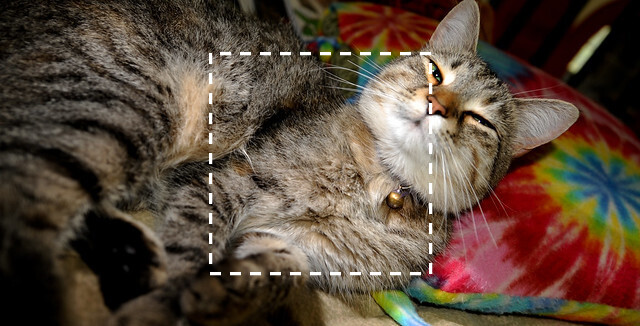
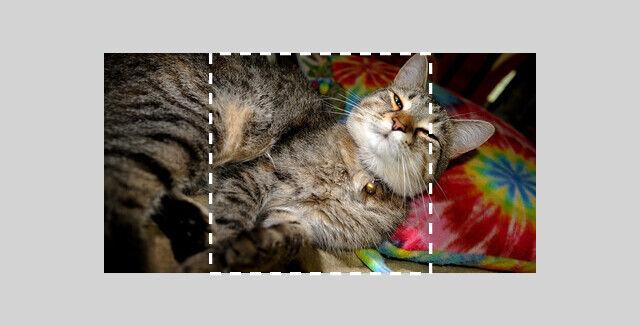

<object data="../img/pipeline-top-1.svg" type="image/svg+xml" id="pipeline-top">
</object>

<!--
If you are adding a new DataOptions type:

 * Update #types with the new type of data to be loaded.
 * Update #dataoptions to reference the new type.
 * Create a new options section to describe the new type and its standalone
   operators and members.
 * Update the formats table in #formats.
 * Add a section with examples about the type of data to be loaded.
 * Where relevant, add links to the new data type or new options class
   throughout.

Then go read it and make sure it all makes sense... :)
-->

# Data loading and I/O

mlpack provides the `data::Load()` and `data::Save()` functions to load and save
[Armadillo matrices](matrices.md) (e.g. numeric and categorical datasets) and
any mlpack object via the [cereal](https://uscilab.github.io/cereal/)
serialization toolkit.  A number of other utilities related to loading and
saving data and objects are also available.  The `data::Load()` and
`data::Save()` functions have numerous options to configure load/save behavior
and [format detection/selection](#formats).

## `data::Load()`

 - `data::Load(filename, X)`
   * Load `X` from the given file `filename` with default options:
     - the format of the file is [auto-detected](#formats) based on the
       extension of the file, and
     - an exception is *not* thrown on an error.
   * Returns a `bool` indicating whether the load was a success.
   * `X` can be [any supported load type](#types).

 - `data::Load(filename, object, Option1 + Option2 + ...)`
   * Load `X` from the given file `filename` with the given options.
   * Returns a `bool` indicating whether the load was a success.
   * `X` can be [any supported load type](#types).
   * The given options must be from the
     [list of standalone operators](#dataoptions) and be appropriate for the type
     of `X`.

 - `data::Load(filename, object, opts)`
   * Load `X` from the given file `filename` with the given options specified in `opts`.
   * Returns a `bool` indicating whether the load was a success.
   * `X` can be [any supported load type](#types).
   * `opts` is a [`DataOptions` object](#dataoptions) whose subtype matches the
     type of `X`.

For some types of data, it is also possible to load multiple images at once from a set of files:

 - `data::Load(filenames, X)`
 - `data::Load(filenames, X, Option1 + Option2 + ...)`
 - `data::Load(filenames, X, opts)`
    * Load data from `filenames` (a `std::vector<std::string>`) into the matrix `X`.
      - For [numeric data](#numeric-data), data loaded from each file is concatenated into `X`.
      - For [image data](#image-data), each image is flattened into one column of `X`.
    - Metadata (e.g. image size, number of columns, etc.) in all files in `filenames` must match or loading will fail.
    - Loading options can be specified by either standalone options or an instantiated [`DataOptions` object](#dataoptions).

---

*Simple example:*

```c++
// See https://datasets.mlpack.org/iris.csv.
arma::mat x;
mlpack::data::Load("iris.csv", x);

std::cout << "Loaded iris.csv; size " << x.n_rows << " x " << x.n_cols << "."
    << std::endl;
```

Among other things, the file format can be easily specified:

```c++
// See https://datasets.mlpack.org/iris.csv.
arma::mat x;
mlpack::data::Load("iris.csv", x, mlpack::data::CSV);

std::cout << "Loaded iris.csv; size " << x.n_rows << " x " << x.n_cols << "."
    << std::endl;
```

See also the other examples for each [supported load type](#types):

 * [Numeric data](#numeric-data-loadsave-examples)
 * [Categorical data](#categorical-data-loadsave-examples)
 * [Image data](#image-data-loadsave-examples)
 * [mlpack models and objects](#mlpack-models-and-objects-loadsave-examples)

## `data::Save()`

 - `data::Save(filename, X)`
   * Save `X` to the given file `filename` with default options:
     - the format of the file is auto-detected based on the extension of the
       file, and
     - an exception is *not* thrown on an error.
   * Returns a `bool` indicating whether the save was a success.
   * `X` can be [any supported save type](#types).

 - `data::Save(filename, object, Option1 + Option2 + ...)`
   * Save `X` to the given file `filename` with the given options.
   * Returns a `bool` indicating whether the save was a success.
   * `X` can be [any supported save type](#types).
   * The given options must be from the
     [list of standalone options](#dataoptions) and be appropriate for the type
     of `X`.

 - `data::Save(filename, object, opts)`
   * Save `X` to the given file `filename` with the given options specified in
     `opts`.
   * Returns a `bool` indicating whether the save was a success.
   * `X` can be [any supported save type](#types).
   * `opts` is a [`DataOptions` object](#dataoptions) whose subtype matches the
     type of `X`.

***Note:*** when saving images, it is possible to save
into multiple images from one matrix `X`.  See [image data](#image-data) for more
details.

---

*Simple example:*

```c++
// Generate a 5-dimensional matrix of random data.
arma::mat dataset(5, 1000, arma::fill::randu);
mlpack::data::Save("dataset.csv", dataset);

std::cout << "Saved random data to 'dataset.csv'." << std::endl;
```

Among other things, the file format can be easily specified manually:

```c++
// Generate a 5-dimensional matrix of random data.
arma::mat dataset(5, 1000, arma::fill::randu);
mlpack::data::Save("dataset.csv", dataset, mlpack::data::CSV);

std::cout << "Saved random data to 'dataset.csv'." << std::endl;
```

See also the other examples for each [supported save type](#types):

 * [Numeric data](#numeric-data-loadsave-examples)
 * [Categorical data](#categorical-data-loadsave-examples)
 * [Image data](#image-data-loadsave-examples)
 * [mlpack models and objects](#mlpack-models-and-objects-loadsave-examples)

## Types

Support is available for loading and saving several kinds of data.  Given an
object `X` to be loaded or saved:

 * For [***numeric data***](#numeric-data),
   - `X` should have type
     [`arma::mat` or any supported matrix type](matrices.md)
     (e.g. `arma::fmat`, `arma::umat`, etc.).
   - Supported formats are CSV, TSV, text, binary, ARFF, and others;
     see [the table of format options](#formats).
   - Additional options can be specified with a [`DataOptions`](#dataoptions),
     [`MatrixOptions`](#matrixoptions), or [`TextOptions`](#textoptions) object.
   - See [numeric data examples](#numeric-data-loadsave-examples) for example
     usage.

 * For [***mixed categorical data***](#mixed-categorical-data) (data where not
   all columns are numeric),
   - `X` should have type
     [`arma::mat` or any supported matrix type](matrices.md) (e.g.
     `arma::fmat`, `arma::umat`, etc.).
   - Columns of `X` that are categorical are represented as integer values
     starting from 0.
   - Information about categorical dimensions is stored in a
     [`data::DatasetInfo`](#datadatasetinfo) object, which is held inside of a
     [`TextOptions`](#textoptions) object.
   - Supported formats are CSV, TSV, text, and ARFF;
     see [the table of format options](#formats).
   - See [categorical data examples](#categorical-data-loadsave-examples) for
     example usage.

 * For [***image data***](#image-data),
   - `X` should have type
     [`arma::mat` or any supported matrix type](matrices.md) (e.g.
     `arma::fmat`, `arma::umat`, etc.).
   - Images are represented in a vectorized form; see [image data](#image-data)
     for details.
   - An [`ImageOptions`](#imageoptions) object is used for representing metadata
     specific to image formats.
   - Supported formats are PNG, JPEG, TGA, BMP, PSD, GIF, PIC, and PNM;
     see [the table of format options](#formats).
   - See [image data examples](#image-data-loadsave-examples) for example usage.

 * For [***mlpack models and objects***](#mlpack-models-and-objects),
   - `X` can have type equivalent to any mlpack class or type (e.g.
     [`mlpack::RandomForest`](methods/random_forest.md),
     [`mlpack::KDTree`](core/trees/kdtree.md),
     [`mlpack::Range`](core/math.md#range), etc.).
   - Supported formats for model/object serialization are binary, text, and JSON;
     see [the table of format options](#formats).
   - See [mlpack model and object examples](#mlpack-models-and-objects-loadsave-examples)
     for example usage.

## `DataOptions`

The [`data::Load()`](#dataload) and [`data::Save()`](#datasave) functions allow
specifying options in a standalone manner or with an instantiated `DataOptions`
object.  Standalone options provide convenience:

<!-- note: marked this example as C so we get syntax highlighting but it doesn't
     get compiled -->

```c
// Individual standalone options can be combined with the + operator.
mlpack::data::Load("filename.csv", X, mlpack::data::CSV + mlpack::data::Fatal);
```

The use of an instantiated `DataOptions` (or a child class relevant to the type
of data being loaded) allows more complex options to be configured and for
metadata resulting from a load or save operation to be stored:

```c
// Different data types will use DataOptions, MatrixOptions, TextOptions,
// ModelOptions, or other types.  See the documentation for each class below.
mlpack::data::ImageOptions opts;
opts.Channels() = 1; // Force loading in grayscale.
mlpack::data::Load("filename.png", X, opts);
// Now, `opts.Width()` and `opts.Height()` will store the size of the loaded
// image.
```

The set of allowed standalone options differs depending on the
[type of data](#types) being loaded or saved; if using an instantiated options
object, so does the type of `opts`:

 * ***Numeric data***: [`MatrixOptions`](#matrixoptions) and its
   [standalone options](#matrixoptions-standalone-operators-and-members), or
   [`TextOptions`](#textoptions) and its
   [standalone options](#textoptions-standalone-operators-and-members)
   for plaintext formats;
 * ***Mixed categorical data***: [`TextOptions`](#textoptions) and its
   [standalone options](#textoptions-standalone-operators-and-members);
 * ***Image data***: [`ImageOptions`](#imageoptions) and its
   [standalone options](#imageoptions-standalone-operators-and-members);
 * ***mlpack models and objects***: [`ModelOptions`](#modeloptions) and its
   [standalone options](#modeloptions-standalone-operators-and-members).

### `DataOptions`

The `DataOptions` class is the base class from which all options classes
specific to [data types](#types) are derived.  It is default-constructible and
provides the `.Fatal()` and `.Format()` members.

Any members or standalone operators available in `DataOptions` are also
available when using other options types (e.g. [`TextOptions`](#textoptions),
[`ImageOptions`](#imageoptions), etc.).

#### `DataOptions` standalone operators and members

The options below can be used as standalone operators to the
[`data::Load()`](#dataload) and [`data::Save()`](#datasave) functions, or as
calls to set members of an instantiated `DataOptions` object.

| ***Standalone operator*** | ***Member function***   | ***Available for:***      | ***Description*** |
|---------------------------|-------------------------|---------------------------|-------------------|
| _Load/save behavior._     |                         |                           |                   |
| `Fatal`                   | `opts.Fatal() = true;`  | All [data types](#types). | A `std::runtime_error` will be thrown on failure. |
| `NoFatal` _(default)_     | `opts.Fatal() = false;` | All [data types](#types). | `false` will be returned on failure.  A warning will also be printed if [`MLPACK_PRINT_WARN`](compile.md#configuring-mlpack-with-compile-time-definitions) is defined. |
|---------------------------|-------------------------|---------------------------|-------------------|
| [_Formats._](#formats)    |                         |                           |                   |
| `AutoDetect` _(default)_  | `opts.Format() = mlpack::data::FileType::AutoDetect;` | All [data types](#types). | The format of the file is autodetected using the extension fo the filename and (if loading) inspecting the file contents. |
|---------------------------|-------------------------|---------------------------|-------------------|

### `MatrixOptions`

The `MatrixOptions` class represents options specific to matrix types
([numeric](#numeric-data) and [categorical](#mixed-categorical-data) data).
`MatrixOptions` is derived from [`DataOptions`](#dataoptions) and thus any
[standalone operators or member functions from `DataOptions`](#dataoptions-standalone-operators-and-members)
(e.g. `Fatal`, `NoFatal`, and `AutoDetect`) can also be used with
`MatrixOptions`.

***Note:*** closely related is the [`TextOptions`](#textoptions) class,
specifically for loading numeric or categorical data from plaintext formats.
`MatrixOptions` is used for non-plaintext numeric data formats.

#### `MatrixOptions` standalone operators and members

The options below can be used as standalone operators to the
[`data::Load()`](#dataload) and [`data::Save()`](#datasave) functions, or as
calls to set members of an instantiated `MatrixOptions` object.

If an option is given that does not match the type of data being loaded or
saved, if [`Fatal()`](#dataoptions-standalone-operators-and-members) is set,
then an exception will be thrown; otherwise, a warning will be printed if
[`MLPACK_PRINT_WARN`](compile.md#configuring-mlpack-with-compile-time-definitions)
is set.

| ***Standalone operator*** | ***Member function***       | ***Available for:***      | ***Description*** |
|---------------------------|-----------------------------|---------------------------|-------------------|
| _Load/save behavior._     |                             |                           |                   |
| `Transpose` _(default)_   | `opts.Transpose() = true;`  | [Numeric](#numeric-data) and [categorical](#mixed-categorical-data) data. | The matrix will be transposed to/from [column-major form](matrices.md#representing-data-in-mlpack) on load/save. |
| `NoTranspose`             | `opts.Transpose() = false;` | [Numeric](#numeric-data) and [categorical](#mixed-categorical-data) data. | The matrix will not be transposed to [column-major form](matrices.md#representing-data-in-mlpack) on load/save. |
|---------------------------|-----------------------------|---------------------------|-------------------|
| [_Formats._](#formats)    |                             |                           |                   |
| `PGM`                     | `opts.Format() = mlpack::data::FileType::PGMBinary;`  | [Numeric](#numeric-data) data. | Load/save in the PGM image format; data should have values in the range `[0, 255]`.  The size of the image will be the same as the size of the matrix (after any transpose is applied). |
| `PPM`                     | `opts.Format() = mlpack::data::FileType::PPMBinary;`  | [Numeric](#numeric-data) data. | Load/save in the PPM image format; data should have values in the range `[0, 255]`.  The size of the image will be the same as the size of the matrix (after any transpose is applied). |
| `HDF5`                    | `opts.Format() = mlpack::data::FileType::HDF5Binary;` | [Numeric](#numeric-data) data. | Load/save in the [HDF5](https://en.wikipedia.org/wiki/Hierarchical_Data_Format) binary format; only available if Armadillo is configured with [HDF5 support](https://arma.sourceforge.net/docs.html#config_hpp). |
| `ArmaBin`                 | `opts.Format() = mlpack::data::FileType::ArmaBinary;` | [Numeric](#numeric-data) data. | Load/save in the space-efficient [`arma_binary`](https://arma.sourceforge.net/docs.html#save_load_mat) format (packed binary data). |
| `RawBinary`               | `opts.Format() = mlpack::data::FileType::RawBinary;`  | [Numeric](#numeric-data) data. | Load/save as packed binary data with no header and no size information; data will be loaded as a single column vector _(not recommended)_. |
|---------------------------|-----------------------------|---------------------------|-------------------|

### `TextOptions`

The `TextOptions` class represents options specific to matrix types stored in
plaintext formats ([numeric](#numeric-data) and [categorical](#mixed-categorical-data)
data).  `TextOptions` is a child class and thus any standalone operators or members from its parent classes are also available:

 * [`DataOptions`](#dataoptions) provides:
   - `Fatal`, `NoFatal`, and `AutoDetect` standalone operators
   - `opts.Fatal()` and `opts.Format()` members
   - See the [`DataOptions` operator and member documentation](#dataoptions-standalone-operators-and-members)
 * [`MatrixOptions`](#matrixoptions) provides:
   - `Transpose`, `NoTranspose`, `PGM`, `PPM`, `HDF5`, `ArmaBin`, and
     `RawBinary` standalone operators
   - `opts.Transpose()` member
   - See the [`MatrixOptions` operator and member documentation](#matrixoptions-standalone-operators-and-members)

#### `TextOptions` standalone operators and members

The options below can be used as standalone operators to the
[`data::Load()`](#dataload) and [`data::Save()`](#datasave) functions, or as
calls to set members of an instantiated `TextOptions` object.

If an option is given that does not match the type of data being loaded or
saved, if [`Fatal()`](#dataoptions-standalone-operators-and-members) is set,
then an exception will be thrown; otherwise, a warning will be printed if
[`MLPACK_PRINT_WARN`](compile.md#configuring-mlpack-with-compile-time-definitions)
is set.

<!-- TODO for Omar: what happens when HasHeaders() is true for saving? -->

| ***Standalone operator*** | ***Member function***       | ***Available for:***      | ***Description*** |
|---------------------------|-----------------------------|---------------------------|-------------------|
| _Load/save behavior._     |                             |                           |                   |
| `HasHeaders`              | `opts.HasHeaders() = true;` | [Numeric](#numeric-data) and [categorical](#mixed-categorical-data) data, only for the CSV format.. | If `true`, the first row of the file contains column names instead of data.  See note below. |
| `Categorical`             | `opts.Categorical() = true;` | [Categorical](#mixed-categorical-data), only for the CSV or ARFF formats. | If `true`, the data to be loaded or saved is mixed categorical data.  See note below. |
| `SemiColon`               | `opts.SemiColon() = true;`  | [Numeric](#numeric-data) and [categorical](#mixed-categorical-data) data, only for the CSV, `CoordAscii`, and `RawAscii` formats. | If `true`, the field separator in the file is a semicolon instead of a comma. |
| `MissingToNan` | `opts.MissingToNan() = true;` | [Numeric](#numeric-data) and [categorical](#mixed-categorical-data) data. | If `true`, any missing data elements will be represented as `NaN` instead of 0. |
|---------------------------|-----------------------------|---------------------------|-------------------|
| [_Formats._](#formats)    |                             |                           |                   |
| `CSV`                     | `opts.Format() = mlpack::data::FileType::CSVASCII;` | [Numeric](#numeric-data) and [categorical](#mixed-categorical-data) data. | CSV or TSV format.  If loading a sparse matrix and the CSV has three columns, the data is interpreted as a [coordinate list](https://arma.sourceforge.net/docs.html#save_load_mat). |
| `ArmaAscii`               | `opts.Format() = mlpack::data::FileType::ArmaASCII;` | [Numeric](#numeric-data) data. | Space-separated values as saved by Armadillo with the [`arma_ascii`](https://arma.sourceforge.net/docs.html#save_load_mat) format. |
| `RawAscii`                | `opts.Format() = mlpack::data::FileType::RawASCII;` | [Numeric](#numeric-data) data. | Space-separated values or tab-separated values (TSV) with no header. |
| `CoordAscii`              | `opts.Format() = mlpack::data::FileType::CoordAscii;` | [Numeric](#numeric-data) data where `X` is a sparse matrix (e.g. `arma::sp_mat`). | Coordinate list format for sparse data (see [`coord_ascii`](https://arma.sourceforge.net/docs.html#save_load_mat)). |
| `ARFF`                    | `opts.Format() = mlpack::data::FileType::ARFFAscii;` | [Categorical](#mixed-categorical-data) data. | ARFF filetype. Used specifically to load mixed categorical dataset.  See [ARFF documentation](https://ml.cms.waikato.ac.nz/weka/arff.html).  *Only for loading.* |
|---------------------------|-----------------------------|---------------------------|-------------------|
| _Metadata._               |                             |                           |                   |
| _(n/a)_                   | `opts.Headers()`            | [Numeric](#numeric-data) and [categorical](#mixed-categorical-data) data. | Returns a `std::vector<std::string>` with headers detected after loading a CSV. |
| _(n/a)_                   | `opts.DatasetInfo()`        | [Categorical](#mixed-categorical-data) data. | Returns a [`data::DatasetInfo`](#datadatasetinfo) with dimension information after loading, or that will be used for dimension information during saving. |
|---------------------------|-----------------------------|---------------------------|-------------------|

***Notes:***

 - When `opts.HasHeaders()` is `true` while loading, the parsed headers from the CSV
   file are stored into the `opts.Headers()` member, which has type
   `std::vector<std::string>`.  In order to access the headers after loading, an
   instantiated `TextOptions` must be passed to [`data::Load()`](#dataload); if
   `HasHeaders` is passed as a standalone option, the parsed headers will not be
   accessible after loading.

 - When `opts.Categorical()` is `true` while loading with the CSV format, any
   fields where a value cannot be interpreted as numeric will be
   automatically converted to a categorical dimension with values between `0`
   and the number of unique values in the field/dimension.  See
   [categorical data](#mixed-categorical-data) for more information on this
   representation.

 - When `opts.Categorical()` is `true` while loading, a
   [`data::DatasetInfo`](#datadatasetinfo) option is populated with information
   about each of the dimensions in the dataset and stored in
   `opts.DatasetInfo()`.  In order to access this after loading, an instantiated
   `TextOptions` must be passed to [`data::Load()`](#dataload); if `Categorical`
   is passed as a standalone option, the `data::DatasetInfo` object will not be
   accessible after loading.

 - When `opts.Categorical()` is `true` while saving, the values in
   `opts.DatasetInfo()` (which has type [`data::DatasetInfo`](#datadatasetinfo))
   will be used to map any categorical dimensions back to their original values.
   If `Categorical` was passed as a standalone option, then no
   `data::DatasetInfo` can be set before saving, and all dimensions of the data
   will be saved as numeric data.

### `ImageOptions`

The `ImageOptions` class represents options specific to [images](#image-data).
`ImageOptions` is a child class of [`DataOptions`](#dataoptions) and thus any
[standalone operators or member functions from `DataOptions`](#dataoptions-standalone-operators-and-members)
(e.g. `Fatal`, `NoFatal`, and `AutoDetect`) can also be used with
`ImageOptions`.

#### `ImageOptions` standalone operators and members

The options below can be used as standalone operators to the
[`data::Load()`](#dataload) and [`data::Save()`](#datasave) functions, or as
calls to set members of an instantiated `MatrixOptions` object.

If an option is given that does not match the type of data being loaded or
saved, if [`Fatal()`](#dataoptions-standalone-operators-and-members) is set,
then an exception will be thrown; otherwise, a warning will be printed if
[`MLPACK_PRINT_WARN`](compile.md#configuring-mlpack-with-compile-time-definitions)
is set.

| ***Standalone operator*** | ***Member function***                 | ***Available for:***       | ***Description*** |
|---------------------------|---------------------------------------|----------------------------|-------------------|
| [_Formats._](#formats)    |                                       |                            |                   |
| `Image`                   | `opts.Format() = mlpack::data::FileType::ImageType;` | [Image data](#image-data). | Load in the image format detected by the header of the file; save in the image format specified by the filename's extension. |
| `PNG`                     | `opts.Format() = mlpack::data::FileType::PNG;`       | [Image data](#image-data). | Load/save as a PNG image. |
| `JPG`                     | `opts.Format() = mlpack::data::FileType::JPG;`       | [Image data](#image-data). | Load/save as a JPEG image. |
| `TGA`                     | `opts.Format() = mlpack::data::FileType::TGA;`       | [Image data](#image-data). | Load/save as a TGA image. |
| `BMP`                     | `opts.Format() = mlpack::data::FileType::BMP;`       | [Image data](#image-data). | Load/save as a BMP image. |
| `PSD`                     | `opts.Format() = mlpack::data::FileType::PSD;`       | [Image data](#image-data). | Load/save as a PSD (Photoshop) image.  *Only for loading.* |
| `GIF`                     | `opts.Format() = mlpack::data::FileType::GIF;`       | [Image data](#image-data). | Load/save as a GIF image.  *Only for loading.* |
| `PIC`                     | `opts.Format() = mlpack::data::FileType::PIC;`       | [Image data](#image-data). | Load/save as a PIC (PICtor) image.  *Only for loading.* |
| `PNM`                     | `opts.Format() = mlpack::data::FileType::PNM;`       | [Image data](#image-data). | Load/save as a PNM (Portable Anymap) image.  *Only for loading.* |
|---------------------------|---------------------------------------|----------------------------|-------------------|
| _Save behavior._          |                                       |                            |                   |
| _(n/a)_                   | `opts.Quality()`                      | [Image data](#image-data) with JPEG format. | Desired JPEG quality level for saving (a `size_t` in the range from 0 to 100). |
|---------------------------|---------------------------------------|----------------------------|-------------------|
| _Metadata._               |                                       |                            |                   |
| _(n/a)_                   | `opts.Height()`                       | [Image data](#image-data)  | Returns a `size_t` representing the height in pixels of the loaded image(s), or the desired height in pixels for saving. |
| _(n/a)_                   | `opts.Width()`                        | [Image data](#image-data)  | Returns a `size_t` representing the height in pixels of the loaded image(s), or the desired height in pixels for saving. |
| _(n/a)_                   | `opts.Channels()`                     | [Image data](#image-data)  | Returns a `size_t` representing the height in pixels of the loaded image(s), or the desired height in pixels for saving. |
|---------------------------|---------------------------------------|----------------------------|-------------------|

***Notes:***

 * After a call to [`data::Load()`](#dataload), if an instantiated
   `ImageOptions` was passed, the `opts.Height()`, `opts.Width()`, and
   `opts.Channels()` members will be set with the values found during loading.

 * Before calling [`data::Load()`](#dataload), the value of `opts.Channels()`
   can be set to the desired number of channels (1/3/4) to force loading with
   that many color channels.

 * The `opts.Quality()` option is only relevant when calling
   [`data::Save()`](#datasave) when using the `JPG` format.

### `ModelOptions`

The `ModelOptions` class represents options specific to
[mlpack models and objects](#mlpack-models-and-objects).  `ModelOptions` is a
child class of [`DataOptions`](#dataoptions) and thus any
[standalone operators or member functions from `DataOptions`](#dataoptions-standalone-operators-and-members)
(e.g. `Fatal`, `NoFatal`, and `AutoDetect`) can also be used with
`ImageOptions`.

#### `ModelOptions` standalone operators and members

The options below can be used as standalone operators to the
[`data::Load()`](#dataload) and [`data::Save()`](#datasave) functions, or as
calls to set members of an instantiated `MatrixOptions` object.

If an option is given that does not match the type of data being loaded or
saved, if [`Fatal()`](#dataoptions-standalone-operators-and-members) is set,
then an exception will be thrown; otherwise, a warning will be printed if
[`MLPACK_PRINT_WARN`](compile.md#configuring-mlpack-with-compile-time-definitions)
is set.

| ***Standalone operator*** | ***Member function***                 | ***Available for:***      | ***Description*** |
|---------------------------|---------------------------------------|---------------------------|-------------------|
| [_Formats._](#formats)    |                                       |                           |                   |
| `BIN`                     | `opts.Format() = mlpack::data::FileType::BIN;`       | [mlpack models and objects](#mlpack-models-and-objects) | Load/save the object using an efficient packed binary format. |
| `JSON`                    | `opts.Format() = mlpack::data::FileType::JSON;`      | [mlpack models and objects](#mlpack-models-and-objects) | Load/save the object using human- and machine-readable JSON. |
| `XML`                     | `opts.Format() = mlpack::data::FileType::XML;`       | [mlpack models and objects](#mlpack-models-and-objects) | Load/save the object using XML (warning: may be very large). |
|---------------------------|---------------------------------------|---------------------------|-------------------|

***Notes:***

 - `FileType::BIN` (`.bin`) is recommended for the sake of size; objects in
   binary format may be an order of magnitude or more smaller than JSON!

 - `FileType::JSON` (`.json`) and `FileType::XML` (`.xml`) produce human-readable
   files, but they may be quite large.

## Formats

The [`data::Load()`](#dataload) and [`data::Save()`](#datasave) functions
support numerous different formats for loading and saving.  Not all formats are
relevant for all types of data.  The table below lists standalone options that
can be used to specify the format, as well as member functions for a
[`DataOptions`](#dataoptions) object.

When `AutoDetect` (the default) is specified as the format, the actual file
format is auto-detected using the filename's extension and (if loading)
inspecting the file contents.  Accepted filename extensions for each type are
given in the table.

| ***Standalone operator*** | ***Member function***                   | ***Filename extensions*** | ***Available for:***      | ***Description*** |
|---------------------------|-----------------------------------------|---------------------------|---------------------------|-------------------|
| `AutoDetect` _(default)_  | `opts.Format() = FileType::AutoDetect`  | _(n/a)_                   | All [data types](#types). | The format of the file is autodetected as one of the formats below. |
|---------------------------|-----------------------------------------|---------------------------|---------------------------|-------------------|
| `CSV`                     | `opts.Format() = FileType::CSVASCII;`   | `.csv`, `.tsv`            | [Numeric](#numeric-data) and [categorical](#mixed-categorical-data) data | CSV or TSV format.  If loading a sparse matrix and the CSV has three columns, the data is interpreted as a [coordinate list](https://arma.sourceforge.net/docs.html#save_load_mat). |
| `ArmaAscii`               | `opts.Format() = FileType::ArmaASCII;`  | `.txt`, `.csv`            | [Numeric](#numeric-data) data | Space-separated values as saved by Armadillo with the [`arma_ascii`](https://arma.sourceforge.net/docs.html#save_load_mat) format. |
| `RawAscii`                | `opts.Format() = FileType::RawASCII;`   | `.txt`                    | [Numeric](#numeric-data) data | Space-separated values or tab-separated values (TSV) with no header. |
| `CoordAscii`              | `opts.Format() = FileType::CoordAscii;` | `.txt` (if `X` is sparse) | [Numeric](#numeric-data) data where `X` is a sparse matrix (e.g. `arma::sp_mat`). | Coordinate list format for sparse data (see [`coord_ascii`](https://arma.sourceforge.net/docs.html#save_load_mat)). |
| `ARFF`                    | `opts.Format() = FileType::ARFFAscii;`  | `.arff`                   | [Categorical](#mixed-categorical-data) data | ARFF filetype. Used specifically to load mixed categorical dataset.  See [ARFF documentation](https://ml.cms.waikato.ac.nz/weka/arff.html).  *Only for loading.* |
| `PGM`                     | `opts.Format() = FileType::PGMBinary;`  | `.pgm`                    | [Numeric](#numeric-data) data | Load/save in the PGM image format; data should have values in the range `[0, 255]`.  The size of the image will be the same as the size of the matrix (after any transpose is applied). |
| `PPM`                     | `opts.Format() = FileType::PPMBinary;`  | `.ppm`                    | [Numeric](#numeric-data) data | Load/save in the PPM image format; data should have values in the range `[0, 255]`.  The size of the image will be the same as the size of the matrix (after any transpose is applied). |
| `HDF5`                    | `opts.Format() = FileType::HDF5Binary;` | `.h5`, `.hdf5`, `.hdf`, `.he5` | [Numeric](#numeric-data) data | Load/save in the [HDF5](https://en.wikipedia.org/wiki/Hierarchical_Data_Format) binary format; only available if Armadillo is configured with [HDF5 support](https://arma.sourceforge.net/docs.html#config_hpp). |
| `ArmaBin`                 | `opts.Format() = FileType::ArmaBinary;` | `.bin` (if `X` is an Armadillo type) | [Numeric](#numeric-data) data | Load/save in the space-efficient [`arma_binary`](https://arma.sourceforge.net/docs.html#save_load_mat) format (packed binary data). |
| `RawBinary`               | `opts.Format() = FileType::RawBinary;`  |                                | [Numeric](#numeric-data) data | Load/save as packed binary data with no header and no size information; data will be loaded as a single column vector _(not recommended)_. |
|---------------------------|-----------------------------------------|---------------------------|---------------------------|-------------------|
| `Image`                   | `opts.Format() = FileType::ImageType`   | _(n/a)_                   | [Image data](#image-data) | Load in the image format detected by the header of the file; save in the image format specified by the filename's extension. |
| `PNG`                     | `opts.Format() = FileType::PNG`         | `.png`                    | [Image data](#image-data) | Load/save as a PNG image. |
| `JPG`                     | `opts.Format() = FileType::JPG`         | `.jpg`, `.jpeg`           | [Image data](#image-data) | Load/save as a JPEG image. |
| `TGA`                     | `opts.Format() = FileType::TGA`         | `.tga`                    | [Image data](#image-data) | Load/save as a TGA image. |
| `BMP`                     | `opts.Format() = FileType::BMP`         | `.bmp`                    | [Image data](#image-data) | Load/save as a BMP image. |
| `PSD`                     | `opts.Format() = FileType::PSD`         | `.psd`                    | [Image data](#image-data) | Load/save as a PSD (Photoshop) image.  *Only for loading.* |
| `GIF`                     | `opts.Format() = FileType::GIF`         | `.gif`                    | [Image data](#image-data) | Load/save as a GIF image.  *Only for loading.* |
| `PIC`                     | `opts.Format() = FileType::PIC`         | `.pic`                    | [Image data](#image-data) | Load/save as a PIC (PICtor) image.  *Only for loading.* |
| `PNM`                     | `opts.Format() = FileType::PNM`         | `.pnm`                    | [Image data](#image-data) | Load/save as a PNM (Portable Anymap) image.  *Only for loading.* |
|---------------------------|-----------------------------------------|---------------------------|---------------------------|-------------------|
| `BIN`                     | `opts.Format() = FileType::BIN`         | `.bin`                    | [mlpack models and objects](#mlpack-models-and-objects) | Load/save the object using an efficient packed binary format. |
| `JSON`                    | `opts.Format() = FileType::JSON`        | `.json`                   | [mlpack models and objects](#mlpack-models-and-objects) | Load/save the object using human- and machine-readable JSON. |
| `XML`                     | `opts.Format() = FileType::XML`         | `.xml`                    | [mlpack models and objects](#mlpack-models-and-objects) | Load/save the object using XML (warning: may be very large). |
|---------------------------|-----------------------------------------|---------------------------|---------------------------|-------------------|

## Numeric data

Standard numeric data is represented in mlpack as a
[column-major matrix](matrices.md) and a variety of formats for loading and
saving are supported.

 * When calling [`data::Load()`](#dataload) and [`data::Save()`](#datasave), `X`
   should have type [`arma::mat`](matrices.md) or any other supported matrix
   type (e.g. `arma::fmat`, `arma::umat`, and so forth).

 * When calling [`data::Load()`](#dataload) with a vector `filenames`, all files
   must have the same number of dimensions and header names (if using
   CSVs with headers).  All files will be concatenated into the output matrix `X`.

 * When loading and saving with an instantiated [`DataOptions`](#dataoptions)
   object, the [`MatrixOptions`](#matrixoptions) and
   [`TextOptions`](#textoptions) subtypes can be used.

 * Supported formats are CSV, TSV, text, binary, ARFF, and others;
   see [the table of format options](#formats).

### Numeric data load/save examples

Load two datasets, print information about them, modify them, and save them back
to disk.

```c++
// Throw an exception if loading fails with the Fatal option.

// See https://datasets.mlpack.org/satellite.train.csv.
arma::mat dataset;
mlpack::data::Load("satellite.train.csv", dataset, mlpack::data::Fatal);

// See https://datasets.mlpack.org/satellite.train.labels.csv.
arma::Row<size_t> labels;
mlpack::data::Load("satellite.train.labels.csv", labels, mlpack::data::Fatal);

// Print information about the data.
std::cout << "The data in 'satellite.train.csv' has: " << std::endl;
std::cout << " - " << dataset.n_cols << " points." << std::endl;
std::cout << " - " << dataset.n_rows << " dimensions." << std::endl;

std::cout << "The labels in 'satellite.train.labels.csv' have: " << std::endl;
std::cout << " - " << labels.n_elem << " labels." << std::endl;
std::cout << " - A maximum label of " << labels.max() << "." << std::endl;
std::cout << " - A minimum label of " << labels.min() << "." << std::endl;

// Modify and save the data.  Add 2 to the data and drop the last column.
dataset += 2;
dataset.shed_col(dataset.n_cols - 1);
labels.shed_col(labels.n_cols - 1);

// Don't throw an exception if saving fails.  Technically there is no need to
// explicitly specify NoFatal---it is the default.
mlpack::data::Save("satellite.train.mod.csv", dataset, mlpack::data::NoFatal);
mlpack::data::Save("satellite.train.labels.mod.csv", labels, mlpack::data::NoFatal);
```

---

Load a dataset stored in a binary format and save it as a CSV.

```c++
// See https://datasets.mlpack.org/iris.bin.
arma::mat dataset;
mlpack::data::Load("iris.bin",
    dataset, mlpack::data::Fatal + mlpack::data::ArmaBin);

// Save it back to disk as a CSV.
mlpack::data::Save("iris.converted.csv", dataset, mlpack::data::CSV);
```

---

Load a dataset that has a semicolon as a separator instead of a comma.

```c++
// First write the semicolon file to disk.
std::fstream f;
f.open("semicolon.csv", std::fstream::out);
f << "1; 2; 3; 4" << std::endl;
f << "5; 6; 7; 8" << std::endl;
f << "9; 10; 11; 12" << std::endl;

// Now create a TextOptions and specify that the separator is a semicolon.
// Since all of the elements are integers, we load into an `arma::umat` (a
// matrix that holds unsigned integers) instead of an `arma::mat`.
arma::umat dataset;
mlpack::data::TextOptions opts;
opts.Semicolon() = true;

// Note that instead of `opts` we could just specify `Semicolon` instead!
mlpack::data::Load("semicolon.csv", dataset, opts);
std::cout << "The data in 'semicolon.csv' has: " << std::endl;
std::cout << " - " << dataset.n_cols << " points." << std::endl;
std::cout << " - " << dataset.n_rows << " dimensions." << std::endl;
```

---

Load a dataset with missing elements, and replace the missing elements with NaN
using the [`MissingToNan`](#textoptions-standalone-operators-and-members) option.

```c++
// First write a CSV file to disk with some missing values.
std::fstream f;
f.open("missing_to_nan.csv", std::fstream::out);
// Missing 2 value in the first row.
f << "1, , 3, 4" << std::endl;
f << "5, 6, 7, 8" << std::endl;
f << "9, 10, 11, 12" << std::endl;

arma::mat dataset;
mlpack::data::TextOptions opts;
opts.MissingToNan() = true;

// Note that instead of `opts` we could just specify `MissingToNan` instead!
mlpack::data::Load("missing_to_nan.csv", dataset, opts);
// Print information about the data.
std::cout << "Loaded data:" << std::endl;
std::cout << dataset;
```

---

Load a CSV into a 32-bit floating point matrix and print the headers (column names).

```c++
// See https://datasets.mlpack.org/Admission_Predict.csv.
arma::fmat dataset;
// We have to make a TextOptions object so that we can recover the headers.
mlpack::data::TextOptions opts;
opts.Format() = mlpack::data::FileType::CSVASCII;
opts.HasHeaders() = true;
mlpack::data::Load("Admission_Predict.csv", dataset, opts);

std::cout << "Found " << opts.Headers().size() << " columns." << std::endl;
for (size_t i = 0; i < opts.Headers().size(); ++i)
{
  std::cout << " - Column " << i << ": '" << opts.Headers()[i] << "'."
      << std::endl;
}
```

---

Load a CSV containing a coordinate list into a sparse matrix and print the
overall size of the loaded matrix.

```c++
// See https://datasets.mlpack.org/movielens-100k.csv.
arma::sp_mat dataset;
// A 3-column CSV into a sparse matrix is interpreted as a coordinate list.
mlpack::data::Load("movielens-100k.csv", dataset, mlpack::data::CSV);

std::cout << "Loaded data from movielens-100k.csv; matrix size: "
    << dataset.n_rows << " x " << dataset.n_cols << "." << std::endl;
```
---

## Mixed categorical data

mlpack supports mixed categorical data, e.g., data where some dimensions take
only categorical values (e.g. `0`, `1`, `2`, etc.).  When using mlpack, string
data and other non-numerical data must be mapped to categorical values and
represented as part of an `arma::mat` or other matrix type.  Category metadata
is stored in an auxiliary [`data::DatasetInfo`](#datadatasetinfo) object.

 * When calling [`data::Load()`](#dataload) and [`data::Save()`](#datasave), `X`
   should have type [`arma::mat`](matrices.md) or any other supported matrix
   type (e.g. `arma::fmat`, `arma::umat`, and so forth).

 * To load categorical data, either the
   [`Categorical`](#textoptions-standalone-operators-and-members) standalone
   option must be passed, or an instantiated [`TextOptions`](#textoptions)
   `opts` must be passed with `opts.Categorical() = true`.

 * Supported formats are CSV, TSV, text, and ARFF; see
   [the table of format options](#formats).

 * When loading, each unique non-numeric value is mapped (sequentially) to
   positive integers.  Any columns with non-numeric values are marked as
   categorical.

 * To access mappings from each categorical value to its original value after
   load, as well as which dimensions are categorical, an instantiated
   [`TextOptions`](#textoptions) `opts` must be passed to
   [`data::Load()`](#dataload); then, the associated
   [`data::DatasetInfo`](#datadatasetinfo) is accessible via
   [`opts.DatasetInfo()`](#textoptions-standalone-operators-and-members).

 * When saving, reverse mappings from positive integers to the original unique
   non-numeric values in `opts.DatasetInfo()` are applied.  To set these
   mappings, as well as which dimensions are categorical, an instantiated
   [`TextOptions`](#textoptions) `opts` must be passed to
   [`data::Save()`](#datasave) with
   [`opts.DatasetInfo()`](#textoptions-standalone-operators-and-members) set
   accordingly.

Categorical data is supported by a number of mlpack algorithms, including
[`DecisionTree`](methods/decision_tree.md),
[`HoeffdingTree`](methods/hoeffding_tree.md), and
[`RandomForest`](methods/random_forest.md).

### `data::DatasetInfo`

mlpack represents categorical data via the use of the auxiliary
`data::DatasetInfo` object, which stores information about which dimensions are
numeric or categorical and allows conversion from the original category values
to the numeric values used to represent those categories.

For loading and saving categorical data, an instantiated
[`TextOptions`](#textoptions) must be passed to [`data::Load()`](#dataload) or
[`data::Save()`](#datasave); this object contains a `data::DatasetInfo` object,
accessible via the
[`.DatasetInfo()`](#textoptions-standalone-operators-and-members) method; e.g.,
`opts.DatasetInfo()`.

#### Accessing and setting properties

This documentation uses `info` as the name of the `data::DatasetInfo` object,
but if a categorical dataset has been loaded with [`data::Load()`](#dataload),
it is instead suggested to use `opts.DatasetInfo()` in place of `info`.

 - `info = data::DatasetInfo(dimensionality)`
   * Create a `data::DatasetInfo` object with the given dimensionality
   * All dimensions are assumed to be numeric (not categorical).

 - `info.Type(d)`
   * Get the type (categorical or numeric) of dimension `d`.
   * Returns a `data::Datatype`, either `data::Datatype::numeric` or
     `data::Datatype::categorical`.
   * Calling `info.Type(d) = t` will set a dimension to type `t`, but this
     should only be done before `info` is used with `data::Load()` or
     `data::Save()`.

 - `info.NumMappings(d)`
   * Get the number of categories in dimension `d` as a `size_t`.
   * Returns `0` if dimension `d` is numeric.

 - `info.Dimensionality()`
   * Return the dimensionality of the object as a `size_t`.

---

#### Map to and from numeric values

 - `info.MapString<double>(value, d)`
   * Given `value` (a `std::string`), return the `double` representing the
     categorical mapping (an integer value) of `value` in dimension `d`.
   * If a mapping for `value` does not exist in dimension `d`, a new mapping is
     created, and `info.NumMappings(d)` is increased by one.
   * If dimension `d` is numeric and `value` cannot be parsed as a numeric
     value, then dimension `d` is changed to categorical and a new mapping is
     returned.

 - `info.UnmapString(mappedValue, d)`
   * Given `mappedValue` (a `size_t`), return the `std::string` containing the
     original category that mapped to the value `mappedValue` in dimension `d`.
   * If dimension `d` is not categorical, a `std::invalid_argument` is thrown.

---

### Categorical data load/save examples

Load and manipulate an ARFF file.

```c++
// Load a categorical dataset.
arma::mat dataset;

// Define a TextOptions to load categorical data.
mlpack::data::TextOptions opts;
opts.Fatal() = true;
opts.Categorical() = true;

// See https://datasets.mlpack.org/covertype.train.arff.
mlpack::data::Load("covertype.train.arff", dataset, opts);

// Print information about the data.
std::cout << "The data in 'covertype.train.arff' has: " << std::endl;
std::cout << " - " << dataset.n_cols << " points." << std::endl;
std::cout << " - " << opts.DatasetInfo().Dimensionality() << " dimensions."
    << std::endl;

arma::Row<size_t> labels;
// We need to have a second options, since we are loading two different
// data types and extension.
mlpack::data::TextOptions labelOpts;
labelOpts.Fatal() = true;
// See https://datasets.mlpack.org/covertype.train.labels.csv.
mlpack::data::Load("covertype.train.labels.csv", labels, labelOpts);


// Print information about each dimension.
for (size_t d = 0; d < opts.DatasetInfo().Dimensionality(); ++d)
{
  if (opts.DatasetInfo().Type(d) == mlpack::data::Datatype::categorical)
  {
    std::cout << " - Dimension " << d << " is categorical with "
        << opts.DatasetInfo().NumMappings(d) << " categories." << std::endl;
  }
  else
  {
    std::cout << " - Dimension " << d << " is numeric." << std::endl;
  }
}

// Modify the 5th point.  Increment any numeric values, and set any categorical
// values to the string "hooray!".
for (size_t d = 0; d < opts.DatasetInfo().Dimensionality(); ++d)
{
  if (opts.DatasetInfo().Type(d) == mlpack::data::Datatype::categorical)
  {
    // This will create a new mapping if the string "hooray!" does not already
    // exist as a category for dimension d..
    dataset(d, 4) = opts.DatasetInfo().MapString<double>("hooray!", d);
  }
  else
  {
    dataset(d, 4) += 1.0;
  }
}
```

---

Manually create a [`data::DatasetInfo`](#datadatasetinfo) object and use it to
save a categorical dataset.

```c++
// This will manually create the following data matrix (shown as it would appear
// in a CSV):
//
// 1, TRUE, "good", 7.0, 4
// 2, FALSE, "good", 5.6, 3
// 3, FALSE, "bad", 6.1, 4
// 4, TRUE, "bad", 6.1, 1
// 5, TRUE, "unknown", 6.3, 0
// 6, FALSE, "unknown", 5.1, 2
//
// Although the last dimension is numeric, we will take it as a categorical
// dimension.

arma::mat dataset(5, 6); // 6 data points in 5 dimensions.
mlpack::data::DatasetInfo info(5);

// Set types of dimensions.  By default they are numeric so we only set
// categorical dimensions.
info.Type(1) = mlpack::data::Datatype::categorical;
info.Type(2) = mlpack::data::Datatype::categorical;
info.Type(4) = mlpack::data::Datatype::categorical;

// The first dimension is numeric.
dataset(0, 0) = 1;
dataset(0, 1) = 2;
dataset(0, 2) = 3;
dataset(0, 3) = 4;
dataset(0, 4) = 5;
dataset(0, 5) = 6;

// The second dimension is categorical.
dataset(1, 0) = info.MapString<double>("TRUE", 1);
dataset(1, 1) = info.MapString<double>("FALSE", 1);
dataset(1, 2) = info.MapString<double>("FALSE", 1);
dataset(1, 3) = info.MapString<double>("TRUE", 1);
dataset(1, 4) = info.MapString<double>("TRUE", 1);
dataset(1, 5) = info.MapString<double>("FALSE", 1);

// The third dimension is categorical.
dataset(2, 0) = info.MapString<double>("good", 2);
dataset(2, 1) = info.MapString<double>("good", 2);
dataset(2, 2) = info.MapString<double>("bad", 2);
dataset(2, 3) = info.MapString<double>("bad", 2);
dataset(2, 4) = info.MapString<double>("unknown", 2);
dataset(2, 5) = info.MapString<double>("unknown", 2);

// The fourth dimension is numeric.
dataset(3, 0) = 7.0;
dataset(3, 1) = 5.6;
dataset(3, 2) = 6.1;
dataset(3, 3) = 6.1;
dataset(3, 4) = 6.3;
dataset(3, 5) = 5.1;

// The fifth dimension is categorical.  Note that `info` will choose to assign
// category values in the order they are seen, even if the category can be
// parsed as a number.  So, here, the value '4' will be assigned category '0',
// since it is seen first.
dataset(4, 0) = info.MapString<double>("4", 4);
dataset(4, 1) = info.MapString<double>("3", 4);
dataset(4, 2) = info.MapString<double>("4", 4);
dataset(4, 3) = info.MapString<double>("1", 4);
dataset(4, 4) = info.MapString<double>("0", 4);
dataset(4, 5) = info.MapString<double>("2", 4);

// Print the dataset with mapped categories.
dataset.print("Dataset with mapped categories");

// Print the mappings for the third dimension.
std::cout << "Mappings for dimension 3: " << std::endl;
for (size_t i = 0; i < info.NumMappings(2); ++i)
{
  std::cout << " - \"" << info.UnmapString(i, 2) << "\" maps to " << i << "."
      << std::endl;
}

// Now `dataset` is ready for use with an mlpack algorithm that supports
// categorical data.  We will save it to `categorical-data.csv`.
mlpack::data::TextOptions opts;
opts.Categorical() = true;
opts.DatasetInfo() = std::move(info);
mlpack::data::Save("categorical-data.csv", dataset, opts);
```

---

## Image data

mlpack load, saves, and modifies image data using the
[STB library](https://github.com/nothings/stb/).  STB is a
header-only library that is bundled with mlpack; but, it is also possible to use
a version of STB
[available on the system](compile.md#configuring-mlpack-with-compile-time-definitions).

When loading images, each image is represented as a flattened single column
vector in a data matrix; each row of the resulting vector will correspond to a
single pixel value (between 0 and 255) in a single channel.  If an
[`ImageOptions`](#imageoptions) was passed to [`data::Load()`](#dataload), it
will be populated with the metadata of the image.

Images are flattened along rows, with channel values interleaved, starting from
the top left.  Thus, the value of the pixel at position `(x, y)` in channel `c`
will be contained in element/row `y * (channels) + x * (width * channels) + c`
of the flattened vector.

 * Supported image loading formats are JPEG, PNG, TGA, BMP, PSD, GIF, PIC, and
   PNM; see [the table of formats](#formats) for more details.

 * Multiple images can be loaded into the columns of a single matrix using the
    overload of [`data::Save`](#datasave) that takes a vector of `filenames`.

 * Supported image saving formats are JPEG, PNG, TGA, and BMP.

 * Accessing the metadata of an image after loading can be done with
   `opts.Width()`, `opts.Height()`, and `opts.Channels()`.  See the
   [`ImageOptions` member documentation](#imageoptions-standalone-operators-and-members)
   for more details.

 * mlpack offers the following image modification functionality, documented in
   the sections below:
   - [`ResizeImages()`](#resizing-images)
   - [`ResizeAndCropImages()`](#resize-and-crop-images)
   - [`GroupChannels()` and `InterleaveChannels()`](#changing-the-memory-layout-of-images)
   - [`LetterboxImages()`](#letterbox-transform)

---

When working with images, the following overload for
[`data::Save()`](#datasave) is also available:

 * `data::Save(filenames, X, opts)`
   - Save each column in `X` (an `arma::mat` or other
     [matrix type](matrices.md)) as a separate image.

   - `filenames` is a `std::vector<std::string>` representing all the images that
     should be saved.

   - `opts` is an [`ImageOptions`](#imageoptions) that contains image metadata.

   - `opts.Width()`, `opts.Height()`, `opts.Channels()`, and `opts.Quality()`
     should be set to the desired parameters before calling; see
     [`ImageOptions` members](#imageoptions-standalone-operators-and-members)
     for more details.

   - The `i`th column of `X` will be saved to the `i`th filename in `filenames`.

   - If all images are saved successfully, `true` will be returned.

<!-- TODO: is this always true? for all types? -->

***Note:*** when loading and saving images, if the element type of `X` is not
`unsigned char` (e.g. if `image` is not `arma::Mat<unsigned char>`, when
loading, the data will be temporarily loaded as `unsigned char`s and then
converted, and when saving, `X` will be converted to `unsigned char`s before
saving.

### Image data load/save examples

Load a single image, but don't store the metadata (so, e.g., height, width, and
number of channels are unavailable after loading!).

```
// See https://www.mlpack.org/static/img/numfocus-logo.png.
arma::mat image;
mlpack::data::Load("numfocus-logo.png", image, PNG);

// If we wanted image metadata, we would need to pass an ImageOptions.  See the
// next example.
//
// We could also specify `Image` instead of `PNG` if we did not care which image
// format was used, but just that *some* image format was used.

std::cout << "The image in 'numfocus-logo.png' has " << image.n_rows
    << " pixels." << std::endl;
```

---

Load and save a single image:

```c++
// See https://www.mlpack.org/static/img/numfocus-logo.png.
mlpack::data::ImageOptions opts;
opts.Fatal() = true;
arma::mat matrix;
mlpack::data::Load("numfocus-logo.png", matrix, opts /* format autodetected */);

// `matrix` should now contain one column.

// Print information about the image.
std::cout << "Information about the image in 'numfocus-logo.png': "
    << std::endl;
std::cout << " - " << opts.Width() << " pixels in width." << std::endl;
std::cout << " - " << opts.Height() << " pixels in height." << std::endl;
std::cout << " - " << opts.Channels() << " color channels." << std::endl;

std::cout << "Value at pixel (x=3, y=4) in the first channel: ";
const size_t index = (4 * opts.Width() * opts.Channels()) +
    (3 * opts.Channels());
std::cout << matrix[index] << "." << std::endl;

// Increment each pixel value, but make sure they are still within the bounds.
matrix += 1;
matrix.clamp(0, 255);

mlpack::data::Save("numfocus-logo-mod.png", matrix, opts);
```

---

Load and save multiple images:

```c++
// Load some favicons from websites associated with mlpack.
std::vector<std::string> images;
// See the following files:
// - https://datasets.mlpack.org/images/mlpack-favicon.png
// - https://datasets.mlpack.org/images/ensmallen-favicon.png
// - https://datasets.mlpack.org/images/armadillo-favicon.png
// - https://datasets.mlpack.org/images/bandicoot-favicon.png
images.push_back("mlpack-favicon.png");
images.push_back("ensmallen-favicon.png");
images.push_back("armadillo-favicon.png");
images.push_back("bandicoot-favicon.png");

mlpack::data::ImageOptions opts;
opts.Channels() = 1; // Force loading in grayscale.
opts.Fatal() = true;

arma::mat matrix;
mlpack::data::Load(images, matrix, opts);

// Print information about what we loaded.
std::cout << "Loaded " << matrix.n_cols << " images.  Images are of size "
    << opts.Width() << " x " << opts.Height() << " with " << opts.Channels()
    << " color channel." << std::endl;

// Invert images.
matrix = (255.0 - matrix);

// Save as compressed JPEGs with low quality.
opts.Quality() = 75;
std::vector<std::string> outImages;
outImages.push_back("mlpack-favicon-inv.jpeg");
outImages.push_back("ensmallen-favicon-inv.jpeg");
outImages.push_back("armadillo-favicon-inv.jpeg");
outImages.push_back("bandicoot-favicon-inv.jpeg");

mlpack::data::Save(outImages, matrix, opts);
```

### Resizing images

The `ResizeImages()` function can be used to resize image data:

- `ResizeImages(images, opts, newWidth, newHeight)`
   * `images` is a [column-major matrix](matrices.md) containing a set of
      images; each image is represented as a flattened vector in one column.

   * `opts` is a [`data::ImageOptions&`](#imageoptions) containing details about
     the images in `images`, and will be modified to contain the new size of the
     images.

   * `newWidth` and `newHeight` (of type `size_t`) are the desired new
     dimensions of the resized images.

   * This function returns `void` and modifies `opts` and `images`.

   * ***NOTE:*** if the element type of `images` is not `unsigned char` or
     `float` (e.g. if `image` is not `arma::Mat<unsigned char>` or
     `arma::fmat`), the matrix will be temporarily converted during resizing;
     therefore, using `unsigned char` or `float` as the element type is the most
     efficient.

   * This function expects all the images to have identical
     dimensions. If this is not the case, iteratively call `ResizeImages()` with
     a single image/column in `images`.

Example usage of the `ResizeImages()` function on a set of images with
different dimensions:

```c++
// See https://datasets.mlpack.org/sheep.tar.bz2
arma::Mat<unsigned char> image;
mlpack::data::ImageOptions opts;
opts.Fatal() = false;

// The images are located in our test/data directory. However, any image could
// be used instead.
std::vector<std::string> files =
    {"sheep_1.jpg", "sheep_2.jpg", "sheep_3.jpg", "sheep_4.jpg",
     "sheep_5.jpg", "sheep_6.jpg", "sheep_7.jpg", "sheep_8.jpg",
     "sheep_9.jpg"};

// The resized images will be saved locally. We are declaring the vector that
// contains the names of the resized images.
std::vector<std::string> reSheeps =
    {"re_sheep_1.jpg", "re_sheep_2.jpg", "re_sheep_3.jpg", "re_sheep_4.jpg",
     "re_sheep_5.jpg", "re_sheep_6.jpg", "re_sheep_7.jpg", "re_sheep_8.jpg",
     "re_sheep_9.jpg"};

// Load and Resize each one of them individually, because they do not have
// the same dimensions. The `opts` will contain the dimension for each one.
for (size_t i = 0; i < files.size(); i++)
{
  mlpack::data::Load(files.at(i), image, opts);
  mlpack::data::ResizeImages(image, opts, 320, 320);
  mlpack::data::Save(reSheeps.at(i), image, opts);
}
```

Example usage of `ResizeImages()` function on a set of images that have the
same dimensions.

```c++
// All images have the same dimension, It would be possible to load all of
// them into one matrix

// See https://datasets.mlpack.org/sheep.tar.bz2
arma::Mat<unsigned char> images;
mlpack::data::ImageOptions opts;
opts.Fatal() = false;

std::vector<std::string> reSheeps =
    {"re_sheep_1.jpg", "re_sheep_2.jpg", "re_sheep_3.jpg", "re_sheep_4.jpg",
     "re_sheep_5.jpg", "re_sheep_6.jpg", "re_sheep_7.jpg", "re_sheep_8.jpg",
     "re_sheep_9.jpg"};

mlpack::data::Load(reSheeps, images, opts);

// Now let us resize all these images at once, to specific dimensions.
mlpack::data::ResizeImages(images, opts, 160, 160);

// The resized images will be saved locally. We are declaring the vector that
// contains the names of the resized images.
std::vector<std::string> smSheeps =
    {"sm_sheep_1.jpg", "sm_sheep_2.jpg", "sm_sheep_3.jpg", "sm_sheep_4.jpg",
     "sm_sheep_5.jpg", "sm_sheep_6.jpg", "sm_sheep_7.jpg", "sm_sheep_8.jpg",
     "sm_sheep_9.jpg"};

mlpack::data::Save(smSheeps, images, opts);
```

## Resize and crop images

In addition to resizing images, mlpack also provides resize-and-crop
functionality.  This is useful when the desired aspect ratio of an image differs
largely from the original image.

The resize-and-crop operation, given a target size `outputWidth` x
`outputHeight`, first resizes the image while preserving the aspect ratio such
that the width and height of the image both no smaller than `outputWidth` and
`outputHeight`.  Then, the image is cropped to have size `outputWidth` by
`outputHeight`, keeping the center pixels only.  This process is shown below.

*Original image:*

<p align="center">
  
</p>

*Original image with target size of* `220`x`220` *pixels:*

<p align="center">
  
</p>

*First step: resize while preserving aspect ratio:*

<p align="center">
  
</p>

*Second step: crop to desired final size:*

<p align="center">
  
</p>

- `ResizeCropImages(images, opts, newWidth, newHeight)`
   * `images` is a [column-major matrix](matrices.md) containing a set of
      images; each image is represented as a flattened vector in one column.

   * `opts` is a [`data::ImageOptions&`](#imageoptions) containing details about
     the images in `images`.

   * `images` and `opts` are modified in-place.

   * `newWidth` and `newHeight` (of type `size_t`) are the desired new
     dimensions of the resized images.
     - If the output size is larger than the input image size, the images will
       be upscaled the minimum amount necessary before cropping.
     - If the aspect ratio is not changed from the input aspect ratio, no
       cropping is performed.

   * ***NOTE:*** if the element type of `images` is not `unsigned char` or
     `float` (e.g. if `image` is not `arma::Mat<unsigned char>` or
     `arma::fmat`), the matrix will be temporarily converted during resizing;
     therefore, using `unsigned char` or `float` as the element type is the most
     efficient.

   * This function expects all the images to have identical dimensions. If this
     is not the case, iteratively call `ResizeCropImages()` with a single
     image/column in `images`.

Example usage of the `ResizeCropImages()` function on a set of images with
different dimensions:

```c++
// See https://datasets.mlpack.org/sheep.tar.bz2.
arma::Mat<unsigned char> image;
mlpack::data::ImageOptions opts;
opts.Fatal() = false;

// The images are located in our test/data directory. However, any image could
// be used instead.
std::vector<std::string> files =
    {"sheep_1.jpg", "sheep_2.jpg", "sheep_3.jpg", "sheep_4.jpg",
     "sheep_5.jpg", "sheep_6.jpg", "sheep_7.jpg", "sheep_8.jpg",
     "sheep_9.jpg"};

// The resized images will be saved locally. We are declaring the vector that
// contains the names of the resized and cropped images.
std::vector<std::string> cropSheeps =
    {"crop_sheep_1.jpg", "crop_sheep_2.jpg", "crop_sheep_3.jpg",
     "crop_sheep_4.jpg", "crop_sheep_5.jpg", "crop_sheep_6.jpg",
     "crop_sheep_7.jpg", "crop_sheep_8.jpg", "crop_sheep_9.jpg"};

// Load and resize-and-crop each image individually, because they do not have
// the same dimensions. The `opts` will contain the dimension for each one.
for (size_t i = 0; i < files.size(); i++)
{
  mlpack::data::Load(files.at(i), image, opts);
  mlpack::data::ResizeCropImages(image, opts, 320, 320);
  mlpack::data::Save(cropSheeps.at(i), image, opts);
  std::cout << "Resized and cropped " << files.at(i) << " to "
      << cropSheeps.at(i) << " with output size 320x320." << std::endl;
}
```

## Changing the memory layout of images

Image-related utilities such as `GroupChannels()` and
`InterleaveChannels()` have been moved to a dedicated page.
See [Working with Images](data/images.md) for details.


When loading images using `data::Load()` channels are interleaved, i.e.
the underlying vector contains the values `[r, g, b, r, g, b, ... ]`
(for an image with 3 channels). mlpack has functionality such as `Convolution`
that requires channels be grouped, e.g `[r, r, ..., g, g, ..., b, b]`.
The same is true when using `data::Save()`, the channels are expected to be
interleaved.

To convert the layout of your image from interleaved channels to grouped
channels and vice versa, you can use `data::GroupChannels()` and
`data::InterleaveChannels()`.

***NOTE***: Other image related functions (such as
[`ResizeImages`](#resizing-images) etc) require channels be interleaved. If you
need to use `GroupChannels()` make sure to resize or crop your images first
beforehand.

---

#### `data::GroupChannels()`

 * `data::GroupChannels(images, opts)`
    - `images` must be a matrix where each column is an image. Each image is
      expected to be interleaved, i.e. in the format `[r, g, b, r, g, b ... ]`.

    - `opts` ImageOptions object describes the shape of each image.

    - Returns a matrix where each image from `images` are in the
      format `[r, r, ... , g, g, ... , b, b]`.

---

#### `data::InterleaveChannels()`

 * `data::InterleaveChannels(images, opts)`
    - Performs the reverse of `data::GroupChannels()`.

    - `images` must be a matrix where each column is an image. Each image is
      expected to be grouped, i.e. in the format `[r, r, ..., g, g, ..., b, b]`.

    - `opts` ImagesOptions object describes the shape of each image.

    - Returns a matrix where each image from `images` are in the
      format `[r, g, b, r, g, b ... ]`.

#### Example

This example loads an image, and converts the layout such that channels are
grouped together in preparation for a convolutional neural network. Then, the
image is converted back to interleaved channels and saved.

```c++
// Download: https://datasets.mlpack.org/images/mlpack-favicon.png
arma::mat image;
mlpack::data::ImageOptions opts;
opts.Fatal() = true;
mlpack::data::Load("mlpack-favicon.png", image, opts);

std::vector<std::string> colors =
     { "\033[31m", "\033[32m", "\033[34m", "\033[37m" };

// Display input before grouping channels (Load() returns channels interleaved).
std::cout << "Original Image (channels interleaved):" << std::endl;
for (size_t i = 0; i < image.n_rows; i += opts.Channels())
{
  for (size_t j = 0; j < opts.Channels(); j++)
    std::cout << colors[j] << image.at(i + j, 0) << "\033[0m" << ", ";
}
std::cout << std::endl << std::endl;

// Group channels.
image = mlpack::data::GroupChannels(image, opts);

// Display submatrix of input after grouping channels
std::cout << "Grouped channels:" << std::endl;
for (size_t i = 0; i < opts.Channels(); i++)
{
  for (size_t j = 0; j < image.n_rows / opts.Channels(); j++)
    std::cout << colors[i] <<
      image.at(i * image.n_rows / opts.Channels() + j, 0) << "\033[0m" << ", ";
}
std::cout << std::endl << std::endl;

// Do some computation here; for example, a convolutional neural network.

// Interleave channels to prepare for saving.
image = mlpack::data::InterleaveChannels(image, opts);

// Display input after interleaving channels.
// This should be identical to the original image.
std::cout << "Interleaved channels (identical to original):" << std::endl;
for (size_t i = 0; i < image.n_rows; i += opts.Channels())
{
  for (size_t j = 0; j < opts.Channels(); j++)
    std::cout << colors[j] << image.at(i + j, 0) << "\033[0m" << ", ";
}
std::cout << std::endl << std::endl;

mlpack::data::Save("mlpack-favicon.png", image, opts);
```

### Letterbox transform

The letterbox transform resizes an image's dimensions to `width x height` but
keeps the aspect ratio of the original image. Whitespace is then filled in
with `fillValue`.

*Original image with size of* `640`x`326` *pixels:*

<p align="center">
  
</p>

*Image with target size of* `416`x`416` *pixels after letterbox:*

<p align="center">
  
</p>

*Image with target size of* `300`x`208` *pixels after letterbox:*

<p align="center">
  
</p>

- `LetterboxImages(src, opt, width, height, fillValue)`
  * `src` is a [column-major matrix](matrices.md) containing a single image,
    where the image is represented as a flattened vector in one column.
  * `opt` is a [`data::imageOptions&`](#imageoptions) containing info on
    the dimensions of the image.
  * `width` and `height` are `const size_t`s determining the new width and
    height of `src`.
  * `fillValue` is the white space value that pads out the resized image.
    Each channel will be filled in with this value, i.e., if `fillValue` is 127
    then each RGB channel will be 127.
  * Only images with 1 or 3 channels can be used.

#### Example

An example that loads an image, resizes the image to some square image
while keeping the aspect ratio using `LetterboxImages()`.

```c++
// Download: https://datasets.mlpack.org/jurassic-park.png
arma::mat image;
mlpack::data::ImageOptions opts;
opts.Fatal() = true;
mlpack::data::Load("jurassic-park.png", image, opts);
mlpack::data::LetterboxImages(image, opts, 416, 416, 127.0);
// Image dimensions are now 416x416.
mlpack::data::Save("jurassic-park-letterbox.png", image, opts, true);

std::cout << "Dimensions: " << opts.Width() << " x " << opts.Height()
          << " x " << opts.Channels() << "\n";
std::cout << "Total size: " << image.n_rows << "\n";
```

## mlpack models and objects

Machine learning models and any mlpack object (i.e. anything in the `mlpack::`
namespace) can be saved with [`data::Save()`](#datasave) and loaded with
[`data::Load()`](#dataload).  Serialization is performed using the
[cereal](https://uscilab.github.io/cereal/) serialization toolkit.

 * When calling [`data::Load()`](#dataload) and [`data::Save()`](#datasave), `X`
   should be the desired mlpack model or object type.

 * When loading and saving with an instantiated [`DataOptions`](#dataoptions)
   object, the [`ModelOptions`](#modeloptions) subtype can be used.

 * Supported formats are binary, JSON, and XML; see
   [the table of format options](#formats).

***Note:*** when loading an object that was saved in the binary format
([`BIN`](#modeloptions-standalone-operators-and-members)), the C++ type of the
object must be ***exactly the same*** (including template parameters) as the
type used to save the object.  If not, undefined behavior will occur---most
likely a crash.

### mlpack models and objects load/save examples

Simple example: create a `math::Range` object, then save and load it.

```c++
mlpack::math::Range r(3.0, 6.0);

// How we can use DataOptions with loading / saving objects.
mlpack::data::DataOptions opts;
opts.Fatal() = true;
opts.Format() = mlpack::data::FileType::BIN;

// Save the Range to 'range.bin', using the name "range".
mlpack::data::Save("range.bin", r, opts);

// Load the range into a new object.
mlpack::math::Range r2;
mlpack::data::Load("range.bin", r2, mlpack::data::BIN + mlpack::data::Fatal);

std::cout << "Loaded range: [" << r2.Lo() << ", " << r2.Hi() << "]."
    << std::endl;

// Modify and save the range as JSON.
r2.Lo() = 4.0;
mlpack::data::Save("range.json", r2, mlpack::data::JSON + mlpack::data::Fatal);

// Now 'range.json' will contain the following:
//
// {
//     "range": {
//         "cereal_class_version": 0,
//         "hi": 6.0,
//         "lo": 4.0
//     }
// }
```

---

Train a [`LinearRegression`](methods/linear_regression.md) model and save it to
disk, then reload it.

```c++
// See https://datasets.mlpack.org/admission_predict.csv.
arma::mat data;
mlpack::data::DataOptions opts;
opts.Fatal () = false;
mlpack::data::Load("admission_predict.csv", data, true);

// See https://datasets.mlpack.org/admission_predict.responses.csv.
arma::rowvec responses;
mlpack::data::Load("admission_predict.responses.csv", responses, true);

// Train a linear regression model, fitting an intercept term and using an L2
// regularization parameter of 0.3.
mlpack::LinearRegression lr(data, responses, 0.3, true);

// Save the model using the binary format as a standalone parameter, throwing an
// exception on failure.
mlpack::data::Save("lr-model.bin", lr, mlpack::data::Fatal + mlpack::data::BIN);
std::cout << "Saved model to lr-model.bin." << std::endl;

// Now load the model back, using format autodetection on the filename
// extension.
mlpack::LinearRegression loadedModel;
if (!mlpack::data::Load("lr-model.bin", loadedModel, opts))
{
  std::cout << "Model not loaded successfully from 'lr-model.bin'!"
      << std::endl;
}
else
{
  std::cout << "Model loaded successfully from 'lr-model.bin' with "
      << "intercept value of " << loadedModel.Parameters()[0] << "."
      << std::endl;
}
```
