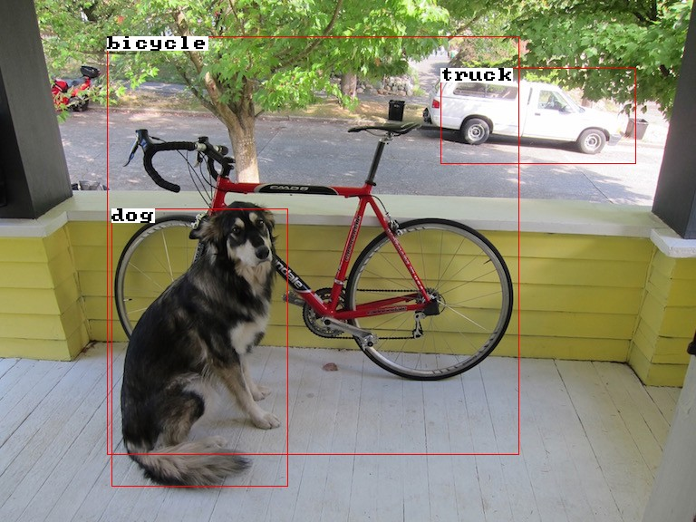
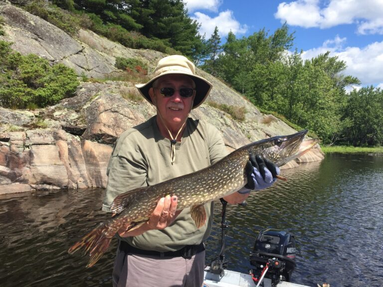

## YOLOv3 and YOLOv3Tiny

The `YOLOv3` and `YOLOv3Tiny` classes implement the models from
the paper ["YOLOv3: An Incremental Improvement"](https://arxiv.org/abs/1804.02767). `YOLOv3` is a simple
object detection algorithm that takes in an image and predicts multiple bounding
boxes in a single forward pass of the neural network.

**NOTE**: At the current time, only prediction is supported by the `YOLOv3`
and `YOLOv3Tiny` classes. Support for training and fine-tuning is in progress.

#### Simple usage example:

**NOTE**: You must define the `MLPACK_ENABLE_ANN_SERIALIZATION` macro
to serialize and deserialize models that use `arma::mat` as the data type.

```c++
// Download: https://models.mlpack.org/yolo/yolov3-320-coco-f64.bin
mlpack::YOLOv3 model;
mlpack::Load("yolov3-320-coco-f64.bin", model);

// Download: https://models.mlpack.org/yolo/dog.jpg
arma::mat inputImage, outputImage;
mlpack::ImageOptions opts;
mlpack::Load("dog.jpg", inputImage, opts);

// Preprocess the `inputImage`, predict bounding boxes using `YOLOv3` and draw them onto `outputImage`.
model.Predict(inputImage, opts, outputImage, true);

// Save to "output.jpg"
mlpack::Save("output.jpg", outputImage, opts);
```

<p align="center">
  
</p>

<p align="center">
  
</p>

<p align="center">
  
</p>

<p style="text-align: center; font-size: 85%"><a href="#simple-examples">More examples...</a></p>

#### Quick Links:

 * [Constructors](#constructors): create `YOLOv3` objects.
 * [`Predict()`](#predicting-bounding-boxes): predict bounding boxes in an
   image.
 * [Other functionality](#other-functionality) for loading, saving, and
   inspecting the model.
 * [`YOLOv3Tiny` class](#yolov3tiny) for efficient low-resource detection.
 * [Pretrained weights](#pretrained-weights) for different YOLO models.
 * [Examples](#simple-examples) of simple usage and links to detailed example
   projects.
 * [Template parameters](#advanced-functionality-template-parameters) for custom
   behavior.

#### See also:
 * [Object Detection on Wikipedia](https://en.wikipedia.org/wiki/Object_detection)
 * [You Only Look Once (original YOLO paper)](https://www.cv-foundation.org/openaccess/content_cvpr_2016/papers/Redmon_You_Only_Look_CVPR_2016_paper.pdf)
 * [YOLOv3 paper](https://arxiv.org/abs/1804.02767) where the YOLOv3 architecture is described.
 * [COCO dataset](https://cocodataset.org/) was used to train the pretrained weights included.
 * [COCO class names](https://models.mlpack.org/yolo/coco.names) in their correct order.
 * [`DAGNetwork`](/src/mlpack/methods/ann/dag_network.hpp) is used internally to represent the model.
 * [`LetterboxImages()`](../core/images.md#letterbox-transform) is used to make the input image square but retain the aspect ratio of the original image.
 * [`GroupChannels()`](../core/images.md#groupchannels) is used to group the image channels for the convolutional layers.

### Constructors

Construct a `YOLOv3` object using one of the constructors below.
Defaults and types are detailed in the

 * `model = YOLOv3()`
   - Create an uninitialized YOLOv3 model.
   - After this step, load [pretrained weights](#pretrained-weights) into the
     model with [`Load()`](../load_save.md#load).

---

### Predicting Bounding Boxes

Once the weights are loaded, you can compute likely object bounding boxes with with `Predict()`.

 * `model.Predict(image, opts, output, drawBoxes=false ignoreThresh=0.7)`
   - Predict objects in the given `image` (with metadata [`opts`](../load_save.md#imageoptions)).
   - Image pixel values are expected to be between 0-255. A [letterbox](../core/images.md#letterbox-transform) transform will be applied to the image.
   - If `drawBoxes` is true, output will be a copy of image with the bounding boxes from the model drawn onto it.
   - Bounding boxes will be drawn if their confidence is greater than `ignoreThresh`.
   - If `drawBoxes` is false, the output will be the raw outputs of the model. The bounding box coordinates will be in the original image's space.


| **name** | **type** | **description** | **default**|
|----------|----------|-----------------|------------|
| `image` | `arma::mat` | Input image. See [example](#simple-usage-example) for details on loading an image with mlpack | n/a |
| `opt` | [`ImageOptions`](../load_save.md#imageoptions) | Image metadata. | n/a |
| `output` | `arma::mat` | Output. Will be an output image with bounding boxes or raw outputs of the model depending on `drawBoxes`. | n/a |
| `drawBoxes` | `bool` | Boolean to decide to copy `image` to `output` and draw bounding boxes or simply return raw outputs in `output`. | `false` |
| `ignoreThreshold` | `double` | Minimum confidence to have the corresponding bounding box drawn onto `output`, if `drawBoxes` is true. | `0.7` |

---

 * `model.Predict(preprocessedInput, rawOutput)`
  - Takes in a preprocessed `input`. See [example](#simple-examples).
  - `output` stores the raw detection data. The shape of the output matrix will be `(numAttributes * numDetections, batchSize)`.
  - You can get the `numAttributes` of the model from [`model.NumAttributes()`](#other-functionality).
  - Each bounding box is made up of `numAttributes` number of data points. This includes `cx`, `cy`, `w`, `h`, objectness and class probabilities.
  - Objectness means how likely an object is in the given box.
  - The class probability means that given there's an object in the box, what's the probability that it's this class.


| **name** | **type** | **description** |
|----------|----------|-----------------|
| `input` | `MatType` | Input image. See [example](#simple-usage-example) for details on preprocessing the input image |
| `output` | `MatType` | Raw outputs of the model |

---

### Other Functionality

 * `YOLOv3` can be serialized with
   [`Save()` and `Load()`](../load_save.md#mlpack-models-and-objects).

 * `Model()` will return the underlying
   [`DAGNetwork`](/src/mlpack/methods/ann/dag_network.hpp) object that represents the model architecture.

 * `ImageSize()` will return a `size_t` containing the expected width and height
    of the image afte preprocessing. The `yolov3-320.bin` model for example converts the
    input image to shape `(320, 320, 3)`.

 * `NumClasses()` will return the number of classes that a
    bounding box could contain. For example, the pretrained weights
    were trained on the COCO dataset, which includes 80 different
    classes.

 * `ClassNames()` will return a vector of strings, each being the name
    of a class the model can predict. You can find all the COCO names in order [here](https://models.mlpack.org/yolo/coco.names).

 * `Anchors()` returns a vector of doubles representing the anchors used
    during inference.

### `YOLOv3Tiny`

<!-- TODO: update when YOLOv3Tiny is updated. -->

### Pretrained weights

Because training a `YOLOv3` model from scratch is time-consuming,
a number of pretrained models are available for download.

The format for the name of each YOLOv3 pretrained model is
`<model name>-<image size>-<finetuned dataset name>-<matrix type>.bin`.
 * [`https://models.mlpack.org/yolo/yolov3-320-coco.bin`](https://models.mlpack.org/yolov3/yolov3-320-coco.bin)

An increased image size means the model will be able to detect smaller objects
at the cost of speed. Similarly, smaller matrix types allow for faster loading
of models and faster inference times.

<!-- TODO: update and add other models -->

The pretrained models available were all finetuned on the [COCO dataset](https://cocodataset.org/).
A link to all the [COCO class names](https://models.mlpack.org/yolo/coco.names) is available too.

### Simple Examples

See also the [simple usage example](#simple-usage-example) for a trivial usage
of the `YOLOv3` class.

**NOTE**: You must define the `MLPACK_ENABLE_ANN_SERIALIZATION` macro
to serialize and deserialize models that use `arma::mat` as the data type.

---

Preprocess the image, predict bounding boxes and get the raw output of the model.

```c++
// Step 1: load the pretrained weights.
// Download: https://models.mlpack.org/yolo/yolov3-320-coco-f64.bin
mlpack::YOLOv3 model;
mlpack::Load("yolov3-320-coco-f64.bin", model);

// Step 2: load the image.
// Download: https://github.com/pjreddie/darknet/blob/master/data/dog.jpg
arma::mat inputImage, rawOutput;
mlpack::ImageOptions opts;
mlpack::Load("dog.jpg", inputImage, opts);

// Step 3: Preprocess the `inputImage`, predict bounding boxes using `YOLOv3`.
// Set `drawBoxes` to false in order to store raw outputs in `rawOutput`.
model.Predict(inputImage, opts, rawOutput, false);

// Step 4: Inspect the first possible bounding box.
std::cout << "First bounding box: [" << (size_t) rawOutput(0, 0) << ", "
    << (size_t) rawOutput(1, 0) << ", " << (size_t) rawOutput(2, 0) << ", "
    << (size_t) rawOutput(3, 0) << "]." << std::endl;
```

---

Simple example of doing custom preprocessing on the input image, and getting raw output of the model.

```c++
// Step 1: load the pretrained model.
// Download: https://models.mlpack.org/yolo/yolov3-320-coco-f64.bin
mlpack::YOLOv3 model;
mlpack::Load("yolov3-320-coco-f64.bin", model);

// Step 2: load the image.
// Download: https://models.mlpack.org/yolo/dog.jpg
arma::mat inputImage, preprocessedImage, rawOutput;
mlpack::ImageOptions opts;
mlpack::Load("dog.jpg", inputImage, opts);

// Step 3: preprocess the image.
// Normalize pixel values to be between 0-1.
preprocessedImage = inputImage / 255.0;

// Change the dimensions of the image to the model's input dimensions while
// keeping the aspect ratio of the original image using `LetterboxImages`.
mlpack::ImageOptions preprocessedOpts = opts;
const size_t imgSize = model.ImageSize();
const double greyValue = 0.5;
LetterboxImages(preprocessedImage, preprocessedOpts, imgSize, imgSize, greyValue);

// Change the layout of the channels such that they're grouped.
preprocessedImage = GroupChannels(preprocessedImage, preprocessedOpts);

// Step 4: detect objects in the image.
// Get raw output from model and store in `rawOutput`.
model.Predict(preprocessedImage, rawOutput);

// Step 5: Inspect the first possible bounding box.
std::cout << "First bounding box: [" << (size_t) rawOutput(0, 0) << ", "
    << (size_t) rawOutput(1, 0) << ", " << (size_t) rawOutput(2, 0) << ", "
    << (size_t) rawOutput(3, 0) << "]." << std::endl;
```

---

Predict and draw bounding boxes on multiple images. **NOTE**: On this example, each image must have the same dimensions.

```c++
// Step 1: load the pretrained model.
// Download: https://models.mlpack.org/yolo/yolov3-320-coco-f64.bin
mlpack::YOLOv3 model;
mlpack::Load("yolov3-320-coco-f64.bin", model);

// Step 2: load the images, in this case copies of the same image three times.
// Download: https://models.mlpack.org/yolo/dog.jpg
// Download: https://models.mlpack.org/yolo/cat.jpg
// Download: https://models.mlpack.org/yolo/fish.jpg
arma::mat inputImages, outputImages;
mlpack::ImageOptions opts;

std::vector<std::string> inputFiles = {"dog.jpg", "cat.jpg", "fish.jpg"};
mlpack::Load(inputFiles, inputImages, opts);

// Step 3: Preprocess each `inputImages`, detect bounding boxes and draw them onto each `outputImages`. Each column is a seperate image.
model.Predict(inputImages, opts, outputImages, true);

// Step 4: Save each image.
std::vector<std::string> outputFiles = {"1.jpg", "2.jpg", "3.jpg"};
mlpack::Save(outputFiles, outputImages, opts);
```

---

### Advanced Functionality: Template Parameters

The `YOLOv3` class also supports using different floating point types.
The full signature of the class is:

```
YOLOv3<MatType>
```

`MatType`: specifies the type of matrix used for learning and internal
representation of weights and biases. The default is `arma::mat`.

 * Any matrix type that implements the Armadillo API can be used.

The example below uses YOLOv3 using the `arma::fmat` weights.

**NOTE**: You must define the `MLPACK_ENABLE_ANN_SERIALIZATION_FMAT` macro
to serialize and deserialize models that use `arma::fmat` as the data type.

```c++
// Step 1: load the pretrained arma::fmat weights.
// Download: https://models.mlpack.org/yolo/yolov3-320-coco-f32.bin
mlpack::YOLOv3<arma::fmat> model;
mlpack::Load("yolov3-320-coco-f32.bin", model);

// Step 2: load the image into an arma::fmat.
// Download: https://models.mlpack.org/yolo/dog.jpg
// Note: the image type must also be `arma::fmat`
arma::fmat image;
mlpack::ImageOptions opts;
mlpack::Load("dog.jpg", image, opts);

// Step 3: Preprocess the input image, detect bounding boxes and draw them onto `outputImage`.
// Predict bounding boxes from an image using `YOLOv3` and draw them.
model.Predict(image, opts);

// Step 4: Save to "output.jpg"
mlpack::Save("output.jpg", image, opts, true);
```
